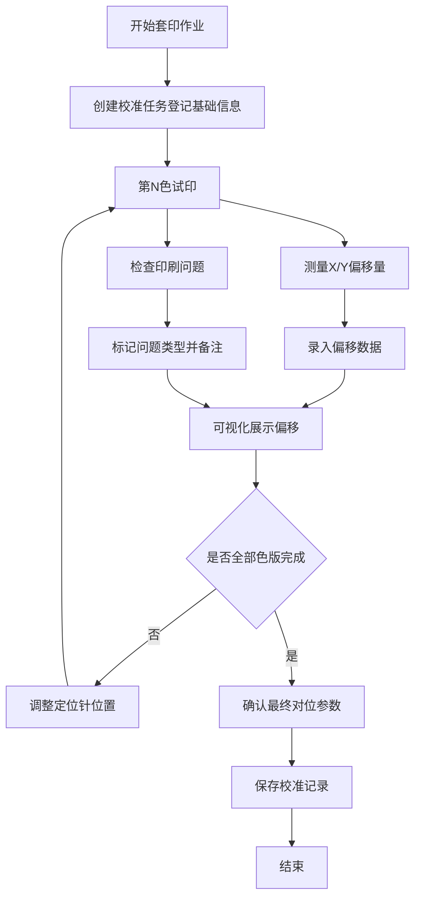

## 1. 产品概述

套色对位校准系统是为版画工作坊设计的专业工具，用于多色套印过程中的精确对位校准。系统帮助师傅记录纸张批次、版块编号、油墨颜色、定位针位置和试印次数，实时展示每一色的偏移量，标记重影、漏白、蹭脏和纸张伸缩等印刷问题，并最终保存可用的对位参数，避免整批报废。

- **目标用户**：版画工作坊师傅、印刷技术员
- **核心价值**：降低对位误差导致的废品率，标准化校准流程，沉淀生产经验数据

## 2. 核心功能

### 2.1 用户角色
| 角色 | 登记方式 | 核心权限 |
|------|----------|----------|
| 印刷师傅 | 直接使用 | 新建校准任务、录入试印数据、标记问题、保存参数 |
| 管理员 | 直接使用 | 查看历史校准记录、导出参数报告 |

### 2.2 功能模块
1. **校准任务登记**：纸张批次、版块编号、油墨颜色、定位针位置基础信息录入
2. **试印记录**：试印次数、偏移量数据（X轴/Y轴）、问题标记
3. **偏移量可视化**：每色偏移量图表展示、对位偏差实时对比
4. **问题标记面板**：重影、漏白、蹭脏、纸张伸缩四类问题快速标记与备注
5. **参数保存与导出**：最终校准参数保存、历史记录查看、参数导出

### 2.3 页面详情
| 页面名称 | 模块名称 | 功能描述 |
|----------|----------|----------|
| 套色对位校准页 | 任务信息卡 | 登记纸张批次、版块编号、油墨色序、定位针位置 |
| 套色对位校准页 | 色版列表 | 逐色录入偏移量（X/Y毫米）、试印次数、当前状态 |
| 套色对位校准页 | 偏移量可视化 | 以十字坐标图展示每色偏移方向与幅度 |
| 套色对位校准页 | 问题标记面板 | 四类印刷问题快速勾选与备注，支持每色单独标记 |
| 套色对位校准页 | 参数保存区 | 校准完成状态标记、最终参数确认、保存到本地 |

## 3. 核心流程

师傅开始套印作业 → 创建校准任务并登记基础信息 → 第一色试印 → 测量偏移量并录入 → 标记印刷问题 → 调整定位针 → 下一色试印 → 重复测量和调整 → 全部色版校准完成 → 确认最终对位参数 → 保存校准记录

## 4. 用户界面设计

### 4.1 设计风格
- **主色调**：深靛蓝 (#1e3a5f) 作为工业专业感基调，搭配暖铜色 (#d4a574) 作为强调色，呼应版画风物
- **辅助色**：问题警示用朱砂红 (#c44536)，合格状态用青瓷绿 (#4a7c59)
- **按钮风格**：微立体倒角按钮，悬停有轻微上浮反馈
- **字体**：标题使用「思源宋体」体现印刷质感，正文使用「思源黑体」保证可读性
- **布局风格**：左侧信息卡 + 中央可视化区 + 右侧问题面板的三栏工作台布局
- **图标风格**：线性图标，线条粗细一致，融入版画工具元素

### 4.2 页面设计概览
| 页面名称 | 模块名称 | UI元素 |
|----------|----------|--------|
| 套色对位校准页 | 任务信息卡 | 深色卡片背景、标签式输入框、编号自动生成 |
| 套色对位校准页 | 色版列表 | 每行一版、颜色色块预览、偏移量正负值用颜色区分 |
| 套色对位校准页 | 偏移量可视化 | 十字靶心坐标图、每色带箭头的偏移线、刻度标尺 |
| 套色对位校准页 | 问题标记面板 | 四象限卡片布局、勾选后高亮边框、备注输入区 |
| 套色对位校准页 | 参数保存区 | 固定底部操作栏、确认保存二次确认、成功状态动效 |

### 4.3 响应式
- 桌面端（≥1280px）：三栏布局完整展示
- 平板端（768-1279px）：左右两栏堆叠，可视化区保持全宽
- 移动端（<768px）：上下堆叠，可视化区优先展示，折叠面板可展开

### 4.4 动效设计
- 页面加载：各模块错峰淡入（staggered 100ms）
- 偏移量更新：坐标图上的点位平滑过渡到新位置（300ms ease）
- 问题标记：勾选时卡片边框发光扩散效果
- 保存成功：参数卡片展开显示绿色勾选，铜色装饰线划过
