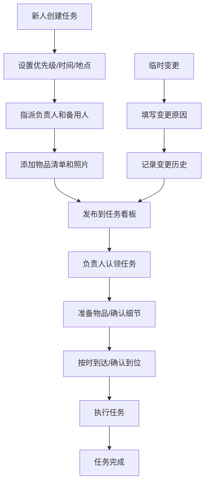

## 1. 产品概述

婚礼分工板是一款帮助婚礼筹备团队高效协作的任务管理工具。通过可视化的任务看板、时间轴和复盘功能，让接亲、红包管理、酒店音响等各项事务有条不紊，避免群聊混乱。

- 核心目标：解决婚礼当天多人协作、任务分配不清、临时变更难追踪的问题
- 目标用户：新郎新娘、伴郎伴娘、婚礼策划、亲友帮忙团
- 产品价值：一份清晰的分工清单，让婚礼当天每一件事都有人盯、有人管

## 2. 核心功能

### 2.1 用户角色

| 角色 | 说明 | 核心权限 |
|------|------|----------|
| 创建者（新人） | 婚礼组织者，创建任务 | 新增/编辑/删除任务、指派负责人、标记优先级、查看复盘 |
| 参与者（帮忙人员） | 负责执行具体任务 | 认领任务、确认到位、记录变更、查看自己的任务 |
| 访客 | 仅查看分工情况 | 浏览任务看板和时间轴 |

### 2.2 功能模块

1. **任务看板**：所有婚礼任务的卡片式展示，支持按状态/优先级/分类筛选
2. **任务详情卡**：展示事项、时间点、地点、负责人、备用人、物品清单、参考照片
3. **时间轴视图**：婚礼当天按小时展示所有事项的时间线
4. **提醒系统**：高优先级任务到点前未确认自动提醒
5. **复盘区**：记录遗漏事项、超时环节、个人完成情况统计

### 2.3 页面详情

| 页面/区域 | 模块名称 | 功能描述 |
|-----------|----------|----------|
| 顶部导航 | 标题区 | 婚礼主题名称、日期、倒计时 |
| 顶部导航 | Tab切换 | 任务看板 / 时间轴 / 复盘区 三大视图切换 |
| 任务看板 | 筛选栏 | 按状态筛选（待认领/进行中/已确认）、按优先级筛选、按分类筛选 |
| 任务看板 | 任务卡片列表 | 瀑布流/网格布局展示所有任务卡片 |
| 任务看板 | 新增任务按钮 | 弹窗创建新任务 |
| 任务详情 | 基本信息 | 事项名称、时间点、地点、分类、优先级 |
| 任务详情 | 人员信息 | 负责人、备用人、支持认领操作 |
| 任务详情 | 物品清单 | 需准备的物品列表，支持勾选 |
| 任务详情 | 参考照片 | 相关参考图片展示 |
| 任务详情 | 变更记录 | 临时变更历史，含原因和时间 |
| 任务详情 | 确认操作 | 负责人确认到位按钮 |
| 时间轴视图 | 小时时间轴 | 按小时分段的垂直时间线，标注所有事项 |
| 时间轴视图 | 当前时间指示 | 实时显示当前时间位置 |
| 时间轴视图 | 任务状态标识 | 不同颜色标识任务状态 |
| 复盘区 | 遗漏事项 | 记录当天漏掉的事情 |
| 复盘区 | 超时环节 | 记录超时的任务和原因 |
| 复盘区 | 人员完成统计 | 每个人的任务完成情况和评分 |
| 复盘区 | 经验总结 | 自由记录的经验和建议 |

## 3. 核心流程

### 3.1 任务创建与分配流程

新人创建任务 → 设置优先级和时间 → 指派负责人/备用人 → 添加物品清单和参考照片 → 发布到看板 → 负责人认领/确认

### 3.2 任务执行流程

查看自己的任务 → 准备物品 → 按时到达指定地点 → 确认到位 → 任务执行中 → 完成标记

### 3.3 临时变更流程

发现问题 → 点击变更按钮 → 填写变更原因和新安排 → 系统记录变更历史 → 相关人员看到更新

### 3.4 流程图

## 4. 用户界面设计

### 4.1 设计风格

**设计主题：浪漫婚礼风 + 高效管理感**

- **主色调**：玫瑰金/香槟粉（#D4A574）作为主色，传递温馨浪漫的婚礼氛围
- **辅助色**：象牙白（#FFF8F0）背景、深酒红（#8B2635）作为高优先级强调色
- **中性色**：暖灰色系文字，柔和不刺眼
- **整体感觉**：精致、温馨、有条不紊，像婚礼请柬一样有仪式感

**组件风格：**
- 卡片式设计，带轻微阴影和圆角，像精美的婚礼卡片
- 按钮采用圆角矩形，主要按钮有玫瑰金渐变
- 高优先级任务有酒红色边框和角标，视觉突出
- 状态标签用胶囊形状，不同状态不同颜色

**字体选择：**
- 标题字体：优雅的衬线字体（如 Playfair Display），有婚礼仪式感
- 正文字体：清晰易读的无衬线字体（如 Noto Sans SC）
- 数字和时间：等宽字体，清晰醒目

### 4.2 页面设计概览

| 页面/区域 | 模块名称 | UI 元素 |
|-----------|----------|----------|
| 整体布局 | 顶部导航 | 固定顶部，毛玻璃效果，左侧婚礼标题，右侧 Tab 切换 |
| 整体布局 | 内容区 | 最大宽度 1200px 居中，上下有 padding |
| 任务看板 | 筛选栏 | 横向排列的筛选标签，胶囊样式，选中态有底色 |
| 任务看板 | 任务卡片 | 网格布局（桌面端 3 列），卡片内顶部是优先级标识和标题，中间是时间地点，底部是负责人头像和状态 |
| 任务看板 | 卡片悬停 | 轻微上浮 + 阴影加深，显示更多操作按钮 |
| 任务详情 | 弹窗/侧边栏 | 从右侧滑出的侧边栏，半透明遮罩 |
| 任务详情 | 信息分组 | 用分割线和小标题分组，信息层次清晰 |
| 时间轴视图 | 时间线 | 左侧垂直时间线，带时间刻度，右侧是任务卡片 |
| 时间轴视图 | 当前时间线 | 红色虚线 + 圆形指示器，标记现在时刻 |
| 复盘区 | 统计卡片 | 顶部三栏统计卡片（完成率、遗漏数、超时数） |
| 复盘区 | 列表区 | 分 tab 展示遗漏、超时、人员统计 |

### 4.3 响应式设计

- **桌面端**：任务卡片 3 列网格布局，时间轴左右分栏
- **平板端**：任务卡片 2 列，时间轴保持左右布局但压缩间距
- **手机端**：任务卡片单列，时间轴改为紧凑模式，底部导航 Tab

### 4.4 动画与交互

- 页面加载时卡片依次淡入（staggered animation）
- 任务状态切换时有平滑过渡动画
- 侧边栏滑入滑出有缓动效果
- 高优先级任务有轻微呼吸动画吸引注意
- 按钮点击有缩放反馈
