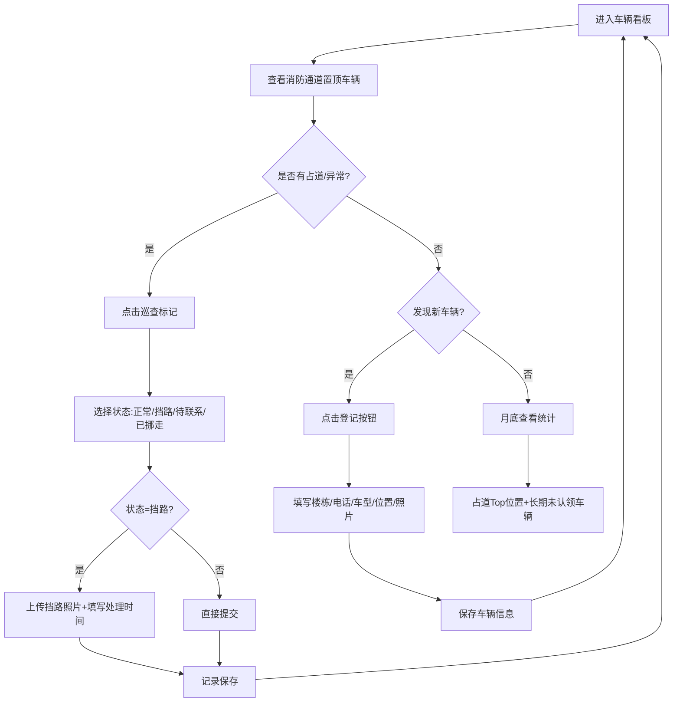

## 1. 产品概述

住宅小区楼下大厅婴儿车随意停放问题管理系统，解决婴儿车归属不清、占用消防通道、无人认领等问题。
- 面向物业管理人员，通过数字化方式登记、巡查、统计婴儿车停放情况
- 提升物业巡查效率，明确消防通道占道责任，实现月底数据复盘

## 2. 核心功能

### 2.1 用户角色

| 角色 | 说明 | 核心权限 |
|------|------|----------|
| 物业管理员 | 系统唯一使用者 | 车辆登记、巡查标记、看板筛选、月度统计 |

### 2.2 功能模块

1. **车辆看板页**：车辆列表、楼栋/位置筛选、消防通道优先排序
2. **车辆登记/详情**：新建/编辑车辆信息（楼栋、电话、车型颜色、停放位置、长期停放标记、照片）
3. **巡查标记**：标记车辆状态（正常、挡路、待联系、已挪走），挡路需上传照片与处理时间
4. **月度统计**：占道次数 Top 位置排行、长期无人认领车辆列表

### 2.3 页面详情

| 页面名称 | 模块名称 | 功能描述 |
|----------|----------|----------|
| 车辆看板 | 顶部筛选栏 | 楼栋下拉选择、停放位置下拉选择、状态标签筛选 |
| 车辆看板 | 车辆卡片列表 | 照片缩略图、楼栋房号、状态徽章（消防通道车辆红色高亮置顶）、快捷巡查按钮 |
| 车辆登记/编辑 | 表单区域 | 楼栋房号输入、车主电话、车型颜色、停放位置选择、是否长期停放开关、照片上传 |
| 车辆详情 | 信息面板 | 完整信息展示、历史巡查记录时间线 |
| 巡查弹窗 | 状态选择 | 4种状态单选，选择"挡路"时强制展开照片上传与处理时间输入 |
| 月度统计 | 占道排行 | 柱状图展示各位置占道次数，Top3 高亮 |
| 月度统计 | 长期未认领 | 超过30天无更新的车辆卡片列表，支持一键联系标记 |

## 3. 核心流程

物业管理员登录系统后，首先通过车辆看板查看当前停放概况，消防通道附近车辆优先显示便于快速处理。发现新车辆时点击登记按钮录入信息。日常巡查时点击车辆卡片上的快捷标记按钮选择状态，如选择"挡路"则强制上传现场照片并记录处理时间。月底进入统计页面查看占道热点位置与长期未认领车辆，针对性制定管理措施。

## 4. 用户界面设计

### 4.1 设计风格
- **主色调**：深青蓝（#0F766E）作为信任与管理主题色
- **警示色**：火橙红（#DC2626）用于消防通道、挡路状态
- **辅助色**：琥珀黄（#D97706）用于待联系状态，翡翠绿（#059669）用于正常/已挪走
- **按钮风格**：圆角12px，悬停微上浮阴影，按下回缩
- **字体**：系统中文字体优先（PingFang SC / HarmonyOS Sans），标题加粗700，正文常规400
- **布局风格**：卡片栅格布局 + 顶部固定筛选栏，卡片悬浮阴影+微边框
- **图标风格**：Lucide 线性图标，统一 18px 尺寸

### 4.2 页面设计概述

| 页面名称 | 模块名称 | UI 元素 |
|----------|----------|----------|
| 车辆看板 | 顶部栏 | 标题「大厅婴儿车管理」，右上角月度统计入口，下方筛选器横排 |
| 车辆看板 | 消防通道警示条 | 固定顶部橙色横幅，显示当前消防通道停放车辆数量 |
| 车辆看板 | 卡片网格 | 3列响应式栅格，消防通道车辆红色左边框置顶，其余按更新时间排序 |
| 车辆看板 | 悬浮添加按钮 | 右下圆形深青蓝按钮，悬停展开文字"登记新车" |
| 车辆详情 | 顶部照片轮播 | 车辆照片大图展示，下方基本信息网格 |
| 车辆详情 | 巡查记录时间线 | 左侧彩色竖线 + 状态圆点，右侧记录内容、照片缩略图、时间 |
| 巡查弹窗 | 状态选择器 | 4个大按钮横向排列，选中时背景填充对应状态色 |
| 月度统计 | 位置占道排行 | 横向柱状图，位置名左侧，次数右侧，Top3 前加奖牌图标 |
| 月度统计 | 长期未认领 | 灰底警示卡片，显示最后更新天数，突出联系按钮 |

### 4.3 响应式
桌面端优先设计（3列卡片栅格），平板端自动变为2列，移动端单列堆叠。筛选栏在移动端改为垂直折叠面板。

### 4.4 动效设计
- 页面加载时卡片从上到下错落渐入（stagger 80ms）
- 状态标记成功后卡片边框闪烁对应颜色 1.2s
- 统计图表柱形从 0 高度向上生长动画
- 悬停卡片时轻微放大 1.02 倍 + 阴影加深
