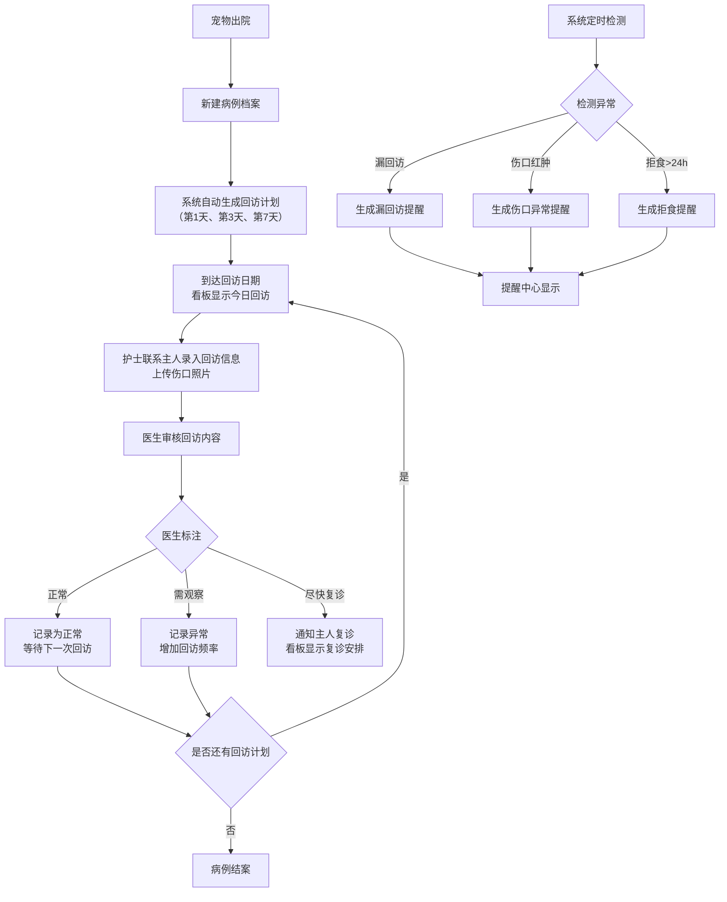

## 1. 产品概述

宠物医院术后回访系统，用于管理宠物绝育、拔牙、清创等手术后的回访跟踪工作，解决主人回家后护理情况不跟进导致病情复发的问题。

- 目标用户：宠物医院医生、护士、前台工作人员
- 核心价值：系统化术后回访流程，降低复发率，提升医院服务质量和宠物治愈率

## 2. 核心功能

### 2.1 用户角色

| 角色 | 登录方式 | 核心权限 |
|------|----------|----------|
| 医生 | 账号密码登录 | 病例管理、回访标注、查看全部数据、异常处理 |
| 护士 | 账号密码登录 | 回访登记、上传照片、记录回访信息、提醒跟进 |
| 前台 | 账号密码登录 | 病例录入、查看看板、提醒通知 |

### 2.2 功能模块

1. **看板首页**：今日回访、异常病例、未回复主人、复诊安排
2. **病例档案管理**：新建/编辑病例、查看病例详情、照片管理
3. **回访管理**：回访计划自动生成、回访记录录入、医生标注
4. **提醒系统**：漏回访提醒、异常指标提醒、复诊提醒

### 2.3 页面详情

| 页面名称 | 模块名称 | 功能描述 |
|----------|----------|----------|
| 看板首页 | 今日回访 | 展示当天需要回访的病例列表，显示宠物名、主人、手术类型、回访天数，支持快速跳转回访 |
| 看板首页 | 异常病例 | 展示标注为"需观察"或"尽快复诊"的病例，显示异常原因和最新状态 |
| 看板首页 | 未回复主人 | 展示已发起回访但主人未回复的病例列表，支持快捷提醒 |
| 看板首页 | 复诊安排 | 展示近期需要复诊的病例，按日期排序 |
| 看板首页 | 统计卡片 | 显示本月回访总数、异常率、完成率等关键指标 |
| 病例档案页 | 病例列表 | 支持搜索、筛选（按手术类型、医生、出院日期），分页展示 |
| 病例档案页 | 新建病例 | 录入宠物名、主人姓名及联系方式、手术类型、主治医生、麻醉方式、出院日期、术前/术后照片 |
| 病例档案页 | 病例详情 | 展示完整病例信息、回访计划时间轴、历次回访记录、照片画廊 |
| 回访记录页 | 回访表单 | 记录食欲、精神状态、伤口照片、用药情况、排便情况、异常描述 |
| 回访记录页 | 医生标注 | 医生对回访内容进行"正常/需观察/尽快复诊"三级标注，可添加备注 |
| 提醒中心 | 提醒列表 | 展示所有系统生成的提醒，包括漏回访、伤口红肿、拒食超过24小时等 |
| 提醒中心 | 提醒处理 | 标记已读、处理、忽略等操作 |

## 3. 核心流程

## 4. 用户界面设计

### 4.1 设计风格

- **主色调**：医疗行业特有的蓝绿色系，传递专业、安心、健康的感受
  - 主色：青绿色 #0EA5A7（专业、洁净）
  - 辅助色：柔和橙色 #F59E0B（温暖、关注）、红色 #EF4444（紧急、异常）
  - 中性色：深灰 #1F2937、中灰 #6B7280、浅灰 #F3F4F6、白色 #FFFFFF
- **按钮风格**：圆角 8px，悬停时有轻微上浮和阴影变化
- **字体**：标题使用思源黑体（Source Han Sans）Bold，正文使用思源黑体 Regular
- **布局风格**：卡片式布局 + 左侧导航，强调信息层次和数据可视化
- **图标风格**：简洁线性图标，统一 2px 线宽

### 4.2 页面设计概览

| 页面名称 | 模块名称 | UI 元素 |
|----------|----------|---------|
| 看板首页 | 顶部导航 | Logo、用户头像、消息铃铛（红点提醒）、退出登录 |
| 看板首页 | 统计卡片区 | 4 个统计卡片，带数据指标和趋势小箭头 |
| 看板首页 | 四象限看板 | 四个卡片并列：今日回访、异常病例、未回复主人、复诊安排，每个卡片带"查看全部"按钮 |
| 病例档案页 | 顶部工具栏 | 搜索框、筛选下拉（手术类型/医生/日期范围）、新建病例按钮 |
| 病例档案页 | 病例列表 | 表格展示，支持排序，行悬停高亮，点击进入详情 |
| 病例档案页 | 新建病例弹窗 | 表单分组：基本信息、手术信息、照片上传 |
| 病例详情页 | 顶部信息栏 | 宠物头像、基本信息摘要、状态标签 |
| 病例详情页 | 时间轴 | 竖向时间轴展示回访计划和已完成回访 |
| 病例详情页 | 照片画廊 | 网格展示历次伤口照片，点击放大查看 |
| 回访记录页 | 表单区域 | 分组展示各项指标录入，星级评分选择食欲/精神状态 |
| 回访记录页 | 标注区域 | 三个状态大按钮，医生选择后可填写备注 |
| 提醒中心 | 提醒列表 | 按紧急程度排序，不同类型不同颜色标签 |

### 4.3 响应式设计

- 桌面端优先设计（1280px 及以上）
- 平板端（768px - 1279px）：四象限改为 2x2 布局
- 移动端（< 768px）：导航改为底部 Tab，列表简化展示核心信息

### 4.4 动效设计

- 页面加载：顶部进度条 + 内容区域淡入（200ms）
- 卡片悬停：轻微上移 2px + 阴影加深（150ms 过渡）
- 状态标签：从左到右滑入显示（200ms）
- 提醒通知：右上角滑入（300ms），5 秒后自动消失
- 照片上传：上传中显示进度条，完成后缩略图淡入
