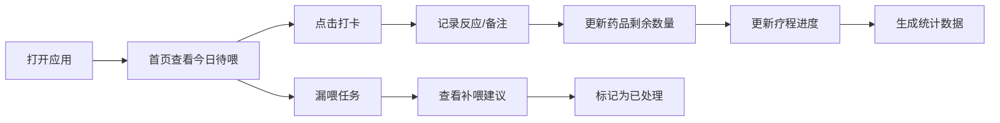

# 宠物喂药日历 - 产品需求文档

## 1. 产品概述

宠物喂药日历是一款帮助宠物主人管理宠物用药计划的工具应用，解决宠物用药容易遗漏、记不清剂量和疗程的痛点。面向有多只宠物、需要长期或短期喂药的养宠家庭，提供系统化的喂药提醒和记录功能。

## 2. 核心功能

### 2.1 用户角色
| 角色 | 注册方式 | 核心权限 |
|------|----------|----------|
| 宠物主人 | 本地应用（无需注册） | 管理宠物档案、药品记录、喂药打卡、查看统计 |

### 2.2 功能模块
1. **首页仪表盘**：今日待喂、已喂、漏喂、快停药概览，快捷打卡
2. **宠物管理**：添加/编辑宠物档案（品种、体重、过敏史、常去医院、照片）
3. **药品管理**：添加/编辑药品记录（药名、剂量、频次、疗程、饭前饭后、剩余数量、医生备注）
4. **喂药记录**：打卡标记、记录不良反应、漏喂补喂建议
5. **统计分析**：疗程完成率、漏喂次数、宠物用药排行

### 2.3 页面详情
| 页面名称 | 模块名称 | 功能描述 |
|----------|----------|----------|
| 首页 | 今日概览卡片 | 展示待喂、已喂、漏喂数量，快停药提醒 |
| 首页 | 今日喂药列表 | 按时间展示今日所有喂药任务，支持打卡 |
| 首页 | 快捷操作 | 快速打卡，记录反应（呕吐/精神差/食欲好等） |
| 宠物管理 | 宠物列表 | 展示所有宠物卡片，显示头像和基本信息 |
| 宠物管理 | 宠物表单 | 添加/编辑宠物：名字、品种、体重、过敏史、常去医院、照片 |
| 药品管理 | 药品列表 | 按宠物分组展示所有药品及疗程进度 |
| 药品管理 | 药品表单 | 添加/编辑药品：药名、剂量、频次、疗程、饭前饭后、剩余数量、医生备注 |
| 喂药详情 | 打卡弹窗 | 确认喂药、选择反应、补充备注 |
| 喂药详情 | 漏喂处理 | 显示漏喂记录、给出补喂建议（禁止修改剂量） |
| 统计页 | 疗程完成率 | 各药品疗程完成百分比可视化 |
| 统计页 | 漏喂统计 | 总漏喂次数、按宠物/药品分类统计 |
| 统计页 | 用药排行 | 哪只宠物用药最多、用药种类统计 |

## 3. 核心流程

用户打开应用后，在首页查看今日待喂任务 → 点击打卡按钮确认喂药 → 记录宠物反应 → 系统自动更新药品剩余数量和疗程进度。

## 4. 用户界面设计

### 4.1 设计风格
- **主色调**：温暖的珊瑚橙（#FF6B6B）作为主色，搭配薄荷绿（#4ECDC4）作为成功色，体现宠物主题的温馨活力
- **辅助色**：奶油白背景（#FFF9F0），柔和的棕褐色文字
- **按钮风格**：圆角胶囊形按钮，带有轻微阴影和按压效果
- **字体**：圆润友好的无衬线字体，标题使用稍粗字重
- **布局风格**：卡片式布局，柔和圆角，适度阴影，温暖舒适的视觉感受
- **图标风格**：可爱线条风图标，使用 paw/medicine/syringe 等宠物医疗相关元素

### 4.2 页面设计概览
| 页面名称 | 模块名称 | UI 元素 |
|----------|----------|---------|
| 首页 | 今日概览 | 四个状态卡片（待喂/已喂/漏喂/快停药），彩色背景，图标+数字 |
| 首页 | 喂药列表 | 时间线式布局，每条任务含宠物头像、药名、剂量、打卡按钮 |
| 宠物管理 | 宠物卡片 | 头像、名字、品种标签、体重、编辑/删除按钮 |
| 药品管理 | 药品卡片 | 药名、剂量、频次、疗程进度条、剩余数量 |
| 统计页 | 数据可视化 | 环形进度图、柱状图、排行榜 |

### 4.3 响应式
- 桌面端优先设计，支持平板和移动端自适应
- 移动端采用底部导航栏，桌面端采用侧边导航
- 卡片布局在小屏幕下自动堆叠为单列

### 4.4 动效与交互
- 打卡成功有弹跳动效和轻微的庆祝动画
- 卡片悬浮有微妙上浮效果
- 页面切换使用淡入淡出过渡
- 进度条变化有平滑动画
