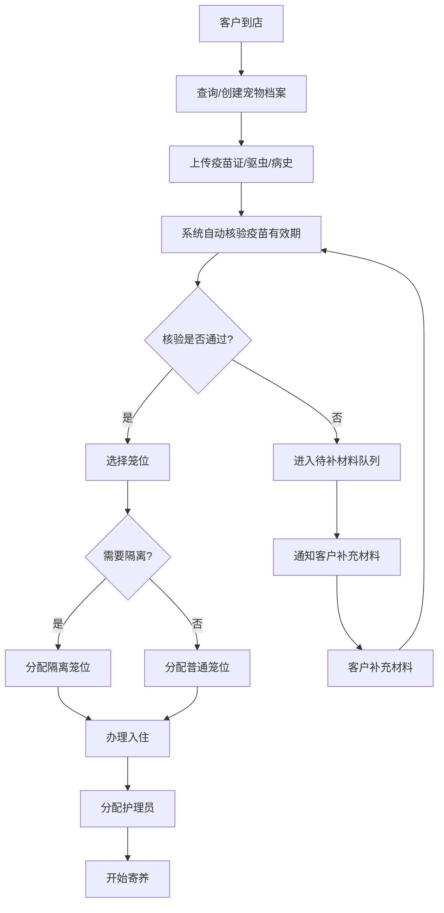

## 1. 产品概述

宠物寄养疫苗证核验系统是一套面向宠物寄养机构的全流程管理系统，解决寄养前疫苗核验不规范、寄养中记录不完整、寄养后追溯困难等痛点问题。通过标准化的疫苗核验流程，确保入住宠物的健康安全，降低寄养机构的运营风险。

- 主要目的：建立标准化的宠物寄养准入机制，强制核验疫苗有效期，实现寄养全过程可追溯
- 解决问题：疫苗证人工核验疏漏、材料缺失无法入住、寄养期间状态记录不全、高风险宠物识别不及时
- 目标用户：宠物寄养机构管理员、前台接待人员、护理人员
- 市场价值：提升寄养机构专业形象、降低运营风险、保障宠物健康安全、提高管理效率

## 2. 核心功能

### 2.1 用户角色

| 角色 | 注册方式 | 核心权限 |
|------|----------|----------|
| 管理员 | 系统预置 | 全部功能权限、系统配置、数据导出 |
| 前台 | 管理员创建 | 宠物档案管理、入住办理、材料核验、退房结算 |
| 护理员 | 管理员创建 | 寄养日常记录、状态上报、异常拍照 |

### 2.2 功能模块

1. **数据看板**：今日入住退房概览、疫苗临期提醒、材料缺失清单、隔离笼位状态、高风险宠物预警
2. **宠物档案管理**：宠物基础信息录入、主人联系方式、照片上传、历史寄养记录
3. **疫苗核验系统**：疫苗证上传、驱虫记录、病史登记、狂犬/联苗/猫三联/犬四联有效期自动校验
4. **寄养流程管理**：入住申请、材料审核、笼位分配、待补材料队列、隔离管理
5. **寄养日常记录**：喂食记录、排便记录、精神状态、异常照片上传
6. **系统设置**：笼位配置、疫苗类型管理、有效期规则配置

### 2.3 页面详情

| 页面名称 | 模块名称 | 功能描述 |
|----------|----------|----------|
| 数据看板 | 统计卡片 | 今日入住/退房数量、在住宠物数、待补材料数、隔离宠物数 |
| 数据看板 | 疫苗临期 | 列表展示30天内疫苗到期的宠物，包含疫苗类型、到期日期、预警等级 |
| 数据看板 | 材料缺失 | 列表展示材料不完整无法入住的宠物，包含缺失材料类型、提交时间 |
| 数据看板 | 笼位状态 | 可视化展示所有笼位使用状态，标注隔离笼位、高风险笼位 |
| 数据看板 | 高风险提醒 | 展示需要重点关注的宠物（老年、病史、特殊需求） |
| 宠物档案列表 | 搜索筛选 | 按宠物名、主人名、品种、状态筛选 |
| 宠物档案列表 | 档案卡片 | 展示宠物照片、基础信息、疫苗状态标签 |
| 宠物档案详情 | 基础信息 | 名字、品种、年龄、体重、性格、绝育情况、主人联系方式 |
| 宠物档案详情 | 疫苗记录 | 狂犬、联苗、猫三联/犬四联、驱虫等记录及有效期 |
| 宠物档案详情 | 病史记录 | 既往病史、过敏史、特殊护理要求 |
| 宠物档案详情 | 寄养历史 | 历次寄养记录、入住退房时间、备注 |
| 疫苗核验 | 材料上传 | 疫苗证照片、驱虫记录、病史证明上传 |
| 疫苗核验 | 自动校验 | 系统自动检查各疫苗是否在有效期，生成核验报告 |
| 疫苗核验 | 人工审核 | 管理员人工复核，标注核验结果和备注 |
| 寄养办理 | 入住申请 | 选择宠物、入住日期、退房日期、笼位选择 |
| 寄养办理 | 核验检查 | 入住前自动检查疫苗状态，未通过拦截并引导补充材料 |
| 寄养办理 | 待补材料 | 材料缺失宠物队列，补充后重新发起核验 |
| 寄养记录 | 日常记录 | 喂食情况、排便情况、精神状态、饮水量、运动量 |
| 寄养记录 | 异常记录 | 异常情况描述、照片上传、处理措施 |
| 寄养记录 | 记录日历 | 按日期查看每日记录，缺失记录提醒 |
| 系统设置 | 笼位管理 | 笼位编号、类型（普通/隔离）、容纳宠物类型 |
| 系统设置 | 疫苗配置 | 疫苗类型、有效期、必填项配置 |

## 3. 核心流程

### 3.1 宠物入住流程

1. 前台接待客户，查询或创建宠物档案
2. 上传疫苗证、驱虫记录、病史材料
3. 系统自动核验狂犬疫苗、联苗（猫三联/犬四联）有效期
4. 核验通过 → 选择笼位 → 办理入住 → 分配护理员
5. 核验不通过 → 进入待补材料队列 → 通知客户补充材料 → 补充后重新核验
6. 核验通过但有特殊情况 → 分配隔离笼位 → 标注高风险

### 3.2 寄养日常记录流程

1. 护理员登录系统，查看今日待记录宠物列表
2. 选择宠物，记录喂食、排便、精神状态
3. 如有异常，填写异常描述并上传照片
4. 系统自动检查当日记录完整性
5. 异常记录自动触发高风险提醒，推送至管理员

### 3.3 宠物退房流程

1. 到期前1天系统自动提醒
2. 退房日核对寄养记录，确认无异常
3. 生成寄养报告（含每日记录、照片）
4. 办理退房，释放笼位
5. 发送报告给主人

## 4. 用户界面设计

### 4.1 设计风格

- **设计方向**：专业医疗感 + 温暖关怀感，采用"医疗白 + 治愈蓝 + 活力橙"配色体系
- **主色调**：#165DFF（专业蓝）- 代表专业、信任、医疗属性
- **辅助色**：#FF7D00（活力橙）- 用于高风险提醒、重要操作
- **成功色**：#00B42A（健康绿）- 疫苗有效、状态正常
- **警告色**：#FF7D00（警告橙）- 疫苗临期、材料缺失
- **危险色**：#F53F3F（危险红）- 疫苗过期、异常紧急
- **中性色**：#1D2129 / #4E5969 / #86909C / #C9CDD4 / #F2F3F5 / #FFFFFF
- **按钮风格**：圆角8px，悬浮有阴影动效，主按钮使用主色填充，次按钮使用描边
- **字体**：Noto Sans SC - 清晰易读的中文字体，标题加粗，正文常规
- **布局风格**：卡片式布局，分区明确，重要信息突出展示，数据可视化清晰
- **图标风格**：Lucide图标库，线性风格，统一24px尺寸，颜色与语义匹配

### 4.2 页面设计概述

| 页面名称 | 模块名称 | UI Elements |
|----------|----------|-------------|
| 数据看板 | 顶部统计 | 5张圆角卡片，左侧图标，右侧数字，底部环比箭头，不同状态使用不同主色调 |
| 数据看板 | 疫苗临期 | 表格+标签，30天内黄色，7天内橙色，过期红色，倒计时天数醒目 |
| 数据看板 | 笼位状态 | 网格化布局，每个笼位为卡片，不同状态不同边框色，悬浮显示详情 |
| 数据看板 | 高风险提醒 | 左侧红色竖条标识，宠物头像+名称+风险原因，右侧紧急操作按钮 |
| 宠物档案 | 列表页 | 左侧筛选面板，右侧卡片网格，每张卡片含宠物照片、基础信息、疫苗状态标签 |
| 宠物档案 | 详情页 | 左右分栏，左侧宠物照片+基础信息卡片，右侧Tab切换（疫苗/病史/寄养历史） |
| 疫苗核验 | 核验页 | 三列布局：左侧材料上传区、中间自动校验结果、右侧人工审核区 |
| 疫苗核验 | 核验报告 | 逐条展示疫苗类型、接种日期、有效期、核验状态（✅有效/⚠️临期/❌过期） |
| 寄养办理 | 入住页 | 分步引导（选择宠物→核验→选择笼位→确认），顶部进度条 |
| 寄养记录 | 记录页 | 左侧宠物列表，右侧日历+记录表单，快速录入，支持拍照上传 |
| 系统设置 | 配置页 | 左侧菜单导航，右侧表单配置，支持实时预览效果 |

### 4.3 响应式

- **桌面优先**：以1440px为基准设计，适配1280px-1920px屏幕
- **平板适配**：≥768px，侧边栏可收起，卡片两列布局
- **移动适配**：<768px，底部导航栏，卡片单列布局，表单优化为移动端样式
- **触控优化**：按钮最小44px点击区域，重要操作二次确认，支持下拉刷新

### 4.4 交互与动效

- **页面加载**：骨架屏占位，内容渐入，数据从左到右、从上到下依次呈现
- **卡片悬浮**：translateY(-2px)，box-shadow加深，过渡0.2s ease
- **按钮点击**：scale(0.98)，背景色加深，过渡0.15s
- **状态切换**：疫苗核验通过时的绿色勾号动画，异常时的红色闪烁提醒
- **通知推送**：右上角滑入通知，3秒后自动消失，重要通知需手动关闭
- **表格排序**：点击表头，数据平滑重新排列
- **模态框**：背景模糊+缩放进入，关闭时缩放淡出
