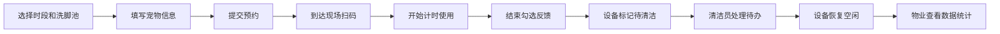

## 1. 产品概述

小区宠物洗脚排队管理系统，解决雨天狗狗进楼前洗脚时水池被占、排队混乱的问题。系统覆盖居民预约排队、扫码使用、清洁员运维、物业数据统计全流程，提升社区宠物服务的效率与体验。

- 目标用户：小区养宠居民、清洁运维人员、物业管理方
- 产品价值：规范宠物洗脚秩序、减少等待时间、提升清洁效率、辅助物业决策

## 2. 核心功能

### 2.1 用户角色

| 角色 | 登录方式 | 核心权限 |
|------|----------|----------|
| 居民用户 | 手机号验证 | 预约时段、选择洗脚池、扫码开始计时、结束反馈 |
| 清洁员 | 工号登录 | 查看待办任务、处理地垫/排水口/消毒液、更新设备状态 |
| 物业管理员 | 账号登录 | 查看数据统计、管理设备、监控使用情况 |

### 2.2 功能模块

1. **居民首页**：洗脚池状态总览、时段选择、我的预约
2. **预约页面**：选择时段和洗脚池、填写宠物信息
3. **使用中页面**：扫码开始、计时显示、结束反馈表单
4. **清洁员待办页**：任务列表、状态更新、设备维护
5. **物业数据看板**：高峰时段、爽约统计、超时占用、楼栋使用排行

### 2.3 页面详情

| 页面名称 | 模块名称 | 功能描述 |
|----------|----------|----------|
| 居民首页 | 洗脚池状态卡片 | 实时展示各洗脚池状态（空闲/占用/待清洁/暂停/维修） |
| 居民首页 | 时段选择器 | 展示今日可用时段及剩余名额 |
| 居民首页 | 我的预约 | 展示当前及历史预约记录 |
| 预约页面 | 时段选择 | 选择具体日期和时间段 |
| 预约页面 | 洗脚池选择 | 查看可用洗脚池并选择 |
| 预约页面 | 宠物信息表单 | 昵称、体型、楼栋、主人电话、怕不怕水 |
| 使用中页面 | 扫码启动 | 扫描设备二维码开始计时 |
| 使用中页面 | 计时器 | 实时显示使用时长和超时提醒 |
| 使用中页面 | 结束反馈 | 勾选是否打翻水、地面是否要拖、有没有用消毒液 |
| 清洁员待办页 | 待办任务列表 | 地垫更换、排水口清理、消毒液补充 |
| 清洁员待办页 | 状态更新 | 标记任务完成、更新设备状态为空闲 |
| 清洁员待办页 | 设备管理 | 标记设备暂停使用或维修中 |
| 物业数据看板 | 高峰时段图表 | 按小时展示使用热力图 |
| 物业数据看板 | 爽约统计 | 展示爽约率和爽约用户 |
| 物业数据看板 | 超时占用 | 统计超时次数和时长 |
| 物业数据看板 | 楼栋使用排行 | 各楼栋使用次数排名 |

## 3. 核心流程

居民选择时段和洗脚池 → 填写宠物信息提交预约 → 到达现场扫码开始计时 → 使用结束勾选反馈项 → 系统标记设备待清洁 → 清洁员接收待办处理 → 设备恢复可用状态 → 物业查看数据统计

## 4. 用户界面设计

### 4.1 设计风格
- **主色调**：清新蓝绿色系（#0D9488 青色为主色），体现清洁卫生的感觉
- **辅助色**：橙色（#F97316）用于提醒和强调，绿色（#22C55E）表示空闲可用，红色（#EF4444）表示占用/维修
- **按钮风格**：圆角胶囊型按钮，带微妙渐变和阴影
- **字体**：Noto Sans SC 作为主要字体，标题使用稍粗字重
- **布局风格**：卡片式布局，顶部导航栏，底部标签栏切换角色视图
- **图标/emoji 风格**：使用 Lucide 图标库，搭配狗狗脚印、水滴等具象 emoji

### 4.2 页面设计概述

| 页面名称 | 模块名称 | UI 元素 |
|----------|----------|---------|
| 居民首页 | 状态卡片 | 不同颜色状态标签、水池图标、状态文字、悬停微动效 |
| 居民首页 | 时段选择 | 横向时间轴卡片，可用/已满状态区分 |
| 预约页面 | 宠物表单 | 分组标签输入、单选按钮组、楼栋下拉选择 |
| 使用中页面 | 计时器 | 大号数字显示、进度圆环、超时闪烁提醒 |
| 清洁员待办页 | 任务列表 | 卡片式任务、优先级标签、完成按钮、下拉操作 |
| 物业数据看板 | 数据图表 | 柱状图、折线图、饼图、数据卡片配数字动效 |

### 4.3 响应式设计
- 移动端优先设计，完美适配手机屏幕
- 触摸操作优化，按钮最小触控区域 44×44px
- 物业看板支持平板和桌面端大屏展示
