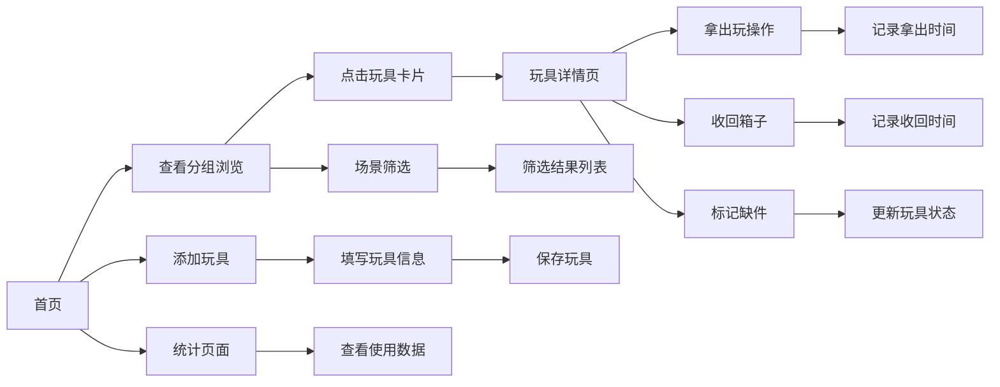

## 1. 产品概述

家庭旧玩具轮换箱是一款帮助家长管理孩子玩具的应用。解决玩具太多记不住、轮换混乱的问题，让玩具管理更轻松有序。

- 主要用途：登记管理家庭玩具、记录玩具轮换、追踪玩具备注信息、筛选适合场景、统计玩具使用情况
- 目标用户：有孩子的家庭，尤其是玩具数量较多需要轮换管理的家长

## 2. 核心功能

### 2.1 用户角色

| 角色 | 注册方式 | 核心权限 |
|------|----------|----------|
| 家庭用户 | 本地存储本地使用，无需注册 | 玩具增删改查、轮换记录、统计查看 |

### 2.2 功能模块

1. **首页**：玩具分组展示（正在玩、收纳中、该清洗、准备送人）、快速筛选（雨天/亲子/安静游戏）、安全提醒
2. **玩具详情页**：玩具基本信息展示、轮换历史记录、状态操作按钮
3. **添加/编辑玩具页**：玩具信息表单（名称、适合年龄、类型、小零件、购买日期、所在箱子、照片、场景标签）
4. **统计页**：最常玩玩具排行、长期未碰玩具、送出玩具数量统计
5. **筛选功能**：按场景标签筛选玩具

### 2.3 页面详情

| 页面名称 | 模块名称 | 功能描述 |
|----------|----------|----------|
| 首页 | 状态分组卡片 | 四个分组卡片展示不同状态的玩具数量和缩略图 |
| 首页 | 安全提醒条 | 顶部提醒小龄孩子避免接触小零件玩具 |
| 首页 | 场景筛选标签 | 雨天、亲子、安静游戏快速筛选 |
| 首页 | 玩具卡片列表 | 按当前筛选结果展示 |
| 玩具详情页 | 玩具信息区 | 照片、名称、年龄、类型、小零件、箱子位置、购买日期 |
| 玩具详情页 | 轮换历史 | 拿出/收回时间记录 |
| 玩具详情页 | 操作按钮 | 拿出玩、收回箱子、标记缺件、准备送  |
| 添加/编辑页 | 表单区域 | 玩具信息表单填写 |
| 添加/编辑页 | 照片上传 | 玩具照片上传/预览 |
| 统计页 | 最常玩排行 | 按玩耍次数排行 |
| 统计页 | 长期闲置 | 超过30天未玩的玩具 |
| 统计页 | 送出统计 | 已送出玩具数量和列表 |

## 3. 核心流程

用户打开应用首页查看分组玩具 → 点击玩具查看详情 → 进行轮换操作（拿出/收回）

## 4. 用户界面设计

### 4.1 设计风格

- 主色调：温暖的橙黄色系（#FF8C42）搭配柔和的薄荷绿（#88D8B5）
- 辅助色：天空蓝（#7EC8E3）、樱花粉（#FFB6C1）
- 按钮风格：圆角大按钮，柔和阴影，点击有微动效
- 字体：圆润可爱的字体风格，标题使用圆润无衬线字体
- 布局风格：卡片式布局，圆角卡片，柔和阴影，留白充足
- 图标风格：彩色可爱风图标，使用 emoji 风格统一

### 4.2 页面设计概览

| 页面名称 | 模块名称 | UI 元素 |
|----------|----------|---------|
| 首页 | 顶部安全提醒 | 浅红色背景，警示图标，提醒文字 |
| 首页 | 状态分组卡片 | 四列卡片，图标+数字+名称 |
| 首页 | 场景筛选标签 | 横向滚动标签，选中高亮 |
| 首页 | 玩具卡片 | 图片+名称+状态标签 |
| 玩具详情页 | 顶部照片区 | 大图片轮播/单图 |
| 玩具详情页 | 信息标签 | 彩色标签展示属性 |
| 玩具详情页 | 轮换时间线 | 时间轴样式展示历史 |
| 添加页 | 表单输入 | 圆角输入框，标签在上 |
| 统计页 | 数据卡片 | 大数字+趋势图标 |
| 统计页 | 排行列表 | 排名序号+玩具名+次数 |

### 4.3 响应式

- 设计优先移动端适配，触摸优化，支持手机和平板都能良好显示。

### 4.4 动画与动效

- 页面切换：淡入淡出过渡
- 卡片悬停：轻微上浮+阴影加深
- 按钮点击：缩放反馈
- 状态切换：平滑过渡动画
- 数据加载：骨架屏占位
