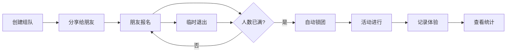

## 1. 产品概述
密室逃脱组队平台，帮助用户组织朋友一起玩密室逃脱，明确主题类型（恐怖本/推理本/机关本），管理报名、成团、体验记录和数据统计。
- 解决朋友间密室组队信息不透明、报名混乱、体验反馈无处记录的问题
- 目标用户：喜欢密室逃脱的年轻人、朋友聚会组织者

## 2. 核心功能

### 2.1 用户角色
| 角色 | 注册方式 | 核心权限 |
|------|----------|----------|
| 普通用户 | 本地存储模拟 | 创建组队、报名参与、记录体验、查看统计 |

### 2.2 功能模块
1. **首页**：组队列表（按缺人/快开场/已成团分组）、快速创建入口、安全提示
2. **创建组队页**：店铺、主题、人数、价格、时长、难度、恐怖程度、可选时间
3. **组队详情页**：报名表单、成员列表、成团状态、安全提示、退出功能
4. **体验记录页**：体验评分、谁最会解谜、是否有隐藏消费
5. **统计页**：大家最喜欢的主题、成团率统计

### 2.3 页面详情
| 页面名称 | 模块名称 | 功能描述 |
|----------|----------|----------|
| 首页 | 分组列表 | 按缺几人、快开场、已成团三个分组展示组队卡片 |
| 首页 | 安全提示横幅 | 孕妇不适合、胆小慎选、迟到不能进场等限制提醒 |
| 创建组队页 | 表单模块 | 店铺名称、主题名称、主题类型、总人数、人均价格、时长、难度、恐怖程度、可选时间 |
| 组队详情页 | 成员列表 | 显示已报名成员及其偏好信息 |
| 组队详情页 | 报名表单 | 能否接受恐怖、是否晕暗、擅长解谜/搜证、预算上限 |
| 组队详情页 | 成团状态 | 人数满自动锁团，显示成团状态，支持临时退出 |
| 体验记录页 | 反馈表单 | 体验评分(1-5星)、解谜MVP成员、隐藏消费备注 |
| 统计页 | 主题排行 | 按参与次数统计最受欢迎主题 |
| 统计页 | 成团率统计 | 展示成团率、平均参与人数等数据 |

## 3. 核心流程
用户创建组队 → 朋友查看并报名 → 人数满自动锁团 → 活动结束后记录体验 → 查看统计数据

## 4. 用户界面设计

### 4.1 设计风格
- 主色：深酒红 #8B0000、暗黑 #1a1a2e
- 辅色：金色 #d4af37、米白 #f5f5dc
- 按钮风格：圆角矩形，带有微弱光晕效果
- 字体：Cinzel（标题，复古神秘）、Noto Serif SC（正文，宋体）
- 布局风格：卡片式布局，深色背景带纹理
- 图标/emoji：🔐 🕯️ 👻 🧩 🔍 等密室相关元素

### 4.2 页面设计概览
| 页面名称 | 模块名称 | UI 元素 |
|----------|----------|---------|
| 首页 | 分组列表 | 暗黑卡片、分组标题带装饰线、悬停微光效果、入场渐入动画 |
| 创建组队页 | 表单模块 | 深色表单控件、金色边框聚焦效果、标签式选择器 |
| 组队详情页 | 成员列表 | 成员头像卡片、状态徽章（已锁团/缺X人）、报名按钮发光动效 |
| 统计页 | 数据图表 | 金色数据柱状图、卡片式数据展示、动画计数效果 |

### 4.3 响应式
桌面端优先布局，移动端自适应单列显示，触摸区域优化
