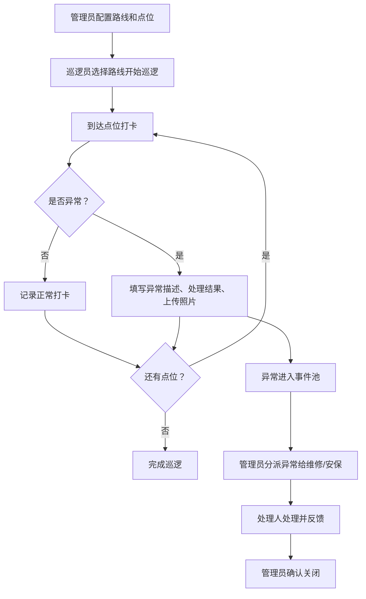

## 1. 产品概述

小区夜间巡逻管理系统，用于规范和监督小区保安夜间巡逻工作。解决"走一圈拍张照就算完"的问题，确保每个巡逻点位都被覆盖，异常事件得到及时处理。

- 目标用户：物业管理人员、巡逻保安、维修人员
- 核心价值：巡逻可追溯、异常可追踪、责任可落实

## 2. 核心功能

### 2.1 用户角色

| 角色 | 登录方式 | 核心权限 |
|------|----------|----------|
| 物业管理员 | 账号登录 | 配置巡逻路线/点位、查看统计、分派异常事件 |
| 巡逻员 | 账号登录 | 执行巡逻打卡、记录异常、上传照片 |
| 维修/安保复查人员 | 账号登录 | 查看分派的异常事件、处理并反馈结果 |

### 2.2 功能模块

1. **巡逻配置页**：管理巡逻路线、点位名称、风险等级、建议时间、现场照片
2. **巡逻打卡页**：选择路线、点位打卡、记录到达时间、异常描述、处理结果、照片
3. **异常事件页**：查看所有异常、分派给物业维修/安保复查、跟踪处理状态
4. **漏打卡页**：独立展示所有未按时打卡的点位
5. **统计分析页**：路线完成率、常出异常位置、巡逻员准点率

### 2.3 页面详情

| 页面名称 | 模块名称 | 功能描述 |
|----------|----------|----------|
| 巡逻配置页 | 路线列表 | 展示所有巡逻路线，支持增删改 |
| 巡逻配置页 | 点位管理 | 为每条路线配置点位：名称、风险等级、建议时间、现场照片 |
| 巡逻打卡页 | 路线选择 | 选择当前要执行的巡逻路线 |
| 巡逻打卡页 | 点位打卡 | 展示路线所有点位，打卡时记录到达时间、可填异常描述和处理结果、上传照片 |
| 巡逻打卡页 | 漏打卡标识 | 未打卡点位高亮显示，与已完成点位区分 |
| 异常事件页 | 异常列表 | 展示所有异常事件，按状态过滤 |
| 异常事件页 | 事件分派 | 将异常分派给物业维修或安保复查人员 |
| 漏打卡页 | 漏打卡列表 | 独立列出所有漏打卡点位，显示所属路线、计划时间、巡逻员 |
| 统计分析页 | 完成率概览 | 每条路线的完成率、总打卡次数、漏打卡次数 |
| 统计分析页 | 异常热点 | 常出异常的点位排名 |
| 统计分析页 | 巡逻员表现 | 每个巡逻员的准点率、完成路线数、异常处理数 |

## 3. 核心流程

### 3.1 巡逻配置流程
物业管理员创建巡逻路线 → 添加多个点位（名称、风险等级、建议时间、照片）→ 保存启用

### 3.2 巡逻打卡流程
巡逻员选择路线 → 按顺序到各点位 → 到达后打卡记录时间 → 如发现异常填写描述和处理结果并拍照 → 完成后提交

### 3.3 异常处理流程
异常上报 → 管理员查看 → 分派给维修/安保 → 处理人处理并反馈 → 管理员确认关闭

## 4. 用户界面设计

### 4.1 设计风格

- 主色：深蓝色 (#1e3a5f)，体现专业、可靠的安防氛围
- 辅色：警示橙 (#f97316) 用于异常、高风险提示；成功绿 (#10b981) 用于正常状态
- 按钮风格：圆角胶囊按钮，带微阴影，悬停有上浮效果
- 字体：思源黑体（Source Han Sans），正文 14px，标题 18-24px
- 布局风格：顶部导航 + 左侧菜单的后台管理布局，卡片式内容区
- 图标风格：Lucide 线性图标

### 4.2 页面设计概览

| 页面名称 | 模块名称 | UI元素 |
|----------|----------|--------|
| 巡逻配置页 | 路线卡片列表 | 卡片展示路线名、点位数、风险等级标签，悬停放大 |
| 巡逻配置页 | 点位编辑表单 | 模态框表单，含名称输入、风险等级下拉、时间选择、图片上传 |
| 巡逻打卡页 | 点位进度条 | 顶部进度条显示已打卡/总点位数 |
| 巡逻打卡页 | 点位卡片网格 | 未打卡灰色、已打卡绿色、漏打卡橙色边框脉冲动画 |
| 巡逻打卡页 | 打卡模态框 | 显示当前时间、异常描述文本框、处理结果下拉、拍照上传 |
| 异常事件页 | 事件列表 | 表格展示，状态标签彩色，分派按钮 |
| 漏打卡页 | 警示列表 | 橙色背景卡片，突出显示，含倒计时或延迟时间 |
| 统计分析页 | 数据仪表盘 | 卡片式KPI展示、柱状图、饼图、排名列表 |

### 4.3 响应式

- Desktop-first 设计，适配 1440px 及以上
- 平板端（768px+）：左侧菜单可折叠
- 移动端：顶部导航简化，内容区域单列堆叠
