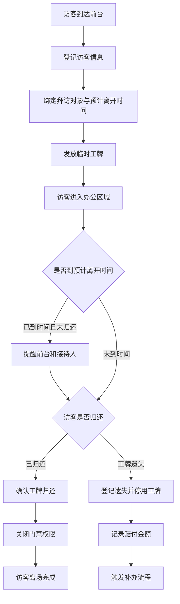

## 1. 产品概述

工牌回收看板是为企业前台设计的访客工牌管理系统，核心目标是让前台在下班前能一眼看出哪些工牌尚未归还，确保工牌管理的高效与安全。

- 主要解决访客工牌发放、回收、超时提醒、遗失处理全流程管理问题
- 目标用户为企业前台行政人员及访客接待人

## 2. 核心功能

### 2.1 用户角色

| 角色 | 核心权限 |
|------|----------|
| 前台管理员 | 工牌管理、访客登记、离场确认、遗失处理、查看看板全部数据 |
| 接待人 | 接收超时提醒、查看自己负责的访客信息 |

### 2.2 功能模块

1. **回收看板主页**：今日访客统计、未归还工牌实时展示、超时提醒、常用区域分布、平均停留时长
2. **工牌管理**：临时工牌的增删改查、启停状态、颜色/区域/押金配置
3. **访客登记**：进门绑定拜访对象、公司、手机号、预计离开时间、发牌
4. **离场流程**：归还工牌 → 确认门禁权限关闭
5. **超时与遗失处理**：超时自动提醒前台和接待人、遗失登记/停用/赔付/补办

### 2.3 页面详情

| 页面名称 | 模块名称 | 功能描述 |
|----------|----------|----------|
| 回收看板主页 | 顶部统计卡片 | 显示今日访客数、未归还工牌数、超时工牌数、平均停留时长 |
| 回收看板主页 | 未归还工牌列表 | 按工牌编号、颜色展示未归还工牌及其访客信息、超时状态 |
| 回收看板主页 | 今日访客列表 | 展示所有今日访客的完整信息，支持搜索筛选 |
| 回收看板主页 | 常用区域分布 | 以卡片或图表形式展示各区域访客数量分布 |
| 工牌管理页 | 工牌列表 | 展示所有临时工牌：编号、颜色、可进区域、押金、启停状态 |
| 工牌管理页 | 工牌表单 | 新增/编辑工牌信息弹窗 |
| 访客登记弹窗 | 登记表单 | 填写访客信息、选择工牌、设置预计离开时间 |
| 离场确认弹窗 | 归还确认 | 确认工牌归还、关闭门禁权限 |
| 遗失处理弹窗 | 遗失表单 | 登记遗失、停用工牌、记录赔付金额、触发补办流程 |

## 3. 核心流程

访客进入时前台登记信息并发放工牌，访客离场时归还工牌并关闭门禁。若超过预计离开时间仍未归还，系统同时提醒前台和接待人。工牌遗失时执行停用、赔付登记和补办流程。

## 4. 界面设计

### 4.1 设计风格

- **主色调**：深蓝 `#1e3a5f` 作为主色，橙红 `#e63946` 用于超时告警，翠绿 `#2a9d8f` 用于正常状态
- **辅助色**：琥珀色 `#f4a261` 用于待归还状态，浅灰 `#f8f9fa` 作为背景
- **按钮风格**：圆角 8px，主按钮深蓝色填充配白色文字，悬停时轻微上浮阴影
- **字体**：标题使用思源黑体 Heavy，正文使用思源黑体 Regular，数字使用等宽字体
- **布局风格**：卡片式布局，顶部统计卡片 + 左右分栏（左侧未归还列表、右侧访客列表与区域分布）
- **图标风格**：使用 Lucide 线性图标

### 4.2 页面设计概览

| 页面名称 | 模块名称 | UI 元素 |
|----------|----------|---------|
| 回收看板主页 | 顶部统计卡片 | 4 个并排统计卡片，带图标、数值、环比变化箭头，背景有渐变装饰条 |
| 回收看板主页 | 未归还工牌列表 | 网格布局，每张工牌卡片显示编号色块、访客姓名、拜访对象、预计离开时间倒计时、超时红框闪烁 |
| 回收看板主页 | 今日访客列表 | 表格展示，支持按状态筛选（全部/在场/已离场/超时）、按姓名搜索 |
| 回收看板主页 | 常用区域分布 | 横向条形图或标签云，区域名 + 访客数，颜色渐变 |
| 工牌管理页 | 工牌列表 | 表格展示，颜色标签直观显示，启停开关，操作列包含编辑/停用/删除 |

### 4.3 响应式设计

桌面端优先（1440px 及以上），支持笔记本（1280px）自适应。在 1024px 以下将左右分栏改为上下堆叠布局。

### 4.4 动效与交互

- 超时工牌卡片边框红色脉冲动画，每 2 秒闪烁一次
- 统计卡片数值加载时使用数字滚动动画
- 工牌归还时卡片渐隐并伴随完成打勾动效
- 弹窗打开使用轻微缩放 + 淡入效果
