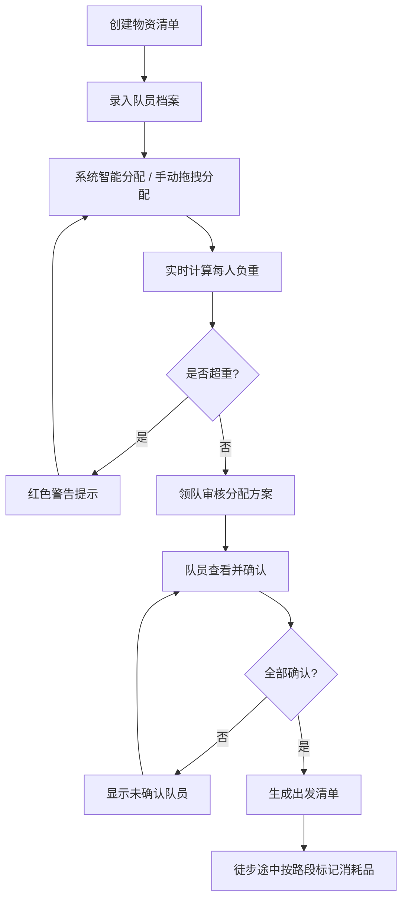

## 1. 产品概述
徒步补给分配系统，解决团队徒步出行中物资合理分配、负重监控、消耗追踪和出发确认的问题。帮助领队科学分配水、能量胶、急救包等物资，避免单人负重过大，确保关键物资不遗漏。

- 目标用户：徒步领队、户外团队组织者
- 核心价值：科学分配、负重可视化、安全保障

## 2. 核心功能

### 2.1 用户角色
| 角色 | 说明 | 核心权限 |
|------|------|----------|
| 领队/组织者 | 负责物资分配和出发确认 | 全部功能：物资管理、队员管理、分配调整、出发清单 |
| 队员 | 查看个人分配物资和确认 | 查看分配、确认出发、标记消耗 |

### 2.2 功能模块
1. **物资清单页**：物资增删改查，包含名称、重量、数量、重要程度、是否易碎、参考照片
2. **队员档案页**：队员信息管理，包含体力等级、背包容量、过敏情况、紧急联系人
3. **物资分配页**：拖拽/选择分配物资，实时计算每人总重量和负重比例，超重高亮提示
4. **出发清单页**：显示队员确认状态、未分配物资、每人负重比例可视化

### 2.3 页面详情
| 页面名称 | 模块名称 | 功能描述 |
|----------|----------|----------|
| 物资清单页 | 物资列表 | 卡片式展示所有物资，显示名称、重量、数量、重要程度标签、易碎标识 |
| 物资清单页 | 新增物资表单 | 表单录入：名称、重量(g)、数量、重要程度(高/中/低)、是否易碎、照片上传 |
| 物资清单页 | 物资分类筛选 | 按类型筛选：水/食品/急救/装备/其他 |
| 队员档案页 | 队员卡片列表 | 显示头像、姓名、体力等级(1-5星)、背包容量、过敏标签 |
| 队员档案页 | 新增队员表单 | 录入：姓名、体力等级、背包容量(kg)、过敏情况、紧急联系人姓名+电话 |
| 物资分配页 | 队员背包面板 | 每个队员一个面板，显示已分配物资列表、当前总重量、负重占比进度条 |
| 物资分配页 | 待分配物资池 | 未分配的物资列表，支持拖拽或点击分配到队员 |
| 物资分配页 | 消耗品路段追踪 | 消耗品可按路段标记已用，已用物资灰色显示 |
| 物资分配页 | 急救用品保护 | 急救类物资显示锁标识，不可随意取消分配 |
| 物资分配页 | 超重警告 | 负重超过建议值(体力等级×背包容量系数)时进度条变红并显示警告 |
| 出发清单页 | 确认状态看板 | 队员确认状态(已确认/未确认)，未确认突出显示 |
| 出发清单页 | 未分配物资警告 | 列出所有未分配到人的物资，红色高亮 |
| 出发清单页 | 负重比例图 | 柱状图/进度条可视化展示每个队员的负重占比 |
| 出发清单页 | 一键确认 | 队员一键确认所有分配物资 |

## 3. 核心流程

## 4. 用户界面设计

### 4.1 设计风格
- **主色调**：深森林绿 `#2D5A27`（户外自然感）+ 大地棕 `#8B6914`
- **辅助色**：警示橙 `#E8743B`（超重/警告）、急救红 `#C0392B`、安全绿 `#27AE60`
- **背景色**：暖米白 `#F5F0E6` 带细微纸张纹理
- **按钮风格**：圆角矩形，深绿底色白字，hover 时略微上浮加深
- **字体**：标题用粗体衬线字体 (Playfair Display / Noto Serif SC)，正文用干净无衬线 (Source Han Sans / Noto Sans SC)
- **布局风格**：卡片式布局，户外探险主题，轻微做旧质感
- **图标风格**：线性户外图标（登山杖、帐篷、水滴、急救十字等）

### 4.2 页面设计概览
| 页面名称 | 模块名称 | UI 元素 |
|----------|----------|---------|
| 物资清单页 | 物资卡片 | 圆角卡片、重要程度色标、易碎玻璃图标、照片缩略图、重量徽章 |
| 队员档案页 | 队员卡片 | 头像圆形边框、体力星级、容量背包图标、过敏三角形警告 |
| 物资分配页 | 背包面板 | 纵向进度条（负重比例）、拖拽区域、急救锁图标、消耗路段时间轴 |
| 出发清单页 | 看板 | 三栏布局：未确认 / 已确认 / 警告区，进度柱状图 |

### 4.3 响应式
- 桌面端优先（≥1280px），三栏并列展示分配面板
- 平板端（768-1279px）：双栏布局，物资池收起为抽屉
- 移动端（<768px）：单栏滚动，Tab 切换各模块

### 4.4 动效设计
- 拖拽物资时卡片轻微缩放+阴影加深
- 超重时进度条脉冲闪烁动画
- 页面加载时卡片依次淡入上浮
- 分配成功时绿色对勾短暂浮现
