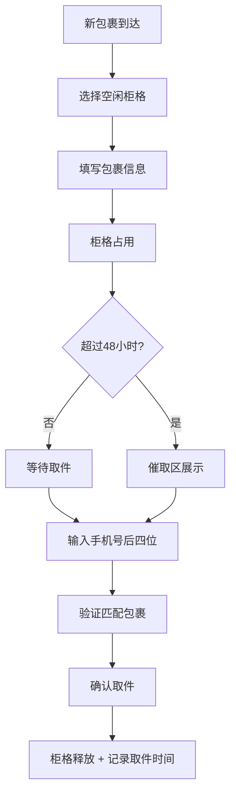

## 1. 产品概述
快递代收柜管理系统，解决前台同事代收快递时柜格混乱、包裹滞留无人领取、冷藏包裹需特殊处理等问题。
- 核心用户：公司前台/行政人员，负责收发快递的工作人员
- 产品价值：清晰的柜格管理、包裹全生命周期追踪、智能提醒与催取、数据可视化看板

## 2. 核心功能

### 2.1 用户角色
| 角色 | 注册方式 | 核心权限 |
|------|----------|----------|
| 管理员/前台 | 系统内置（单用户） | 柜格管理、包裹入柜、取件操作、查看看板、催取包裹 |

### 2.2 功能模块
1. **数据看板页**：统计卡片（空柜格/滞留包裹/今日入柜/快递公司数量）、冷藏包裹提醒、滞留包裹催取区
2. **柜格档案页**：柜格列表、新增/编辑/删除柜格（编号、大小、位置、是否冷藏、照片）
3. **包裹入柜**：入柜表单（收件人、手机号后四位、快递公司、大小、是否易碎、入柜时间、选择柜格）
4. **取件操作**：手机号后四位验证、包裹信息展示、确认取件并记录取走时间
5. **催取区**：超过48小时未取包裹列表、冷藏包裹特殊标记提醒

### 2.3 页面详情
| 页面名称 | 模块名称 | 功能描述 |
|----------|----------|----------|
| 数据看板 | 统计卡片 | 展示空柜格数、滞留包裹数、今日入柜数、各快递公司包裹数量 |
| 数据看板 | 冷藏提醒区 | 醒目标记所有冷藏柜中的包裹，单独提醒 |
| 数据看板 | 催取区 | 展示超过2天未取的包裹，高亮显示滞留天数 |
| 数据看板 | 快捷操作 | 入柜/取件快速入口按钮 |
| 柜格档案 | 柜格列表 | 网格展示所有柜格，显示状态（空闲/占用/催取）、冷藏标记 |
| 柜格档案 | 柜格表单 | 新增/编辑柜格：编号、大小（小/中/大/超大）、位置、是否冷藏、照片上传 |
| 柜格档案 | 柜格详情 | 查看柜格历史记录、当前包裹信息 |
| 包裹入柜 | 入柜表单 | 收件人姓名、手机号后四位（4位数字）、快递公司、包裹大小、是否易碎、入柜时间、选择空闲柜格 |
| 取件操作 | 取件验证 | 输入手机号后四位，匹配对应包裹 |
| 取件操作 | 包裹确认 | 展示匹配包裹信息（收件人、快递公司、入柜时长、柜格），确认取件 |

## 3. 核心流程
### 入柜流程
管理员点击入柜 → 选择空闲柜格 → 填写包裹信息 → 系统记录入柜时间 → 柜格状态变为占用

### 取件流程
用户告知手机号后四位 → 管理员输入查询 → 系统匹配包裹 → 展示包裹详情 → 确认取件 → 柜格释放，记录取件时间

### 催取流程
系统定时检查（或进入看板时检查）→ 包裹入柜超过48小时 → 标记为催取状态 → 显示在催取区 → 冷藏包裹额外高亮提醒

## 4. 用户界面设计

### 4.1 设计风格
- **主色调**：深青色 Teal-600（#0d9488），代表专业、可靠
- **辅助色**：暖橙色 Orange-500（#f97316），用于冷藏提醒和催取标记
- **中性色**：Slate 色系，用于文字、背景
- **按钮风格**：圆角按钮（rounded-lg），主色填充 + 悬停加深，禁用状态灰显
- **字体**：标题使用"Noto Serif SC"思源宋体，正文使用"Noto Sans SC"思源黑体，中文优雅可读
- **布局风格**：顶部导航 + 左侧菜单，内容区卡片式布局
- **图标风格**：Lucide React 线性图标，简洁现代

### 4.2 页面设计概览
| 页面名称 | 模块名称 | UI 元素 |
|----------|----------|----------|
| 数据看板 | 统计卡片 | 渐变背景卡片、大号数字、趋势图标、悬停动效 |
| 数据看板 | 催取区 | 橙红色警示边框、滞留天数徽章、取件快捷按钮 |
| 数据看板 | 冷藏提醒 | 蓝色渐变背景、雪花❄️图标、闪烁提醒动画 |
| 柜格档案 | 柜格网格 | 颜色编码（绿=空、蓝=占用、橙=催取）、悬停放大 |
| 表单弹窗 | 入柜/取件表单 | 模糊背景遮罩、从上滑入动画、表单验证提示 |

### 4.3 响应式设计
- 桌面端优先设计（1280px+）
- 柜格网格自适应列数（大屏6列、中屏4列、小屏2列）
- 移动端侧边栏折叠为汉堡菜单
- 所有可点击区域≥44px，保证触摸友好
