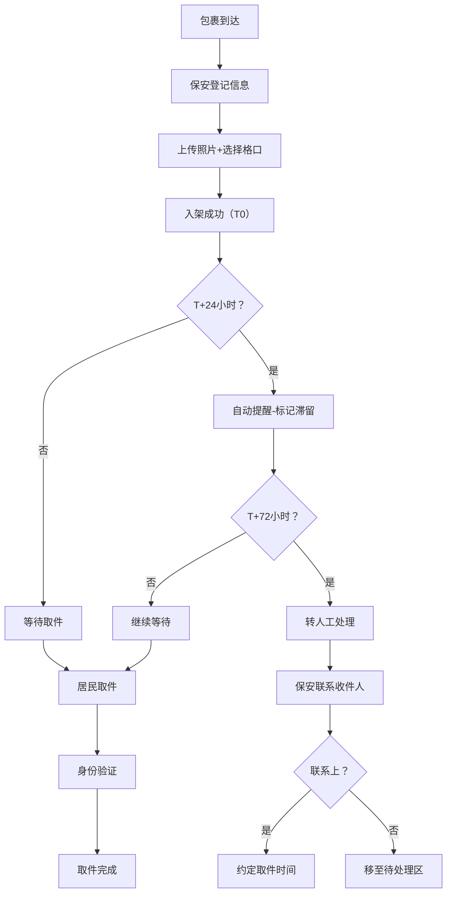

## 1. 产品概述

小区快递架包裹滞留管理系统，解决快递架包裹长期无人领取、保安人工查找效率低的问题。通过数字化登记、自动超时提醒、异常记录和数据看板，实现快递架的智能化管理。

- 目标用户：小区保安、物业管理人员、居民
- 核心价值：提升包裹取件效率，减少包裹滞留，降低错拿/破损纠纷

## 2. 核心功能

### 2.1 用户角色

| 角色 | 使用场景 | 核心权限 |
|------|----------|----------|
| 保安/管理员 | 登记包裹、处理滞留、确认取件、查看看板 | 全部功能 |
| 居民 | 查询包裹、自助取件确认 | 个人包裹查询、取件确认 |

### 2.2 功能模块

1. **数据看板**：实时占用率、滞留包裹预警、高峰时段分析、快递公司滞留率统计
2. **货架档案**：货架区域/层数/容量管理、摄像头点位、负责人配置
3. **包裹登记**：收件人、手机号后四位、快递公司、包裹大小、存放格、照片上传
4. **取件管理**：身份确认、取件时间记录、异常登记（破损/错拿/无人认领）
5. **滞留提醒**：24小时自动提醒、72小时人工干预、提醒记录追踪

### 2.3 页面详情

| 页面名称 | 模块名称 | 功能描述 |
|----------|----------|----------|
| 数据看板 | 统计概览卡片 | 当前占用率、在架包裹数、滞留包裹数、今日取件数 |
| 数据看板 | 滞留预警列表 | 超24小时/超72小时包裹分色高亮显示 |
| 数据看板 | 高峰时段图表 | 24小时取件/入架热力分布 |
| 数据看板 | 快递公司滞留率 | 各快递公司滞留比例柱状图 |
| 货架档案 | 货架列表 | 卡片式展示所有货架，含区域、状态、使用率 |
| 货架档案 | 货架详情/编辑 | 区域、层数、容量、摄像头点位、负责人表单 |
| 包裹登记 | 登记表单 | 收件人、手机尾号、快递公司、大小、存放格、照片 |
| 包裹登记 | 包裹列表 | 筛选/搜索在架包裹，支持快速取件操作 |
| 取件管理 | 取件确认弹窗 | 手机尾号验证、取件人信息记录 |
| 取件管理 | 异常登记 | 破损/错拿/无人认领类型选择+备注 |
| 滞留提醒 | 提醒记录 | 自动/人工提醒历史，含时间、方式、状态 |

## 3. 核心流程

### 3.1 包裹入架流程
保安到达快递架 → 扫码/手动录入包裹信息 → 上传照片 → 选择存放格 → 系统记录入架时间 → 生成取件码

### 3.2 取件流程
居民查找包裹 → 输入手机尾号验证 → 确认身份 → 系统记录取件时间 → 释放格口 → 完成

### 3.3 滞留处理流程
包裹入架满24小时 → 系统自动标记滞留并提醒 → 满72小时 → 转人工处理（保安联系/移仓）→ 记录处理结果

## 4. 用户界面设计

### 4.1 设计风格
- **主色调**：深蓝 #1e3a5f（专业可信）+ 橙红 #e85d3d（预警醒目）
- **辅助色**：绿色 #22c55e（正常）、琥珀色 #f59e0b（24h滞留）、红色 #ef4444（72h滞留）
- **按钮风格**：圆角矩形 8px，微阴影，悬停上浮动效
- **字体**：标题用"思源黑体 Bold"，正文用"PingFang SC Regular"
- **布局风格**：顶部导航 + 左侧菜单 + 主内容区，卡片式模块化
- **图标**：使用 Lucide 线性图标，风格统一

### 4.2 页面设计概览

| 页面名称 | 模块名称 | UI元素 |
|----------|----------|--------|
| 数据看板 | 统计卡片 | 渐变色背景卡片，数字大号字体带趋势箭头 |
| 数据看板 | 滞留列表 | 表格行按滞留时长分色（琥珀/红色条带） |
| 数据看板 | 图表区 | 柱状图+折线图组合，渐变填充 |
| 货架档案 | 货架卡片 | 立体卡片，格口示意图，状态指示灯 |
| 包裹登记 | 表单 | 分组表单，照片拖拽上传，实时预览 |
| 包裹列表 | 数据表格 | 筛选栏+搜索框，操作按钮组，斑马纹 |
| 取件弹窗 | 验证区 | 数字键盘输入，动态验证码，确认动效 |

### 4.3 响应式设计
- Desktop 优先（1440px基准），断点 1024px / 768px
- 移动端转为底部Tab导航，表格转卡片列表
- 触摸屏优化按钮尺寸（≥44px点击区域）
