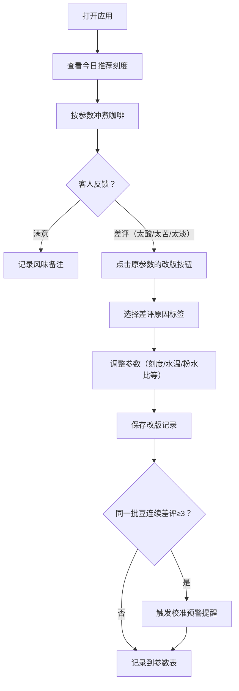

## 1. 产品概述
手冲吧台刻度笔记应用，解决咖啡师每天换豆、换滤杯时研磨刻度记忆混乱的问题。核心是一张按豆子和器具筛选的参数表，配合改版记录和差评预警机制。
- 目标用户：咖啡店主、咖啡师、吧台工作人员
- 核心价值：标准化手冲参数、记录风味迭代、防止重复翻车

## 2. 核心功能

### 2.1 用户角色
| 角色 | 注册方式 | 核心权限 |
|------|----------|----------|
| 咖啡师 | 本地应用，无需注册 | 记录参数、改版、查看历史、标记差评 |

### 2.2 功能模块
1. **仪表盘**：今日推荐刻度卡片、上次翻车原因警示、连续差评校准提醒
2. **参数记录表**：按豆名/磨豆机/滤杯筛选、表格展示、排序
3. **参数记录管理**：新增记录、编辑记录、从原参数复制改版（带差评原因标签）
4. **差评追踪**：同一批豆连续差评统计、自动提示重新校准

### 2.3 页面详情
| 页面名称 | 模块名称 | 功能描述 |
|----------|----------|----------|
| 仪表盘 | 今日推荐刻度 | 展示标记为"今日推荐"的参数卡片，含豆名、磨豆机、刻度、水温等核心信息 |
| 仪表盘 | 上次翻车原因 | 醒目警示卡片，展示最近一条带差评原因的改版记录 |
| 仪表盘 | 校准预警 | 当同一批豆连续3次差评时，显示红色警告条，提示重新校准 |
| 参数表 | 筛选栏 | 支持按豆名、烘焙度、磨豆机、滤杯多条件筛选 |
| 参数表 | 数据表格 | 展示所有参数记录，列包含：豆名、烘焙度、批次、磨豆机、刻度、水温、粉水比、注水段数、出杯时间、风味备注 |
| 参数表 | 操作列 | 编辑、改版（复制+差评标签）、删除、标记为今日推荐 |
| 记录表单 | 基础字段 | 豆名、烘焙度(浅/中/深)、批次日期、磨豆机型号 |
| 记录表单 | 参数字段 | 研磨刻度、水温(℃)、粉水比、注水段数、出杯时间(秒) |
| 记录表单 | 风味字段 | 风味备注、是否今日推荐 |
| 记录表单 | 改版标签 | 改版来源、差评原因(太酸/太苦/太淡/其他)、调整说明 |

## 3. 核心流程

咖啡师日常使用流程：打开应用查看今日推荐刻度 → 按参数冲煮 → 客人反馈不佳时从原参数改版 → 选择差评原因 → 调整参数保存 → 系统累计差评 → 连续3次触发校准提醒。

## 4. 用户界面设计

### 4.1 设计风格
- **主色调**：深咖啡色 `#3E2723`（沉稳专业）、奶白色 `#FFF8E7`（温暖干净）
- **强调色**：琥珀橙 `#E65100`（差评警示）、抹茶绿 `#2E7D32`（推荐标记）
- **字体**：标题使用 Playfair Display（优雅衬线体，咖啡文化感），正文使用 Noto Sans SC（清晰易读）
- **按钮风格**：圆角 6px，悬停有微妙阴影和颜色加深
- **布局风格**：卡片式布局，顶部导航 + 左侧筛选 + 右侧内容区
- **图标**：Lucide 图标库，咖啡杯、水滴、温度计等相关图标

### 4.2 页面设计概述
| 页面名称 | 模块名称 | UI元素 |
|----------|----------|---------|
| 仪表盘 | 今日推荐刻度 | 大卡片，绿色边框高亮，大字号显示豆名和刻度，网格排列参数 |
| 仪表盘 | 上次翻车原因 | 橙色边框警示卡片，左侧显示警告图标，右侧展示差评原因和调整方向 |
| 仪表盘 | 校准预警 | 顶部全宽红色横幅，闪烁动画提示，含"立即校准"按钮 |
| 参数表 | 筛选栏 | 水平排列的下拉选择器，紧凑布局 |
| 参数表 | 数据表格 | 斑马纹行，悬停高亮，推荐行绿色背景，改版行显示来源链接 |
| 记录表单 | 表单布局 | 两列栅格，必填字段标红星，改版模式下显示原参数对比 |

### 4.3 响应性
- Desktop-first 设计，主内容区最小宽度 1024px
- 平板端：筛选栏折行为两排
- 移动端：表格转为卡片列表，横向滚动查看完整参数

### 4.4 动效设计
- 页面加载：卡片依次淡入上滑（stagger 100ms）
- 差评预警条：缓慢呼吸闪烁效果
- 悬停反馈：卡片轻微上浮 + 阴影加深
- 表单保存：成功提示从顶部滑入
