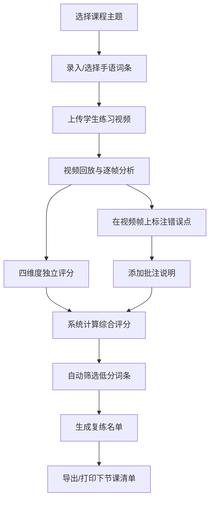

## 1. 产品概述

手语动作回放练习系统是一款专为手语教学场景设计的在线练习与点评工具，帮助手语老师精准分析学生动作问题，提升教学效率。

- 解决问题：手语教学中老师难以逐一细致反馈每个学生的动作细节，学生无法直观看到自己与标准动作的差异
- 目标用户：手语教师及手语学习者
- 产品价值：通过视频逐帧分析、多维度评分、错误标注，构建标准化手语教学反馈闭环

## 2. 核心功能

### 2.1 用户角色

| 角色 | 登录方式 | 核心权限 |
|------|----------|----------|
| 手语教师 | 本地登录 | 录入课程词条、上传学生视频、逐帧标注错误、多维评分、生成复练名单 |
| 学生（可选） | 本地登录 | 查看自己的练习反馈、复练建议 |

### 2.2 功能模块

1. **课程词条管理**：按课程主题录入手语词条、标准动作要点、参考图片/视频
2. **学生练习视频回放**：视频播放、逐帧步进、暂停、倍速控制
3. **多维度评分系统**：手形、朝向、移动轨迹、表情配合四大维度独立评分
4. **逐帧错误标注**：在视频画面上框选/标记错误位置，添加文字批注
5. **复练名单生成**：根据评分自动汇总需要重点复练的词条，导出下节课练习清单

### 2.3 页面详情

| 页面名称 | 模块名称 | 功能描述 |
|-----------|-------------|---------------------|
| 动作回放练习页（主页面） | 课程主题切换 | 下拉选择课程主题，加载对应词条列表 |
| 动作回放练习页 | 词条录入面板 | 新增/编辑词条：名称、标准动作要点、四个维度的评分标准 |
| 动作回放练习页 | 学生视频播放区 | 视频播放器+时间轴，支持逐帧前进/后退、0.25x-2x倍速、截图标记 |
| 动作回放练习页 | 多维度评分面板 | 手形、朝向、移动轨迹、表情配合四个评分滑块（0-100分）+评语输入 |
| 动作回放练习页 | 逐帧标注工具 | 在视频帧上绘制矩形/箭头标记、添加批注文字、错误类型标签 |
| 动作回放练习页 | 批注列表 | 显示当前视频所有标注点，点击跳转到对应帧 |
| 动作回放练习页 | 复练名单面板 | 展示本次课程评分低于阈值的词条，支持编辑、导出、标记完成状态 |

## 3. 核心流程

手语老师使用流程：选择课程主题 → 录入或选择词条 → 上传/选择学生视频 → 回放视频并逐帧标注 → 进行四维度评分 → 系统自动汇总生成复练名单 → 导出下节课重点练习清单

## 4. 用户界面设计

### 4.1 设计风格

- **主色调**：深海蓝 #1e3a5f 作为主色，搭配珊瑚橙 #ff6b6b 作为标注强调色
- **辅助色**：薄荷绿 #2ed573（优秀）、琥珀橙 #ffa502（一般）、珊瑚红 #ff4757（需改进）用于评分状态
- **按钮风格**：圆润方形按钮，主按钮使用渐变背景，悬停时有微上浮效果
- **字体方案**：标题使用「思源黑体 Heavy」，正文使用「思源宋体 Regular」，评分数字使用等宽字体增强可读性
- **布局风格**：左右分栏卡片式布局，左侧视频区为主视觉，右侧工具面板分区折叠展示
- **图标风格**：线性 SVG 图标，标注工具使用手势/手部识别相关视觉符号

### 4.2 页面设计概述

| 页面名称 | 模块名称 | UI元素 |
|-----------|-------------|-------------|
| 动作回放练习页 | 顶部导航 | 课程主题下拉选择器、当前学生姓名标签、保存/导出按钮组 |
| 动作回放练习页 | 视频播放区 | 大尺寸视频画布+自定义播放控制条+帧计数器+标注画布叠加层 |
| 动作回放练习页 | 评分面板 | 四个评分维度卡片，每个含彩色进度条、滑块、分数数字、评语输入框 |
| 动作回放练习页 | 标注工具条 | 矩形框选、箭头、文字批注、橡皮擦、颜色选择、撤销/重做按钮 |
| 动作回放练习页 | 批注时间轴 | 视频时间轴上显示批注标记点，悬停预览批注内容 |
| 动作回放练习页 | 复练名单区 | 词条卡片列表，展示综合评分、主要问题标签、复练优先级 |

### 4.3 响应式

桌面端优先设计（1440px+），视频区占主视觉；平板端采用上下堆叠布局，评分面板可折叠；移动端简化标注功能，保留回放和评分查看能力。

### 4.4 交互与动效

- 视频帧切换时使用轻微淡入淡出过渡
- 评分滑块拖动时实时更新分数数字，并有颜色渐变反馈
- 批注添加时从标记点弹出气泡动画
- 复练名单生成时卡片依次淡入，带轻微位移动画
- 悬停按钮有 3px 上浮 + 阴影增强效果
