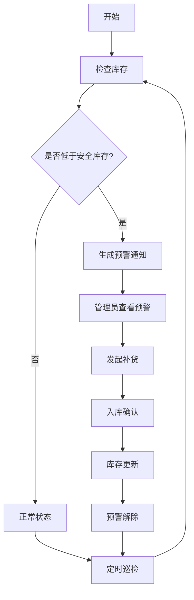

## 1. 产品概述

打印纸补货管理系统是一款专为企业办公场景设计的库存管理工具，解决打印纸领用无记录、库存不足无预警、消耗情况不透明等痛点问题。通过数字化管理，实现打印纸全生命周期追踪，确保办公打印需求不中断。

- **核心问题**：打印机旁纸张突然耗尽、领用无人登记、补货不及时
- **目标用户**：行政管理人员、各部门员工、采购人员
- **产品价值**：库存透明化、领用可追溯、补货智能化、用量统计可视化

## 2. 核心功能

### 2.1 用户角色

| 角色 | 核心权限 |
|------|----------|
| 普通员工 | 查看库存、登记领用 |
| 行政管理员 | 打印点档案管理、补货登记、库存预警处理、查看统计报表 |
| 系统管理员 | 全部功能权限、用户管理 |

### 2.2 功能模块

1. **首页仪表盘**：库存总览、预警提醒、快速操作入口
2. **打印点管理**：档案信息维护、现场照片管理
3. **领用登记**：部门领用记录、领取人信息
4. **补货管理**：供应商信息、入库记录、照片存档
5. **库存预警**：低于安全库存提醒、异常领用标记
6. **统计分析**：消耗速度、部门用量、补货预测

### 2.3 页面详情

| 页面名称 | 模块名称 | 功能描述 |
|-----------|-------------|---------------------|
| 首页 | 仪表盘 | 库存总览卡片、预警列表、快捷操作按钮、关键指标展示 |
| 打印点管理 | 档案列表 | 打印点信息表格、搜索筛选、新增/编辑/删除操作 |
| 打印点管理 | 档案详情 | 位置、打印机型号、纸张规格、最低库存、负责人、现场照片展示 |
| 领用登记 | 领用列表 | 领用记录表格、部门筛选、日期范围筛选 |
| 领用登记 | 新增领用 | 部门选择、数量输入、用途填写、领取人选择 |
| 补货管理 | 补货列表 | 补货记录表格、供应商筛选 |
| 补货管理 | 新增补货 | 供应商选择、箱数输入、单价填写、入库照片上传 |
| 库存预警 | 预警列表 | 低库存预警卡片、异常领用标记、处理状态 |
| 统计分析 | 消耗趋势 | 各打印点消耗速度折线图、柱状图 |
| 统计分析 | 部门用量 | 各部门领用占比饼图、排名列表 |
| 统计分析 | 补货预测 | 下次预计补货日期计算、建议补货量 |

## 3. 核心流程

### 3.1 领用流程
员工进入领用登记页面 → 选择打印点和部门 → 填写领用数量和用途 → 选择领取人 → 提交登记 → 系统自动扣减库存 → 检查是否触发低库存预警

### 3.2 补货流程
管理员进入补货管理 → 选择打印点 → 填写供应商、箱数、单价 → 上传入库照片 → 提交补货 → 系统自动增加库存 → 解除低库存预警

### 3.3 预警流程
系统定时检查库存 → 库存低于安全库存 → 生成预警记录并推送通知 → 管理员处理补货 → 预警标记为已处理

## 4. 用户界面设计

### 4.1 设计风格

- **主色调**：深海蓝 (#0F4C81) - 专业、稳重、可信赖
- **辅助色**：橙红 (#FF6B35) - 预警提醒、活力
- **成功色**：森林绿 (#2E7D32) - 正常库存、补货完成
- **警告色**：琥珀黄 (#FFB300) - 库存紧张提示
- **危险色**：火焰红 (#D32F2F) - 库存告急、异常领用
- **中性色**：深灰 (#2D3748)、中灰 (#718096)、浅灰 (#E2E8F0)、纯白 (#FFFFFF)

- **按钮风格**：圆角 8px，渐变填充，悬停微动效
- **字体**：
  - 标题："Noto Sans SC" - 稳重清晰
  - 正文："Inter" - 现代易读
  - 数字："JetBrains Mono" - 数据展示清晰
- **布局风格**：卡片式布局，顶部导航 + 侧边栏，清晰的信息层级
- **图标风格**：lucide-react 线性图标，简约现代

### 4.2 页面设计概述

| 页面名称 | 模块名称 | UI Elements |
|-----------|-------------|-------------|
| 首页 | 仪表盘 | 渐变色统计卡片、预警横向滚动列表、快捷操作悬浮按钮、数据可视化图表 |
| 打印点管理 | 档案列表 | 带照片的卡片式列表、搜索栏、筛选标签、新增浮动按钮 |
| 打印点管理 | 档案表单 | 分步表单设计、照片上传预览区、自动保存草稿 |
| 领用登记 | 领用表单 | 联动选择器、数量步进器、用途标签快捷选择 |
| 统计分析 | 数据可视化 | 交互式图表、悬停显示详情、时间范围快速切换 |
| 库存预警 | 预警列表 | 颜色分级卡片、紧急程度徽章、处理状态标签 |

### 4.3 响应式设计

- **桌面优先**：1280px 以上完整布局，侧边栏常驻
- **平板适配**：768px - 1279px，侧边栏可收起，表格水平滚动
- **手机适配**：768px 以下，底部导航栏，卡片单列布局，表单垂直排列
- **触摸优化**：按钮最小 44x44px，下拉选择器原生样式，支持滑动操作

### 4.4 动效设计

- **页面加载**：元素交错淡入，首屏骨架屏
- **卡片悬停**：轻微上浮 + 阴影加深
- **按钮点击**：缩放反馈 + 涟漪效果
- **数据更新**：数字滚动动画，图表渐显
- **预警通知**：顶部滑入 + 轻微呼吸动效
