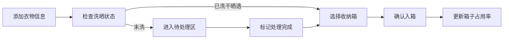
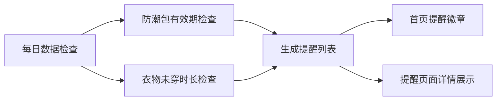

## 1. 产品概述

换季收纳管理系统是一款帮助家庭有序管理换季衣物的工具应用。以"箱子视角"为核心，让用户能够清晰追踪每个收纳箱的位置、容量、内容物，并通过智能提醒功能确保衣物保养得当，告别找校服时翻箱倒柜的窘境。

- **核心价值**：让换季收纳井井有条，衣物存取一目了然
- **目标用户**：有孩子的家庭、注重生活品质的都市人群
- **解决痛点**：收纳位置混乱、衣物状态不清、防潮保养遗忘、换季找衣困难

## 2. 核心功能

### 2.1 用户角色

| 角色 | 注册方式 | 核心权限 |
|------|----------|----------|
| 家庭用户 | 本地使用，无需注册 | 全部功能，管理所有箱子和衣物 |

### 2.2 功能模块

1. **首页仪表盘**：箱子占用率概览、缺失尺码提醒、本周待取衣物、快速操作入口
2. **箱子管理**：箱子列表、新增/编辑/删除箱子、箱子详情、照片管理、防潮包记录
3. **衣物收纳**：衣物入箱、待处理区、衣物搜索、衣物详情、取衣记录
4. **智能提醒**：防潮包到期提醒、长期未穿捐赠候选、换季提醒

### 2.3 页面详情

| 页面名称 | 模块名称 | 功能描述 |
|----------|----------|----------|
| 首页仪表盘 | 占用率卡片 | 展示每个箱子的容量使用率，可视化进度条 |
| 首页仪表盘 | 缺失尺码 | 分析各家庭成员各季节的尺码缺口 |
| 首页仪表盘 | 本周待取 | 显示本周需要取出的衣物清单 |
| 首页仪表盘 | 快捷操作 | 快速入箱、快速搜索、新增箱子入口 |
| 箱子管理 | 箱子列表 | 网格展示所有箱子，显示编号、位置、标签颜色 |
| 箱子管理 | 箱子表单 | 编号、位置、标签颜色、容量、防潮包日期、照片上传 |
| 箱子管理 | 箱子详情 | 箱子信息、衣物清单、占用率、操作记录 |
| 衣物收纳 | 入箱表单 | 选择箱子、归属人、尺码、季节、类别、洗晒状态、真空压缩 |
| 衣物收纳 | 待处理区 | 未洗干晒透的衣物暂存区，可标记处理完成后入箱 |
| 衣物收纳 | 搜索功能 | 按人、场景、尺码组合搜索，如"孩子春游外套" |
| 智能提醒 | 防潮包提醒 | 显示即将到期和已到期的防潮包清单 |
| 智能提醒 | 捐赠候选 | 列出长期未穿着的衣物，建议捐赠 |

## 3. 核心流程

### 3.1 衣物入箱流程

用户添加新衣物时，先填写衣物信息，系统检查洗晒状态：如果已洗干晒透，直接进入选箱环节；如果未洗，则进入待处理区，待用户标记处理完成后再入箱。

### 3.2 衣物取出流程

用户通过搜索或浏览找到目标衣物，标记为"已取出"，系统记录取出时间和用途，方便后续追踪衣物使用频率。

### 3.3 提醒触发流程

系统每日检查防潮包有效期和衣物未穿时长，将符合条件的项目加入提醒列表，在首页展示提醒徽章。

## 4. 用户界面设计

### 4.1 设计风格

- **整体风格**：温暖自然、整洁有序的家居感设计
- **主色调**：暖棕色系（#8B6914 深棕、#D4A574 浅棕），营造温馨收纳氛围
- **辅助色**：
  - 鼠尾草绿（#9CAF88）：代表收纳、环保、自然
  - 珊瑚橙（#E8998D）：代表提醒、关注、活力
  - 雾霾蓝（#A8D0DB）：代表信息、平静、清爽
- **中性色**：米白背景（#FAF8F5）、暖灰文字（#5C5450）、浅灰边框（#E8E4DF）
- **字体**：使用 "Noto Sans SC" 中文无衬线字体，搭配圆润现代的西文字体
- **按钮风格**：圆角胶囊形按钮，柔和阴影，悬停有微浮效果
- **卡片风格**：圆角卡片，轻微阴影，悬停时阴影加深，过渡动画平滑
- **图标风格**：线性填充混合图标，线条圆润，颜色跟随主题色

### 4.2 页面设计概览

| 页面名称 | 模块名称 | UI 元素 |
|----------|----------|---------|
| 首页仪表盘 | 顶部导航 | 品牌Logo、页面标题、提醒图标（带数字徽章） |
| 首页仪表盘 | 欢迎区域 | 问候语、日期、快速统计数字动画 |
| 首页仪表盘 | 箱子占用率 | 横向卡片列表，每个箱子显示编号、位置、彩色进度条、百分比 |
| 首页仪表盘 | 缺失尺码 | 卡片式布局，按家庭成员分组，显示缺少的季节和尺码 |
| 首页仪表盘 | 本周待取 | 时间线式列表，显示衣物名称、所属箱子、取出原因 |
| 首页仪表盘 | 底部导航 | 首页、箱子、收纳、提醒 四个Tab |
| 箱子管理 | 顶部操作栏 | 搜索框、筛选按钮、新增按钮 |
| 箱子管理 | 箱子网格 | 卡片网格布局，彩色标签角标、编号、位置、衣物数量 |
| 箱子管理 | 箱子详情 | 顶部大图、基本信息网格、衣物列表、操作按钮 |
| 衣物收纳 | 搜索栏 | 归属人、场景、尺码 三个筛选条件组合 |
| 衣物收纳 | 衣物列表 | 列表式布局，显示衣物缩略图、名称、所属人、尺码、位置 |
| 衣物收纳 | 入箱表单 | 分步表单，步骤指示器，表单字段带图标 |
| 智能提醒 | 分类Tab | 防潮包提醒、捐赠候选 两个分类 |
| 智能提醒 | 提醒卡片 | 左侧彩色状态条、标题、详情、操作按钮 |

### 4.3 响应式设计

- **设计原则**：桌面端优先，移动端自适应
- **断点设置**：
  - 桌面端：≥ 1024px，多列布局
  - 平板端：768px - 1023px，两列布局
  - 移动端：< 768px，单列布局，底部导航
- **触控优化**：移动端按钮和可点击区域不小于 44px，手势滑动支持

### 4.4 动效与交互

- **页面入场**：元素错落淡入上移，stagger 动画效果
- **卡片交互**：悬停时轻微上浮 + 阴影加深，点击时缩放反馈
- **进度条**：数值变化时有平滑过渡动画
- **提醒徽章**：新提醒时有脉冲动画吸引注意
- **空状态**：友好的插画 + 引导文案
