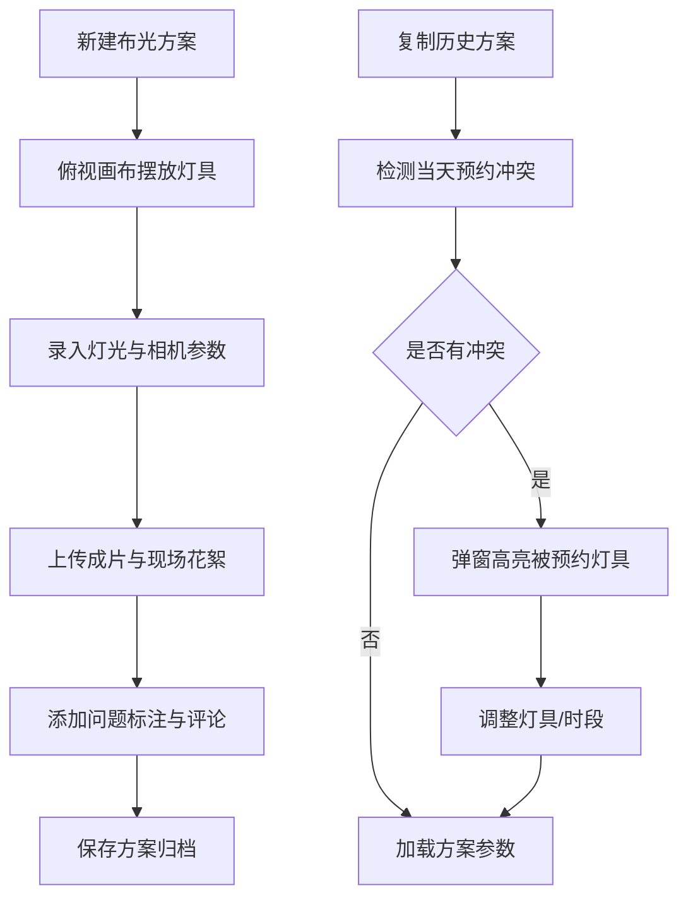

## 1. 产品概述

摄影棚布光复盘系统，解决每次拍摄后灯位和参数无人记录、布光经验无法复用的痛点。面向商业摄影师、摄影助理及摄影棚运营人员，提供可视化布光记录、成片标注、经验沉淀与设备预约管理能力。

- 核心价值：将摄影棚布光经验数字化，实现灯位可复刻、问题可追溯、设备可统筹
- 目标市场：商业摄影棚、广告公司摄影部门、电商摄影团队

## 2. 核心功能

### 2.1 用户角色

| 角色 | 描述 | 核心权限 |
|------|------|----------|
| 摄影师 | 主要使用者，拍摄复盘与布光设计 | 创建布光方案、编辑标注、复制历史方案 |
| 摄影助理 | 协助布光执行 | 查看布光方案、调整灯位参数 |
| 棚管 | 设备调度管理 | 管理设备预约、查看冲突提醒 |

### 2.2 功能模块

1. **布光复盘主页**：俯视布光画布、设备元件库、参数编辑面板、成片对比区
2. **历史方案库**：历史布光方案列表、方案搜索筛选、一键复制复用
3. **设备预约中心**：预约日历、预约冲突检测提醒、设备使用率统计

### 2.3 页面详情

| 页面名称 | 模块名称 | 功能描述 |
|----------|----------|----------|
| 布光复盘页 | 俯视画布 | 8×6米网格俯视图，支持拖拽放置主灯/辅灯/轮廓灯/反光板/背景纸，显示连接线与角度标识 |
| 布光复盘页 | 设备元件库 | 左侧可拖拽元件面板，含5类设备及常用型号缩略图 |
| 布光复盘页 | 参数编辑面板 | 编辑选中设备的距离（米）、角度（°）、功率（Ws/百分比）、色温（K）、附件类型；编辑相机参数（焦距、光圈、快门、ISO） |
| 布光复盘页 | 成片对比区 | 左右分栏展示成片与现场花絮图，支持缩放平移，支持添加问题标注点 |
| 布光复盘页 | 标注评论面板 | 列出所有标注问题（眼神光、阴影过硬、背景不均等），支持文字评论和严重级别 |
| 布光复盘页 | 顶部操作栏 | 方案名称、拍摄日期、客户标签、保存/导出/复制上一套 |
| 历史方案库 | 方案列表 | 卡片式展示，含缩略图、核心参数摘要、创建人时间 |
| 历史方案库 | 复制复用 | 一键复制为新方案，自动触发当天预约冲突检测 |
| 设备预约中心 | 冲突提醒弹窗 | 复制布光方案时弹出，红色高亮已被预约灯具，显示预约人和时段 |

## 3. 核心流程

摄影师完成拍摄后，进入系统新建布光方案 → 在俯视画布上拖拽摆放灯位 → 为每个灯具录入参数 → 上传成片与花絮照片 → 对问题区域添加标注评论 → 保存方案归档。下次拍摄时，从历史库复制相似方案 → 系统检测当天设备预约 → 如有冲突弹窗提醒 → 调整后开始新拍摄。

## 4. 用户界面设计

### 4.1 设计风格

- **主色调**：深空灰 #0F172A（背景）+ 暖琥珀 #F59E0B（强调色，模拟灯光温度）
- **辅助色**：锌灰系列 #1E293B / #334155 / #64748B（层次渐变），警报红 #EF4444（冲突提醒）
- **字体**：标题用 Space Grotesk（几何现代感，工业专业风），正文用 JetBrains Mono（等宽字体，精准参数显示）
- **按钮风格**：直角胶囊型，2px边框，琥珀色hover发光效果
- **布局风格**：三栏仪表盘式布局，左侧元件库、中间画布+对比区、右侧参数面板
- **图标风格**：Lucide线性图标，关键按钮搭配设备emoji增强辨识度

### 4.2 页面设计概述

| 页面名称 | 模块名称 | UI元素 |
|----------|----------|--------|
| 布光复盘页 | 俯视画布 | 深灰网格底，灯具用彩色发光圆点表示，连接线为虚线，选中设备显示琥珀色光环 |
| 布光复盘页 | 参数面板 | 分组折叠卡片，数值输入配滑块调节，色温用蓝-白-橙渐变条可视化 |
| 布光复盘页 | 成片对比区 | 双栏可调节分割线，鼠标悬停显示十字准星，标注点为闪烁圆点 |
| 布光复盘页 | 顶部导航 | 毛玻璃背景，方案名称大字居中，右侧操作按钮组 |
| 冲突提醒弹窗 | 弹窗卡片 | 半透明暗色遮罩，红色描边边框，设备列表用✗/✓标记状态，底部两个行动按钮 |

### 4.3 响应性

- 桌面端优先设计（1440×900基准）
- 画布区域最小宽度600px，自动响应容器缩放
- 平板端折叠左侧元件库为抽屉，参数面板切换到底部Tab
- 移动端仅保留方案查看和标注功能，画布适配竖屏滚动

### 4.4 视觉动效

- 页面加载：顶部→左→中→右 顺序渐入，延迟30ms交错
- 灯具拖拽：半透明跟随虚影，放置区域高亮
- 标注添加：脉冲波纹扩散动画
- 冲突提醒：弹窗从顶部滑入+轻微红色闪烁3次
- 色温调节：滑块移动时实时预览色光渐变
