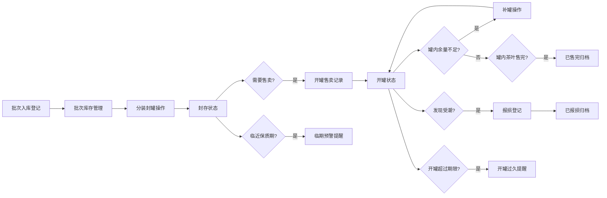

## 1. 产品概述

散装茶叶封罐管理系统，解决茶叶店散装茶开袋后分装到罐中难以追踪封罐时间、受潮状态的问题。面向茶叶店店员和管理者，提供批次管理、封罐记录、开罐/补罐/报损操作、临期预警和统计分析功能。

- 核心目的：实现散装茶叶从批次入库到封罐、售卖、报损的全生命周期可追溯管理
- 目标价值：减少茶叶受潮变质损耗，提升库存管理效率，快速掌握茶品销售状态

## 2. 核心功能

### 2.1 用户角色

| 角色 | 注册方式 | 核心权限 |
|------|----------|----------|
| 店长 | 系统预置 | 全部功能：批次管理、封罐操作、开罐售卖、补罐、报损、统计报表、预警查看 |
| 店员 | 店长添加 | 封罐操作、开罐售卖、补罐、报损登记、查看预警 |

### 2.2 功能模块

1. **批次管理**：茶叶批次录入、编辑、列表查看，含品名、产地、采摘季、进货日期、保质期、库存重量、照片
2. **封罐管理**：封罐记录、罐号管理、封罐详情查看
3. **罐操作**：开罐售卖、补罐、受潮报损登记
4. **预警中心**：临期罐子提醒、开罐过久提醒
5. **数据统计**：各茶品剩余重量、报损原因分析、最快售完批次、需要补货茶品

### 2.3 页面详情

| 页面名称 | 模块名称 | 功能描述 |
|----------|----------|----------|
| 仪表盘 | 数据概览 | 总库存重量、临期罐数、开罐中罐数、本月报损量；快捷操作入口 |
| 仪表盘 | 预警列表 | 展示临期和开罐过久的罐子，支持快速跳转处理 |
| 批次管理 | 批次列表 | 展示所有茶叶批次，支持按品名、产地筛选，支持搜索 |
| 批次管理 | 批次新增/编辑 | 录入品名、产地、采摘季、进货日期、保质期、库存重量、上传照片 |
| 封罐管理 | 封罐列表 | 展示所有封罐记录，按状态（封存中/已开罐/已售完/已报损）筛选 |
| 封罐管理 | 新增封罐 | 选择批次、录入罐号、封罐重量、操作人、密封圈状态、干燥剂批次、封罐时间 |
| 封罐管理 | 罐详情 | 查看单罐完整信息和操作历史 |
| 罐操作 | 开罐售卖 | 记录开罐时间、操作人、售卖重量 |
| 罐操作 | 补罐 | 从同批次其他罐或原批次补入重量，记录操作人和时间 |
| 罐操作 | 报损登记 | 选择报损原因（受潮/变质/其他）、记录重量、操作人、备注 |
| 数据统计 | 茶品剩余重量 | 按茶品维度统计剩余总重量，按数量排序 |
| 数据统计 | 报损分析 | 按原因统计报损重量和金额，饼图展示 |
| 数据统计 | 售完预警 | 按批次计算预计售完时间，标记最快售完的批次 |
| 数据统计 | 补货建议 | 低于安全库存的茶品列表，建议补货量 |

## 3. 核心流程

茶叶从批次入库到最终售卖或报损的全流程：

## 4. 用户界面设计

### 4.1 设计风格

- **主色调**：深茶绿 `#2D5A27`，辅以米色 `#F5EFE0` 背景，营造中式茶文化氛围
- **强调色**：琥珀金 `#C9A961` 用于关键按钮和数据高亮
- **警示色**：暖橙 `#E67E22` 用于临期提醒，赤红 `#C0392B` 用于报损和严重预警
- **按钮风格**：圆角矩形，主按钮深茶绿配白字，悬浮有微立体阴影
- **字体**：标题使用 Noto Serif SC（思源宋体）体现茶文化底蕴，正文使用 Noto Sans SC（思源黑体）保证可读性
- **布局风格**：顶部导航 + 左侧菜单 + 主内容区，卡片式布局，适度留白
- **图标风格**：线性中式图标，使用茶叶、罐子、日历等元素

### 4.2 页面设计概览

| 页面名称 | 模块名称 | UI 元素 |
|----------|----------|---------|
| 仪表盘 | 数据概览 | 4 张数据卡片横排，图标+数字+趋势标签；暖色调渐变背景 |
| 仪表盘 | 预警列表 | 分组卡片：临期罐子（橙色边）、开罐过久（红色边），点击跳转详情 |
| 批次管理 | 批次列表 | 表格布局，每行显示缩略图、品名、产地、库存重量、保质期进度条 |
| 批次管理 | 批次表单 | 左侧表单右侧图片预览区，分栏布局 |
| 封罐管理 | 封罐列表 | 状态标签彩色区分，罐号使用等宽字体突出显示 |
| 封罐管理 | 罐详情 | 时间线展示操作历史，左右分栏：基本信息 + 操作记录 |
| 数据统计 | 图表区 | 柱状图展示茶品剩余量，饼图展示报损原因占比 |
| 数据统计 | 表格区 | 补货建议表格，红色标记紧急补货项 |

### 4.3 响应式

- 桌面端优先，主内容区最小宽度 1024px
- 平板端折叠左侧菜单为图标模式
- 移动端底部 Tab 导航，表格转为卡片列表

