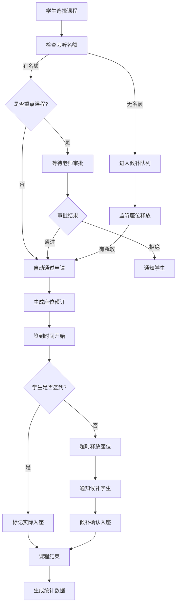

## 1. 产品概述
学校公开课和竞赛辅导常有外班学生旁听，临时搬椅子易挡过道。本系统实现旁听座位的数字化管理，优化教室资源利用，保障课堂秩序。
- 解决问题：旁听座位无序占用、过道阻塞风险、候补流程不透明
- 目标用户：任课老师、教务人员、申请旁听的学生
- 核心价值：提升教室管理效率，降低安全隐患，提供数据决策支持

## 2. 核心功能

### 2.1 用户角色
| 角色 | 注册方式 | 核心权限 |
|------|----------|----------|
| 教务管理员 | 系统内置 | 课程档案管理、查看所有统计数据、系统配置 |
| 任课老师 | 系统内置 | 审批重点课程旁听申请、签到管理、查看授课课程数据 |
| 学生 | 系统内置 | 提交旁听申请、查看申请状态、签到入座 |

### 2.2 功能模块
1. **课程档案页**：课程列表、课程详情、座位图编辑、新增/编辑课程
2. **旁听申请页**：课程选择、申请表单、申请状态查询、候补列表
3. **签到管理页**：座位图显示、签到操作、候补释放、实际入座标记
4. **统计分析页**：旁听率统计、候补人数统计、过道风险分析、借读班级排行

### 2.3 页面详情
| 页面名称 | 模块名称 | 功能描述 |
|---------|---------|----------|
| 课程档案页 | 课程列表卡片 | 展示教室、容量、老师、固定学生数、旁听名额、报名状态 |
| 课程档案页 | 座位图编辑器 | 可视化编辑座位布局，标记固定座位、旁听座位、过道区域 |
| 课程档案页 | 课程表单 | 录入课程基本信息，设置是否为重点课程 |
| 旁听申请页 | 课程选择器 | 按日期/时间筛选可申请课程，显示剩余名额 |
| 旁听申请页 | 申请表单 | 填写学生姓名、班级、申请原因、预计到场时间、是否需要插座 |
| 旁听申请页 | 申请状态列表 | 显示申请状态（待审批/已通过/已拒绝/候补中），支持撤销 |
| 旁听申请页 | 候补队列 | 显示候补顺序、预计可入座概率 |
| 签到管理页 | 实时座位图 | 颜色区分空闲/已预订/已签到/过道座位，支持点击签到 |
| 签到管理页 | 未到处理 | 超时未到自动释放座位给候补，支持手动释放 |
| 统计分析页 | 核心指标卡片 | 旁听率、平均候补人数、高风险课程数、热门借读班级 |
| 统计分析页 | 图表展示 | 趋势图、柱状图、风险热力图 |

## 3. 核心流程

学生浏览可旁听课程 → 选择课程提交申请 → 系统检查名额 → 有名额：自动确认（非重点课程）/ 等待老师审批（重点课程）→ 无名额：进入候补队列 → 签到时间内学生到场签到 → 标记实际入座 → 超时未到释放座位给候补 → 课后生成统计数据

## 4. 用户界面设计

### 4.1 设计风格
- **主色调**：深蓝色（#1e3a5f）代表学术严谨，搭配湖蓝色（#0ea5e9）作为交互强调色
- **辅助色**：绿色（#10b981）表示可用/签到成功，黄色（#f59e0b）表示候补/待确认，红色（#ef4444）表示占用/风险
- **字体**：标题使用 Noto Sans SC 700，正文使用 Noto Sans SC 400/500
- **布局风格**：卡片式布局，顶部导航 + 左侧菜单 + 主内容区
- **按钮风格**：圆角 8px，悬停阴影，点击缩放微动画
- **图标风格**：使用 Lucide 线性图标，保持统一线条粗细

### 4.2 页面设计概述
| 页面名称 | 模块名称 | UI 元素 |
|---------|---------|---------|
| 课程档案页 | 课程卡片网格 | 悬停上浮效果，状态标签角标，渐变背景区分课程类型 |
| 课程档案页 | 座位图编辑器 | 网格布局，拖拽调整座位，右键菜单编辑属性，彩色图例 |
| 旁听申请页 | 时间轴课程列表 | 按时间排序的卡片列表，剩余名额进度条动画 |
| 旁听申请页 | 表单设计 | 分步表单，输入校验实时反馈，提交成功动效 |
| 签到管理页 | 座位热力图 | 颜色深浅表示签到状态，点击波纹反馈，空闲座位呼吸动画 |
| 统计分析页 | 数据仪表盘 | 卡片悬浮阴影，图表渐变色，数字滚动动画 |

### 4.3 响应式
- 桌面端（默认）：侧边栏导航 + 多列布局
- 平板端：折叠侧边栏 + 双列布局
- 移动端：底部导航 + 单列布局，触摸优化按钮尺寸

### 4.4 交互细节
- 座位图支持缩放、平移操作
- 表单提交有加载状态和成功/失败反馈
- 统计图表支持悬停查看详情
- 列表支持搜索、筛选、排序
- 关键操作（如释放座位）有二次确认弹窗
