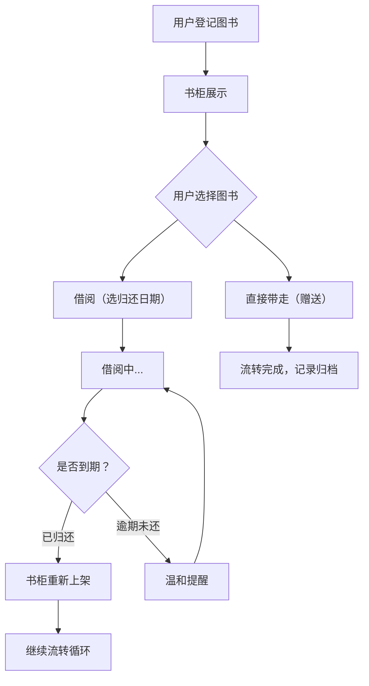

## 1. 产品概述

旧书交换漂流柜是一个面向办公室和小区场景的书籍共享管理系统，解决"谁放了什么书、谁拿走了"变成糊涂账的问题，让闲置好书流动起来。用户可以登记图书、浏览书柜、借阅或领取书籍、写短评推荐，系统提供流转统计和逾期提醒功能。

## 2. 核心功能

### 2.1 用户角色

| 角色 | 注册方式 | 核心权限 |
|------|----------|----------|
| 普通用户 | 用户名+昵称登记 | 登记图书、借阅/领取图书、写短评、查看统计 |

### 2.2 功能模块

1. **首页（书柜视图）**：书柜格子可视化展示，按新放入、热门、待归还、长期闲置分组展示
2. **图书登记页**：填写书名、作者、类别、成色、柜格编号、借阅/赠送选项、上传封面照片
3. **图书详情页**：查看图书信息、借阅历史、短评推荐、执行借阅/领取操作
4. **统计页**：流转总量、类别受欢迎排行、逾期情况统计
5. **用户中心**：我的登记、我的借阅、逾期提醒

### 2.3 页面详情

| 页面名称 | 模块名称 | 功能描述 |
|----------|----------|----------|
| 首页 | 书柜网格 | 6列柜格布局，书脊朝外展示，悬停显示详情 |
| 首页 | 分类标签栏 | 新放入/热门/待归还/长期闲置 分组切换 |
| 首页 | 搜索与筛选 | 按书名、作者、类别搜索图书 |
| 图书登记 | 表单区域 | 书名、作者、类别下拉、成色选择、柜格编号、借阅/赠送单选 |
| 图书登记 | 封面上传 | 图片上传预览，支持本地文件选择 |
| 图书详情 | 基本信息 | 封面大图、完整信息、状态标签 |
| 图书详情 | 借阅操作 | 借阅（选归还日期）/ 领取带走 操作按钮 |
| 图书详情 | 流转记录 | 时间线展示登记、借阅、归还、领取历史 |
| 图书详情 | 短评区 | 推荐理由、短评列表、发表评论 |
| 统计页 | 总览卡片 | 累计登记、正在流转、已归还、逾期数量 |
| 统计页 | 类别排行 | 柱状图/条形图展示类别受欢迎程度 |
| 统计页 | 逾期排行 | 用户逾期次数排名表 |
| 用户中心 | 我的登记 | 我登记过的图书列表及状态 |
| 用户中心 | 我的借阅 | 当前借阅、历史借阅、逾期提醒 |
| 用户中心 | 用户信息 | 昵称编辑、书柜编号设置 |

## 3. 核心流程

### 3.1 图书登记流程
用户点击"登记新书" → 填写图书信息表单 → 上传封面照片 → 选择柜格位置 → 选择借阅方式（可借阅/赠送）→ 提交 → 书柜上新书展示

### 3.2 借阅/领取流程
用户在书柜找到目标书 → 进入详情页 → 点击"借阅"或"带走" → 借阅需选择预计归还日期 → 确认操作 → 柜格状态更新为借出 → 记录流转历史

### 3.3 归还流程
用户中心"我的借阅"中找到图书 → 点击"归还" → 将书放回指定柜格 → 确认归还 → 流转记录更新

### 3.4 逾期提醒流程
系统每日检查借阅记录 → 超过归还日期标记逾期 → 用户中心显示红色逾期徽章 → 温和提示语"这本书期待早点回家哦"

## 4. 用户界面设计

### 4.1 设计风格

**整体定位：温暖的图书馆风格 + 现代简约**

- **主色调**：深棕色 #5D4037（书柜木质），米白色 #FFF8E1（书页纸张），暖橙色 #FF8A65（图书标签），橄榄绿 #81A263（状态正常），砖红色 #C85A5A（逾期提醒）
- **辅助色**：羊皮纸米色、墨绿书签色、印泥红印章色
- **按钮风格**：圆角 8px，微立体阴影，悬停轻微上浮 + 颜色加深
- **字体**：标题用 "Noto Serif SC" 宋体类衬线体（书卷气质），正文用 "Noto Sans SC" 清晰易读
- **布局风格**：书柜采用 6 列网格模拟真实柜格，卡片有纸张纹理，书脊用彩色条带区分类别
- **图标风格**：线性图标，书页、书签、漂流瓶等主题元素，纸张阴影质感
- **特殊质感**：柜体木纹背景、纸张噪点纹理、书本厚度阴影效果

### 4.2 页面设计概览

| 页面名称 | 模块名称 | UI 元素 |
|----------|----------|---------|
| 首页 | 书柜网格 | 木质纹理背景、6列柜格、彩色书脊、悬停书立起动画、柜格编号标签 |
| 首页 | 分类标签栏 | 胶囊状标签、选中态填充色块、新放入有红点提示 |
| 首页 | 顶部导航 | 搜索框、登记按钮、用户头像徽章 |
| 图书登记 | 表单区域 | 羊皮纸背景卡片、标签+输入框两列布局、下拉带图标选项 |
| 图书登记 | 封面上传 | 虚线边框上传区、占位图书图标、预览缩略图带删除按钮 |
| 图书详情 | 基本信息 | 左封面大图（带书架阴影）、右侧详情信息组、状态徽章（可借/借出中/逾期） |
| 图书详情 | 流转时间线 | 竖线时间轴、节点图标、左右交替布局 |
| 图书详情 | 短评区 | 卡片式评论、星星评分（可选）、推荐理由标签 |
| 统计页 | 总览卡片 | 4宫格大数字卡片、每个卡片带渐变背景和图标 |
| 统计页 | 图表区 | 彩色条形图、类别名称+数量+百分比 |
| 统计页 | 逾期排行 | 前三名带奖杯图标、表格行悬停高亮 |
| 用户中心 | 侧边导航 | 图标+文字、选中项深棕色背景 |
| 用户中心 | 逾期提醒 | 砖红色边框卡片、温馨提示语、闪烁书图标 |

### 4.3 响应式设计

- **设计原则**：桌面端优先（书柜 6 列），移动端自适应
- **桌面端 (≥1024px)**：书柜 6 列网格，侧边栏统计区
- **平板端 (768px-1023px)**：书柜 4 列网格，统计区折叠到顶部
- **移动端 (<768px)**：书柜 2-3 列网格，底部 Tab 导航，统计图改为纵向滚动
- **触摸优化**：按钮最小 44px，柜格点击区域放大，滑动切换分组

### 4.4 动效细节

- 书柜加载：书本逐本从上方飘落到位（stagger 动画）
- 悬停柜格：书本向前倾斜 + 放大，显示书名信息卡
- 登记提交：书本飞入书柜对应格子的动画
- 借阅成功：勾选打勾动画 + 轻量 confetti
- 逾期提醒：轻微红色呼吸灯效果，不刺眼
- 页面切换：渐隐渐现 + 轻微位移过渡
