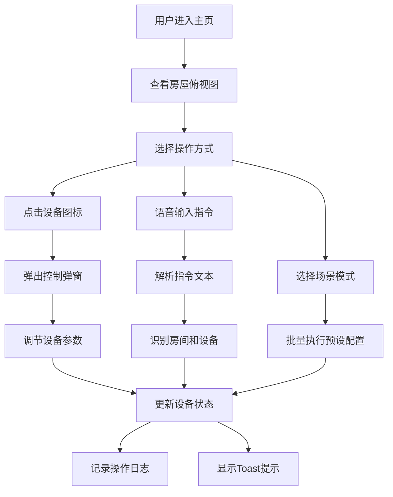

## 1. 产品概述

智能家居模拟控制面板是一个网页版的智能家居管理系统，通过可视化的房屋俯视图展示4个房间（客厅、卧室、厨房、卫生间），用户可以直观地控制各类智能设备，支持语音控制、场景模式、能耗统计和设备日志功能。

- 目标用户：智能家居爱好者、住宅业主、租房用户
- 产品价值：提供直观、便捷的智能家居设备统一管理体验

## 2. 核心功能

### 2.1 用户角色
| 角色 | 注册方式 | 核心权限 |
|------|----------|----------|
| 普通用户 | 无需注册，直接使用 | 设备控制、语音控制、场景模式、查看能耗和日志 |

### 2.2 功能模块
1. **主页（房屋俯视图）**：整屏房屋布局、4个房间展示、房间内设备图标、设备状态可视化
2. **设备控制弹窗**：灯（亮度/颜色）、空调（温度/模式）、窗帘（开闭百分比）、音响、加湿器、摄像头
3. **语音控制**：文本输入框模拟语音、指令识别、设备执行、Toast提示
4. **场景模式**：回家、离家、睡眠、派对四种一键场景
5. **能耗统计**：每日能耗折线图、按设备分类柱状图、总用电度数显示
6. **设备日志**：设备操作记录、时间戳、IndexedDB持久化存储

### 2.3 页面详情
| 页面名称 | 模块名称 | 功能描述 |
|----------|----------|----------|
| 主页 | 房屋俯视图 | SVG绘制的房屋平面布局，4个房间分区显示 |
| 主页 | 设备图标 | 每个房间内展示设备图标，点击打开控制弹窗 |
| 主页 | 语音控制栏 | 底部固定语音输入区域，支持文本指令输入 |
| 主页 | 场景模式栏 | 顶部场景快捷切换按钮 |
| 主页 | 能耗统计面板 | 右侧滑出式能耗统计图表面板 |
| 主页 | 设备日志面板 | 右侧滑出式日志记录面板 |
| 弹窗 | 设备控制弹窗 | 居中模态框，根据设备类型显示不同控制项 |
| 通用 | Toast提示 | 操作成功/失败的消息提示 |

## 3. 核心流程

### 3.1 设备控制流程
用户进入主页 → 选择房间 → 点击设备图标 → 弹出控制弹窗 → 调节参数 → 关闭弹窗 → 设备状态更新 → 记录日志

### 3.2 语音控制流程
用户点击语音输入框 → 输入指令文本（如"打开客厅灯"）→ 系统解析指令 → 识别房间和设备 → 执行对应操作 → 显示成功Toast → 更新设备状态

### 3.3 场景模式流程
用户点击场景按钮（如"回家模式"）→ 系统批量执行预设设备配置 → 多个设备状态同时更新 → 显示场景执行成功提示

## 4. 用户界面设计

### 4.1 设计风格
- **主色调**：深蓝色(#1e3a5f)作为主色，科技感青蓝色(#00d4ff)作为点缀色，深灰(#1a1a2e)作为背景
- **辅助色**：绿色(#00ff88)表示开启/正常，橙色(#ff6b35)表示警告/高亮
- **按钮风格**：圆角胶囊型按钮，带微妙的渐变和光晕效果
- **字体**：标题使用Space Grotesk，正文使用Inter
- **布局风格**：深色科技感主题，玻璃拟态(Glassmorphism)卡片，微妙的发光效果
- **图标风格**：线性图标，悬停时有填充动画效果

### 4.2 页面设计概述
| 页面名称 | 模块名称 | UI元素 |
|----------|----------|--------|
| 主页 | 房屋俯视图 | SVG房屋轮廓、房间分区背景、设备图标定位、状态指示灯 |
| 主页 | 语音控制栏 | 麦克风图标、文本输入框、发送按钮、渐变背景 |
| 主页 | 场景模式栏 | 4个场景卡片、图标+文字、选中态高亮边框 |
| 弹窗 | 设备控制 | 半透明背景、玻璃拟态卡片、滑块控件、色盘选择器、开关按钮 |
| 面板 | 能耗统计 | Chart.js折线图/柱状图、数据卡片、数字动画 |
| 面板 | 设备日志 | 时间线布局、操作记录条目、滚动容器 |

### 4.3 响应式
- 桌面端优先设计（1280px以上）
- 平板端（768-1279px）：侧边栏改为底部抽屉
- 移动端（768px以下）：房屋布局自适应缩放，控制面板全屏显示

### 4.4 动效设计
- 页面加载：房屋轮廓描边动画、设备图标渐次出现
- 设备状态切换：图标发光脉冲动画
- 弹窗：缩放+淡入淡出过渡
- Toast：顶部滑入+自动消失
- 场景切换：多设备状态联动过渡动画
