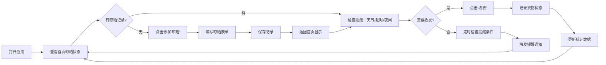

## 1. 产品概述

晾衣防雨提醒应用，帮助家庭管理阳台晾晒衣物，避免因天气突变、晾晒超时或夜间遗忘导致衣物白洗。

- 主要解决问题：晾晒衣物后遗忘收取，遇下雨、起雾或夜间导致衣物受潮
- 目标用户：有阳台晾晒习惯的家庭用户
- 产品价值：智能提醒减少衣物返工，晾晒管理一目了然

## 2. 核心功能

### 2.1 用户角色
| 角色 | 注册方式 | 核心权限 |
|------|----------|----------|
| 家庭成员 | 无需注册，本地使用 | 记录晾晒、收取衣物、查看提醒和统计 |

### 2.2 功能模块
1. **首页**：按阳台区域展示晾晒衣物、提醒横幅、快捷操作
2. **晾晒记录**：新建晾晒记录表单（衣物类型、数量、位置、负责人、预计时长、厚衣标记、照片）
3. **收衣记录**：收取衣物时记录状态（已干/返潮/需二次晾晒）
4. **智能提醒**：天气变化提醒、超时提醒、夜间未收提醒
5. **统计面板**：返潮次数统计、忘收责任人排行、厚衣提前安排

### 2.3 页面详情
| 页面名称 | 模块名称 | 功能描述 |
|---------|----------|----------|
| 首页 | 区域晾晒展示 | 按阳台分区域卡片显示当前晾晒衣物列表，每件显示衣物类型、数量、负责人、晾晒时长 |
| 首页 | 提醒横幅 | 顶部醒目标识显示当前活跃提醒（下雨预警、超时衣物、夜间未收） |
| 首页 | 快捷操作 | 快速添加晾晒、快速收衣按钮 |
| 首页 | 统计概览 | 本周返潮次数、忘收次数、待收厚衣数量 |
| 晾晒记录页 | 衣物信息表单 | 选择衣物类型（上衣/裤子/内衣/床单/其他）、输入数量 |
| 晾晒记录页 | 位置与负责人 | 选择晾晒区域（南阳台/北阳台/主卧阳台/其他）、选择负责人 |
| 晾晒记录页 | 时间设置 | 自动记录开始时间，设置预计晾晒时长 |
| 晾晒记录页 | 特殊标记 | 是否厚衣、上传照片（可选） |
| 收衣弹窗 | 状态记录 | 选择衣物状态：已干完美、轻微返潮、严重返潮需二次晾晒 |
| 收衣弹窗 | 快速备注 | 可选备注信息 |
| 统计页 | 返潮统计 | 本周/本月返潮次数趋势图，按区域分布 |
| 统计页 | 忘收排行 | 按责任人统计忘收次数排行 |
| 统计页 | 厚衣管理 | 当前晾晒中的厚衣列表，建议收取时间 |

## 3. 核心流程

## 4. 用户界面设计

### 4.1 设计风格
- **主色调**：清新天蓝色 `#4A90D9`（代表天空和晴朗），辅助色：暖阳橙 `#F5A623`（代表阳光和温暖）
- **警示色**：雨滴蓝 `#3B82F6`（下雨预警）、晚霞紫 `#8B5CF6`（夜间提醒）、珊瑚红 `#EF4444`（超时提醒）
- **按钮风格**：圆润胶囊型按钮，带有柔和阴影和悬停微动画
- **字体**：标题使用「霞鹜文楷」增强温馨家庭感，正文使用「PingFang SC」保证可读性
- **布局风格**：卡片式布局，区域卡片带有轻微毛玻璃效果，模拟阳台晾衣场景
- **图标风格**：使用 Emoji 图标（👕👖🩲🛏️🌧️☀️🌙）增加亲和力

### 4.2 页面设计概述
| 页面名称 | 模块名称 | UI 元素 |
|---------|----------|---------|
| 首页 | 区域晾晒展示 | 每个区域卡片带有渐变背景（南阳台暖橙渐变、北阳台浅蓝渐变），衣物条目横向排列，悬停显示操作按钮 |
| 首页 | 提醒横幅 | 顶部固定横幅，根据提醒类型显示不同颜色背景和动画（下雨时雨滴飘落动画、超时闪烁效果） |
| 首页 | 快捷操作 | 右下角浮动操作按钮组，展开可快速操作 |
| 晾晒记录页 | 表单 | 分段式表单，每完成一段有进度指示，表单字段带有图标前缀 |
| 统计页 | 图表 | 简约条形图和环形图，使用柔和渐变色 |

### 4.3 响应式
- 桌面端：左右分栏布局，左侧区域列表，右侧详情和统计
- 移动端：单列布局，底部 Tab 导航，卡片全屏宽度
- 触控优化：按钮最小高度 44px，滑动删除/收衣操作

### 4.4 特殊动效
- 晾晒衣物卡片添加轻微微风摆动动画（transform: rotate 1-2deg 循环）
- 天气变化时添加雨滴飘落或阳光照射的背景动效
- 收衣时添加衣物「收起」的折叠动画过渡
