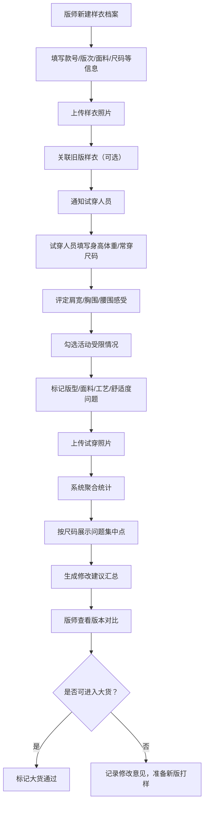

## 1. 产品概述

样衣试穿记录系统是面向服装公司版师、设计和样衣部门的内部管理工具，用于系统化记录样衣打样后的试穿反馈，解决群聊反馈散乱、难以按尺码追溯问题的痛点。通过结构化录入试穿数据、多维度问题标记、版本对比和统计分析，帮助版师快速定位问题、高效迭代版型，并辅助决策是否进入大货生产。

## 2. 核心功能

### 2.1 用户角色

| 角色 | 注册方式 | 核心权限 |
|------|----------|----------|
| 版师 | 内部账号 | 新建/编辑样衣档案、录入试穿反馈、查看统计、版本对比、大货决策 |
| 设计师 | 内部账号 | 查看样衣档案、试穿反馈、统计分析 |
| 试穿人员 | 内部账号 | 录入个人试穿反馈、上传试穿照片 |

### 2.2 功能模块

1. **样衣档案列表页**：样衣卡片展示、搜索筛选、按款号/尺码/日期排序、新建样衣入口
2. **样衣档案详情页**：样衣基本信息、版本时间线、试穿反馈列表、问题统计、大货状态
3. **新建/编辑样衣页**：款号、版次、面料、尺码、目标人群、打样日期、照片上传、关联旧版
4. **试穿反馈录入页**：试穿人信息、身体数据、各部位感受、活动受限描述、问题标记、照片上传
5. **数据统计看板**：各尺码问题集中点热力图、问题类型分布、修改建议汇总、大货通过率

### 2.3 页面详情

| 页面名称 | 模块名称 | 功能描述 |
|----------|----------|----------|
| 样衣档案列表页 | 顶部导航 | Logo、系统名称、用户头像、全局搜索 |
| 样衣档案列表页 | 筛选栏 | 款号搜索、尺码筛选、打样日期范围、大货状态筛选 |
| 样衣档案列表页 | 样衣卡片网格 | 缩略图、款号版次、尺码、打样日期、反馈数量、问题标签、大货状态徽章 |
| 样衣档案详情页 | 样衣信息头 | 主照片、款号、版次、面料、尺码、目标人群、打样日期、大货状态 |
| 样衣档案详情页 | 版本时间线 | 各版次节点、关联旧版跳转、版本对比入口 |
| 样衣档案详情页 | 试穿反馈列表 | 按尺码分组、试穿人卡片、各部位评分、问题标签、照片预览 |
| 样衣档案详情页 | 问题统计区 | 问题类型饼图、各尺码问题柱状图、修改建议汇总 |
| 新建/编辑样衣页 | 基础信息表单 | 款号、版次、面料、尺码多选、目标人群、打样日期 |
| 新建/编辑样衣页 | 照片上传 | 拖拽上传、多图预览、删除重排 |
| 新建/编辑样衣页 | 版本关联 | 选择关联旧版样衣、显示关联关系预览 |
| 试穿反馈录入页 | 试穿人信息 | 姓名、身高、体重、常穿尺码、试穿尺码 |
| 试穿反馈录入页 | 身体部位感受 | 肩宽、胸围、腰围的滑块评分（太紧/合适/太松）+ 文字补充 |
| 试穿反馈录入页 | 活动受限描述 | 抬臂、下蹲、转身等常见动作的受限程度勾选 |
| 试穿反馈录入页 | 问题标记 | 版型/面料/工艺/舒适度四类问题多选 + 自定义描述 |
| 试穿反馈录入页 | 试穿照片 | 正面/侧面/背面多图上传、拖拽排序 |
| 数据统计看板 | 尺码问题热力图 | 矩阵展示各尺码×各问题类型的发生频次 |
| 数据统计看板 | 问题分布图表 | 版型/面料/工艺/舒适度占比饼图、趋势折线图 |
| 数据统计看板 | 修改建议墙 | 聚合所有反馈中的修改建议、按频次排序 |
| 数据统计看板 | 大货决策列表 | 待决策样衣、通过/驳回操作、决策备注 |

## 3. 核心流程

版师新建样衣档案 → 上传样衣照片并关联旧版（如有）→ 通知试穿人员录入反馈 → 试穿人员填写身体数据、部位感受、标记问题并上传照片 → 系统自动聚合统计各尺码问题 → 版师查看统计分析与版本对比 → 综合判断是否进入大货或修改后再打样。

## 4. 用户界面设计

### 4.1 设计风格

- **主色调**：深炭灰 #2D2D2D（专业稳重）+ 暖米色 #F5F0E8（面料质感）+ 砖红 #C75B39（问题警示）
- **辅助色**：墨绿 #4A6B57（通过/正常）、浅金 #D4B896（重点标注）
- **按钮风格**：微圆角（4px），主按钮实心炭灰配浅色文字，次按钮描边，悬停有细腻阴影
- **字体**：标题用「思源宋体」体现服装行业的质感与精致，正文用「Inter」保证数据可读性
- **布局风格**：卡片式布局，大量留白，分栏清晰，类似高端时尚杂志的编辑感
- **图标风格**：线性简约图标，统一 2px 线宽，问题标签用小徽章形式

### 4.2 页面设计概览

| 页面名称 | 模块名称 | UI 元素 |
|----------|----------|----------|
| 样衣档案列表页 | 筛选栏 | 浅色卡片底、细边框搜索框、胶囊状筛选标签 |
| 样衣档案列表页 | 样衣卡片 | 大尺寸主图、hover 微放大、角落版次徽章、底部问题标签横向滚动 |
| 样衣档案详情页 | 信息头 | 左侧大图右侧两列信息、大字号款号、金棕色面料标签、右上角大货状态胶囊 |
| 样衣档案详情页 | 版本时间线 | 竖向时间轴、节点圆点、连线体现版本演进、hover 显示该版问题摘要 |
| 样衣档案详情页 | 反馈卡片 | 按尺码分 Tab、试穿人头像+身体数据、部位感受用横条进度条配色区分 |
| 试穿反馈录入页 | 部位评分 | 三档滑块（太紧/合适/太松）配颜色渐变（红→绿→蓝）、下方文字输入框 |
| 试穿反馈录入页 | 问题标记 | 四色分类卡片（版型-炭灰/面料-米色/工艺-浅金/舒适-砖红）、多选勾选 |
| 数据统计看板 | 热力图 | 尺码×问题类型矩阵、颜色深浅代表频次、点击单元格钻取详情 |
| 数据统计看板 | 修改建议墙 | 瀑布流卡片、字体大小随频次变化、类似词云但更规整 |

### 4.3 响应式

- 桌面优先设计，主内容区固定最大宽度 1440px
- 平板端（768-1024px）：样衣卡片从 4 列改为 3 列，详情页信息头改为上下堆叠
- 移动端（<768px）：导航折叠为汉堡菜单，卡片单列，反馈表单分段纵向排布
- 所有交互元素触控区域 ≥ 44×44px

### 4.4 动效设计

- 页面加载：卡片依次淡入上移，stagger 延迟 80ms
- 样衣卡片 hover：图片 1.02 倍缩放 + 柔和阴影加深，过渡 300ms
- 问题标签点击：选中状态有背景色填充动画，150ms ease-out
- 统计图表：首次进入时数据从 0 动画增长到目标值，持续 800ms
- 版本时间线：滚动到视口时节点依次点亮
