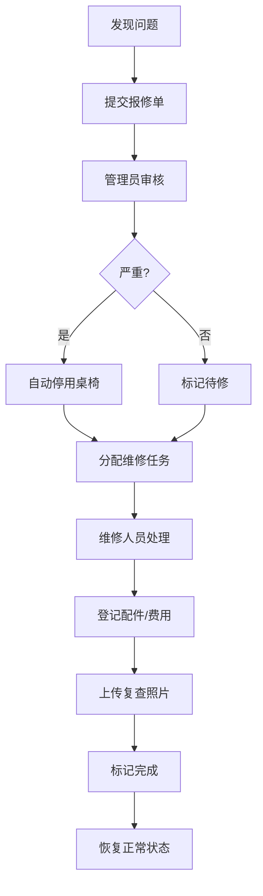

## 1. 产品概述

社区棋牌室桌椅报修系统是一套面向社区棋牌室的设施运维管理平台，解决桌椅损坏发现不及时、维修流程混乱、安全隐患突出的问题。系统覆盖桌椅全生命周期管理，居民和管理员可随时报修，巡检人员按房间逐件核查，严重问题自动停用并标记，维修记录完整可追溯，通过数据看板直观展示设施健康状况。

- **目标用户**：社区居民、棋牌室管理员、巡检人员、维修人员
- **核心价值**：降低安全事故风险、提高维修效率、延长设施使用寿命

## 2. 核心功能

### 2.1 用户角色

| 角色 | 登录方式 | 核心权限 |
|------|----------|----------|
| 居民 | 账号登录 | 提交报修单、查看报修进度、浏览桌椅信息 |
| 管理员 | 账号登录 | 全部功能：桌椅档案管理、报修处理、巡检安排、维修记录、数据看板 |
| 巡检员 | 账号登录 | 执行巡检任务、提交巡检结果、标记问题桌椅 |

### 2.2 功能模块

1. **数据看板**：待修统计、停用统计、重复故障、房间完好率、高峰使用时段
2. **桌椅档案**：桌椅列表、档案详情、新增/编辑/删除、照片管理
3. **报修管理**：报修单列表、提交报修、报修处理、状态跟踪
4. **巡检管理**：巡检任务、按房间巡检、巡检记录、问题标记
5. **维修管理**：维修记录、维修处理、配件登记、费用记录、复查照片

### 2.3 页面详情

| 页面名称 | 模块名称 | 功能描述 |
|----------|----------|----------|
| 数据看板 | 概览统计卡片 | 显示待修数量、停用数量、重复故障数、总桌椅数、完好率 |
| 数据看板 | 房间完好率图表 | 柱状图展示各房间桌椅完好率排名 |
| 数据看板 | 高峰使用时段 | 热力图展示各时段报修/使用频率 |
| 数据看板 | 重复故障列表 | 展示多次出现故障的桌椅及故障类型 |
| 数据看板 | 待修/停用列表 | 展示近期待修和停用的桌椅简要信息 |
| 桌椅档案 | 桌椅列表 | 按房间/类型/状态筛选，支持搜索编号，卡片式展示 |
| 桌椅档案 | 档案详情 | 完整展示桌椅信息：编号、房间、类型、购入日期、承重、巡检记录、维修历史、照片 |
| 桌椅档案 | 档案管理 | 新增、编辑、删除桌椅档案，上传照片 |
| 报修管理 | 报修列表 | 按状态/时间/类型筛选，显示报修人、问题描述、紧急程度 |
| 报修管理 | 提交报修 | 选择桌椅、问题类型（晃动/裂纹/椅脚不平/桌面起皮/抽屉卡住/靠背松动）、描述、上传照片 |
| 报修管理 | 报修详情 | 查看报修详情、处理进度、分配维修、标记停用 |
| 巡检管理 | 巡检任务 | 显示当前待巡检房间列表，按房间逐件确认 |
| 巡检管理 | 房间巡检 | 展示该房间所有桌椅，逐件标记状态（正常/有问题/停用），记录问题 |
| 巡检管理 | 巡检记录 | 历史巡检记录查询，按房间/时间筛选 |
| 维修管理 | 维修列表 | 维修任务列表，显示待维修/维修中/已完成状态 |
| 维修管理 | 维修处理 | 登记处理人、使用配件、维修费用、上传复查照片 |
| 维修管理 | 维修记录 | 历史维修记录查询，支持导出统计 |

## 3. 核心流程

### 3.1 报修流程
居民或管理员发现桌椅问题后，选择对应桌椅并提交报修单，系统自动记录报修时间和问题类型。管理员审核报修单，严重问题自动将桌椅标记为"停用"状态并贴维修标记，然后分配维修任务。维修完成后更新状态并记录维修详情。

### 3.2 巡检流程
巡检员选择待巡检房间，系统展示该房间所有桌椅清单。巡检员逐件检查，正常则标记通过，发现问题则选择问题类型并描述，严重问题自动停用。巡检完成后系统生成巡检记录并自动创建报修单。

### 3.3 维修流程
维修人员接收维修任务，查看问题描述和桌椅信息。维修过程中登记使用的配件和费用，维修完成后上传复查照片并标记完成。系统自动更新桌椅状态为"正常"，并记录完整维修历史。

## 4. 用户界面设计

### 4.1 设计风格
- **主色调**：温暖的橙红色系 (#E65100)，传递社区关怀与警示感
- **辅助色**：深青色 (#00695C) 代表安全可靠，浅灰蓝背景增加舒适度
- **按钮风格**：圆角胶囊式按钮，悬停有轻微上浮和阴影变化
- **字体**：标题使用思源宋体增强稳重感，正文使用思源黑体保证可读性
- **布局风格**：侧边导航 + 顶部栏 + 内容区的经典后台布局，卡片式内容展示
- **图标风格**：线性图标配合圆角，统一 2px 线条粗细

### 4.2 页面设计概览

| 页面名称 | 模块名称 | UI 元素 |
|----------|----------|----------|
| 数据看板 | 统计卡片 | 渐变色背景卡片，大数字 + 趋势小箭头，卡片悬停微上浮 |
| 数据看板 | 图表区域 | 简洁柱状图和热力图，柔和配色，动画加载 |
| 桌椅档案 | 列表卡片 | 图片 + 编号标签 + 状态徽章 + 基本信息网格 |
| 桌椅档案 | 详情页 | 左右布局，左侧照片轮播，右侧信息分块展示 |
| 报修管理 | 列表 | 表格 + 状态标签，紧急程度用颜色区分 |
| 巡检管理 | 房间巡检 | 网格布局桌椅卡片，点击标记状态，进度条显示巡检进度 |
| 维修管理 | 维修单 | 步骤条展示处理进度，配件列表表格 |

### 4.3 响应式
桌面端优先设计，平板端自适应调整列数，移动端简化为单列布局，侧边导航可折叠。触控按钮最小 44px，确保操作便捷。

### 4.4 视觉细节
- 状态徽章使用不同颜色：正常（绿色）、待修（橙色）、停用（红色）、维修中（蓝色）
- 卡片有细微边框和柔和阴影，悬停时阴影加深
- 页面切换有淡入过渡动画
- 数据加载有骨架屏占位
- 重要操作前有确认弹窗
