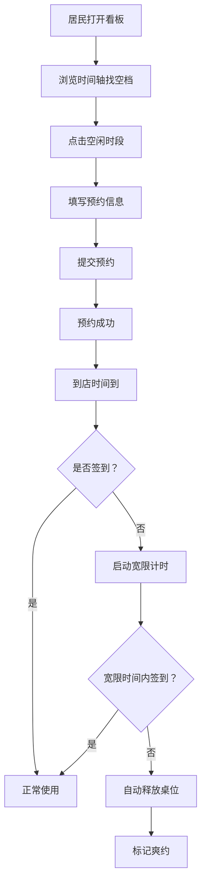

## 1. 产品概述

社区棋牌室桌位预约系统，解决老人到店无桌的痛点，提供可视化时间轴看板，支持桌位管理、在线预约、自动释放和运营数据分析。

- 目标用户：社区棋牌室管理员和居民（以老年人为主）
- 核心价值：提升桌位利用率，减少到店无桌的失望，简化预约管理流程

## 2. 核心功能

### 2.1 用户角色
| 角色 | 登录方式 | 核心权限 |
|------|----------|----------|
| 管理员 | 密码登录 | 桌位管理、预约管理、查看运营数据、签到确认 |
| 居民 | 无需登录 | 查看看板、提交预约、取消预约 |

### 2.2 功能模块
1. **看板首页**：时间轴展示所有桌位今日预约状态，一目了然看空档
2. **桌位预约**：选择桌位和时段，填写预约信息提交
3. **桌位管理**：管理员维护桌号、容量、设施标签、开放时段、照片
4. **运营面板**：高峰时段统计、爽约次数、热门桌位排行
5. **签到管理**：到店签到，超时自动释放桌位

### 2.3 页面详情
| 页面名称 | 模块名称 | 功能描述 |
|---------|----------|----------|
| 看板首页 | 顶部导航 | 日期选择、今日日期、管理员入口 |
| 看板首页 | 时间轴看板 | 横向时间轴，纵向桌位列表，色块展示预约状态 |
| 看板首页 | 桌位卡片 | 桌号、容量、设施标签、照片缩略图 |
| 预约弹窗 | 时段选择 | 开始/结束时间，人数，玩法选择 |
| 预约弹窗 | 联系人信息 | 姓名、电话、茶水需求 |
| 桌位管理 | 桌位列表 | 增删改查桌位信息 |
| 桌位管理 | 桌位表单 | 桌号、容量、靠窗、麻将桌、开放时段、照片 |
| 运营面板 | 数据概览 | 今日预约数、到店率、爽约数 |
| 运营面板 | 高峰时段 | 柱状图展示各时段预约量 |
| 运营面板 | 热门桌位 | 排行榜展示最抢手桌位 |
| 运营面板 | 爽约记录 | 爽约次数统计和明细 |

## 3. 核心流程

### 3.1 居民预约流程
居民打开看板 → 浏览时间轴找空档 → 点击空闲时段 → 填写预约信息 → 提交成功 → 到店签到 → 按时使用

### 3.2 自动释放流程
预约开始时间到 → 检查是否签到 → 未签到则启动宽限时（默认15分钟）→ 宽限到期仍未签到 → 自动释放桌位 → 标记为爽约

### 3.3 Mermaid 流程图

## 4. 用户界面设计

### 4.1 设计风格
- **主色调**：温暖的橙红色系（#E85D3A），搭配米色背景，营造社区温馨感
- **辅助色**：墨绿色（#2D6A4F）表示可用/成功，深红色表示占用/警告
- **按钮风格**：圆角胶囊形按钮，大字号方便老人点击
- **字体**：使用清晰易读的无衬线字体，字号偏大（正文16px起）
- **布局风格**：卡片式布局，留白充足，信息层次分明
- **图标风格**：简约线性图标，搭配文字标签，降低识别成本

### 4.2 页面设计概览
| 页面名称 | 模块名称 | UI元素 |
|---------|----------|--------|
| 看板首页 | 时间轴看板 | 横向时间刻度、纵向桌位卡片、彩色时间块、悬停提示、点击交互 |
| 看板首页 | 顶部栏 | 日期切换、当前日期高亮、管理员入口按钮、今日概览数字 |
| 预约弹窗 | 表单区域 | 大字号标签、大输入框、圆形单选按钮、分段选择器 |
| 桌位管理 | 列表页 | 表格布局、操作按钮组、照片缩略图、状态标签 |
| 运营面板 | 数据卡片 | 大数字展示、趋势箭头、图标点缀、渐变背景 |
| 运营面板 | 图表区 | 柱状图、排行榜、进度条、数据标签 |

### 4.3 响应式
- 桌面端优先设计，时间轴横向展开
- 平板端保持横向滚动，触控优化
- 手机端时间轴改为竖向时间块，桌位卡片垂直堆叠

### 4.4 动效与交互
- 时间块悬停时轻微放大+阴影加深
- 预约成功后弹窗渐隐，看板对应位置渐显新预约块
- 自动释放时有柔和的闪烁提示
- 页面切换使用淡入淡出过渡
- 数字变化使用滚动计数动画
