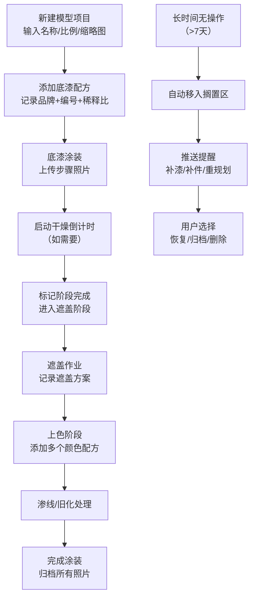

## 1. 产品概述

模型涂装进度板是为模型爱好者设计的涂装进度管理工具，帮助用户追踪多个模型项目的涂装进度，记录颜色配方，按步骤归档照片，并管理干燥等待时间。解决了"开坑太多、进度遗忘、配方丢失"的痛点。

- 目标用户：模型爱好者、高达玩家、军模制作者、手办涂装玩家
- 核心价值：多项目并行管理、配方永久保存、进度可视化、智能提醒

## 2. 核心特性

### 2.1 用户角色

| 角色 | 注册方式 | 核心权限 |
|------|----------|----------|
| 模型制作者 | 本地使用（无需注册） | 完整的项目管理、配方记录、照片归档、提醒设置 |

### 2.2 功能模块

1. **进度看板主页**：模型卡片列表、进度概览、快速操作
2. **模型详情页**：阶段进度、颜色配方、照片画廊、干燥倒计时
3. **搁置区**：长时间停滞项目、提醒管理、重新规划
4. **配方管理**：颜色品牌、编号、稀释比例、使用部位记录

### 2.3 页面详情

| 页面名称 | 模块名称 | 功能描述 |
|----------|----------|----------|
| 进度看板主页 | 顶部导航栏 | 新建模型按钮、搁置区入口、筛选器 |
| 进度看板主页 | 模型卡片网格 | 缩略图、比例标签、当前阶段徽章、下一步提示、进度条 |
| 进度看板主页 | 快速操作区 | 标记完成、添加配方、上传照片、启动干燥倒计时 |
| 模型详情页 | 阶段时间轴 | 底漆→遮盖→上色→渗线→旧化→完成 的可视化进度 |
| 模型详情页 | 颜色配方列表 | 品牌、编号、稀释比例、使用部位、颜色预览 |
| 模型详情页 | 照片画廊 | 按步骤分组的照片归档、点击放大查看 |
| 模型详情页 | 干燥计时器 | 可自定义时长的倒计时、通知提醒 |
| 搁置区 | 停滞项目列表 | 显示停滞天数、上次操作时间、提醒类型 |
| 搁置区 | 批量操作 | 批量提醒设置、重新排序、标记恢复/归档 |

## 3. 核心流程

## 4. 用户界面设计

### 4.1 设计风格
- **整体风格**：工业工作室风格，深色主题，温暖的金属色调
- **主色调**：深炭灰色背景 (#1A1A1E)，铜橙色点缀 (#D97706)，军绿色强调 (#4D7C5E)
- **辅助色**：铁锈红 (#B91C1C) 表示搁置警告，钴蓝色 (#1D4ED8) 表示进行中
- **按钮样式**：圆角矩形，轻微立体阴影，hover时有金属光泽渐变
- **字体**：标题用 "Space Grotesk" 工业感字体，正文用 "Inter" 保证可读性
- **布局风格**：卡片式网格，卡片有细微边框和投影，模拟工作台实物感
- **图标风格**：线性图标，工业风，配合徽章和标签使用

### 4.2 页面设计概览

| 页面名称 | 模块名称 | UI元素 |
|----------|----------|--------|
| 进度看板主页 | 模型卡片 | 缩略图（带裁剪圆角）、比例标签（1/100等）、当前阶段徽章（铜橙色圆角）、进度条（分6段着色）、下一步行动文字提示、三个快速操作按钮 |
| 进度看板主页 | 顶部区域 | 标题文字带工业风装饰线、新建模型按钮（铜橙色突出）、筛选下拉（按阶段/比例/时间）、搁置区入口（带红色未读提醒标记） |
| 模型详情页 | 阶段时间轴 | 垂直线条连接6个阶段节点，当前阶段发光高亮，已完成阶段打勾，未到达阶段灰色显示 |
| 模型详情页 | 配方卡片 | 颜色预览方块（实际颜色）、品牌logo占位、编号文字、稀释比例（如1:1）、使用部位标签（如"装甲正面"） |
| 模型详情页 | 干燥倒计时 | 大号数字显示（时分秒）、进度环动画、暂停/重置按钮、提前完成按钮 |
| 搁置区 | 停滞项目卡片 | 灰色调、红色"已停滞X天"标记、提醒原因标签（补漆/补件/规划）、快速操作（恢复/归档） |

### 4.3 响应性
- 桌面端（默认）：3列网格布局，侧边详情面板
- 平板端：2列网格，详情页全屏
- 移动端：单列瀑布流，底部导航栏
- 触摸优化：按钮最小高度48px，卡片间距适中

### 4.4 动效设计
- 页面加载：卡片依次淡入（staggered 100ms延迟）
- 阶段完成：节点打勾动画 + 轻微庆祝效果
- 倒计时：数字跳动动画，进度环实时更新
- 悬停效果：卡片轻微上浮 + 投影加深
- 搁置提醒：脉冲呼吸动画吸引注意
