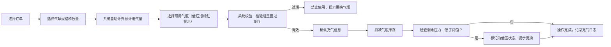
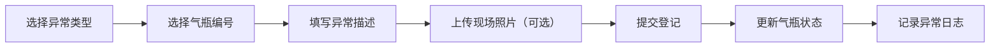

## 1. 产品概述
派对小店氦气瓶数字化管理系统，替代传统"师傅估摸"的气瓶余量判断方式，实现气瓶库存、充气操作、异常登记和数据分析的全流程可视化管理。
- 核心价值：提升气瓶使用效率、降低安全风险、数据驱动经营决策
- 目标用户：派对小店店主、充气师傅、运营管理人员

## 2. 核心功能

### 2.1 用户角色
| 角色 | 核心权限 |
|------|----------|
| 店主/管理员 | 全部功能：气瓶管理、充气操作、异常登记、统计分析、数据导出 |
| 充气师傅 | 充气操作、异常登记、气瓶查看 |

### 2.2 功能模块
1. **气瓶管理页**：气瓶列表展示、状态筛选、详情查看、安全照片
2. **充气操作页**：订单选择、气球规格/数量录入、用气量计算、库存扣减、低压预警
3. **异常登记页**：空瓶归还、换瓶、漏气、阀门异常四大类登记
4. **统计分析页**：周用气量趋势、订单毛利、异常瓶号排行、气球耗气量分析

### 2.3 页面详情
| 页面名称 | 模块名称 | 功能描述 |
|-----------|-------------|---------------------|
| 气瓶管理页 | 顶部筛选区 | 按状态筛选（全部/正常/低压/过期）、按编号搜索 |
| 气瓶管理页 | 气瓶卡片列表 | 展示编号、容量、压力表读数、存放位置、押金、检验日期、状态标签、安全照片缩略图 |
| 气瓶管理页 | 气瓶详情弹窗 | 完整信息展示、历史充气记录、安全照片大图查看 |
| 充气操作页 | 充气表单 | 订单选择、气球规格选择、数量输入、预计用气量自动计算、操作人选择 |
| 充气操作页 | 气瓶选择 | 显示可用气瓶列表、优先推荐满瓶、低压瓶红色警示 |
| 充气操作页 | 充气确认 | 显示扣减后余量、确认提交操作 |
| 异常登记页 | 异常类型选择 | 空瓶归还/换瓶/漏气/阀门异常 四大类Tab切换 |
| 异常登记页 | 登记表单 | 瓶号选择、异常描述、照片上传、登记人、登记时间 |
| 异常登记页 | 异常记录列表 | 历史异常记录按时间倒序展示 |
| 统计分析页 | 周用气量图表 | 柱状图展示近8周用气量趋势 |
| 统计分析页 | 订单毛利卡片 | 本周/本月毛利金额、环比变化 |
| 统计分析页 | 异常瓶号排行 | 异常次数最多的瓶号Top5 |
| 统计分析页 | 气球耗气排行 | 按气球类型统计耗气量，识别最费气的气球类型 |

## 3. 核心流程

### 3.1 充气操作流程

### 3.2 异常登记流程

## 4. 用户界面设计

### 4.1 设计风格
- **设计理念**：工业实用风 × 派对活力感 — 专业可靠又不失趣味
- **主色调**：深海蓝 `#0F2A4A` — 代表专业、安全、可信
- **辅助色**：活力橙 `#FF6B35` — 代表派对、活力、警示
- **状态色**：成功绿 `#10B981` / 警示黄 `#F59E0B` / 危险红 `#EF4444` / 中性灰 `#6B7280`
- **字体**：标题使用 "Space Grotesk" 粗体，正文使用 "Inter" 常规字重
- **按钮风格**：圆角 8px，悬停有微缩放和阴影效果
- **卡片风格**：轻微圆角 12px，淡色边框，悬停阴影加深
- **图标风格**：使用 lucide-react 线性图标，统一 20px 尺寸

### 4.2 页面设计概述
| 页面名称 | 模块名称 | UI 元素 |
|-----------|-------------|-------------|
| 气瓶管理页 | 顶部导航 | 左侧Logo + 标题，右侧导航Tab切换（气瓶/充气/异常/统计） |
| 气瓶管理页 | 筛选栏 | 搜索框 + 状态筛选标签组 + 新增气瓶按钮 |
| 气瓶管理页 | 卡片网格 | 响应式网格布局，每卡展示气瓶核心信息 + 状态色条 |
| 充气操作页 | 表单区 | 左侧表单输入，右侧气瓶选择列表 |
| 充气操作页 | 气瓶列表 | 竖向列表，每项显示瓶号、压力、状态标签，可点击选择 |
| 异常登记页 | Tab切换 | 四大异常类型顶部Tab，下方对应表单 + 历史记录 |
| 统计分析页 | 数据卡片 | 顶部4个核心指标卡片，下方图表区域 |
| 统计分析页 | 图表区 | 左侧周用气量柱状图，右侧两个排行列表 |

### 4.3 响应式
- 桌面端优先设计，支持 1280px 及以上宽屏
- 平板端（768px-1279px）：卡片网格从3列变2列
- 移动端（<768px）：单列布局，导航变底部Tab栏
- 触控优化：按钮最小 44px 点击区域，表单输入框适配软键盘

### 4.4 交互动效
- 页面切换：淡入 + 轻微上移，时长 300ms
- 卡片悬停：上移 2px + 阴影加深，时长 200ms
- 状态变化：颜色过渡动画，时长 300ms
- 低压提醒：脉冲动画（呼吸效果），持续循环
- 数据加载：骨架屏 + 渐变闪烁效果
