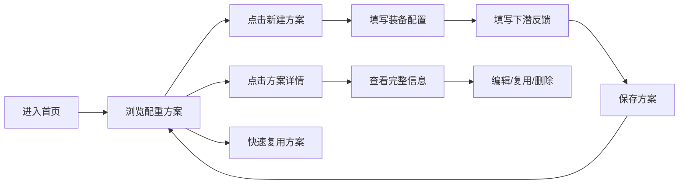

## 1. 产品概述

水下摄影配重记录工具，帮助潜水摄影师记录每次下潜的装备配置和配重反馈，形成可复用的配重方案库。解决下水前反复调试相机和配重的痛点，让同配置下潜可直接复用历史最优方案。

- 目标用户：水下摄影师、技术潜水员
- 核心价值：减少试错成本，提高配重精准度，让镜头稳定对准拍摄目标

## 2. 核心功能

### 2.1 功能模块

1. **配重方案列表**：浏览历史配重方案，支持搜索筛选，一键复用
2. **新建/编辑配重记录**：录入装备配置和下潜反馈
3. **方案详情页**：查看完整配重方案，包含配置信息和反馈评价

### 2.2 页面详情

| 页面名称 | 模块名称 | 功能描述 |
|---------|---------|---------|
| 方案列表页 | 顶部导航 | 标题、新建方案按钮、搜索框 |
| 方案列表页 | 方案卡片列表 | 展示方案摘要，支持快速复用、编辑、删除 |
| 方案列表页 | 空状态引导 | 无数据时引导创建第一个方案 |
| 新建/编辑页 | 装备配置表单 | 盐度、潜水服、相机壳体、镜头罩、浮力臂、铅块位置 |
| 新建/编辑页 | 下潜反馈表单 | 前倾、后仰、侧翻、上浮速度、操作手感评分 |
| 新建/编辑页 | 方案命名与保存 | 自定义方案名称，保存到本地存储 |
| 方案详情页 | 配置信息展示 | 完整展示装备配置参数 |
| 方案详情页 | 反馈信息展示 | 展示下潜反馈评分和备注 |
| 方案详情页 | 操作区 | 编辑、复用、删除按钮 |

## 3. 核心流程

## 4. 用户界面设计

### 4.1 设计风格

- **主色调**：深海蓝（#0a2540）作为主色，搭配青蓝（#00d4ff）作为强调色，营造水下氛围
- **辅助色**：珊瑚橙（#ff6b6b）用于警示和高亮，海藻绿（#2dd4bf）用于正向反馈
- **背景**：深色渐变背景，模拟深海环境，配合微妙的波纹纹理
- **卡片风格**：半透明玻璃拟态效果，圆角8px，柔和发光边框
- **字体**：标题使用现代无衬线字体，正文简洁清晰
- **图标风格**：线性图标，与水下主题呼应（潜水镜、气泡、相机等）

### 4.2 页面设计概览

| 页面名称 | 模块名称 | UI元素 |
|---------|---------|-------|
| 方案列表页 | 顶部区域 | 大标题、搜索框、新建按钮（渐变发光效果） |
| 方案列表页 | 方案卡片 | 玻璃拟态卡片，悬停上浮效果，显示盐度/装备摘要 |
| 新建/编辑页 | 表单区域 | 分组表单，图标标签，滑块/选择器交互 |
| 新建/编辑页 | 评分组件 | 五星或滑杆评分，实时反馈可视化 |
| 方案详情页 | 内容区 | 大卡片布局，配置项图标化展示 |

### 4.3 响应式

- 桌面端优先设计，支持平板和手机自适应
- 移动端采用单列布局，表单控件加大点击区域
- 触摸优化：按钮最小高度44px，滑动操作支持

### 4.4 动效设计

- 页面加载：淡入+轻微上浮动画
- 卡片悬停：Y轴上浮4px，阴影加深，边框发光增强
- 表单交互：输入框聚焦时边框发光过渡
- 保存成功：绿色成功提示，平滑滑入
- 气泡装饰：页面背景缓慢浮动的气泡元素，增强水下氛围
