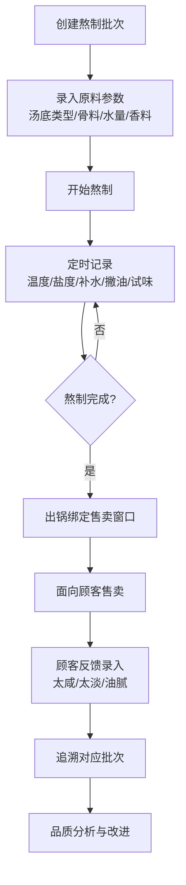

## 1. 产品概述

面馆汤底熬制批次管理系统，旨在解决汤底口味不稳定的问题。通过数字化记录每一批次的熬制过程，实现标准化操作、过程监控、顾客反馈追溯和品质趋势分析，确保汤底口味始终如一。

- 目标用户：面馆后厨师傅、店长、品质管理人员
- 核心价值：标准化熬制流程、可追溯品质管理、数据驱动品质提升

## 2. 核心功能

### 2.1 用户角色
| 角色 | 核心权限 |
|------|----------|
| 后厨师傅 | 创建熬制批次、记录熬制过程、出锅绑定售卖窗口 |
| 店长 | 查看所有批次、录入顾客反馈、查看品质看板 |
| 品质管理员 | 所有权限、查看稳定度趋势分析 |

### 2.2 功能模块
1. **批次管理页**：新建熬制批次、批次列表、批次详情
2. **熬制监控页**：过程记录（温度/盐度/补水/撇油/试味）、实时进度
3. **品质看板页**：正在熬制的锅、可用汤底剩余量、异常反馈、稳定度趋势
4. **反馈追溯页**：顾客反馈录入、关联批次追溯

### 2.3 页面详情
| 页面名称 | 模块名称 | 功能描述 |
|---------|---------|----------|
| 批次管理页 | 新建批次表单 | 汤底类型、骨料重量、加水量、香料包、开始时间、火力档位、目标出汤量、锅号、照片上传 |
| 批次管理页 | 批次列表 | 按状态/日期筛选、快速查看、编辑操作 |
| 批次管理页 | 批次详情 | 完整批次信息、熬制记录时间线、出锅绑定售卖窗口 |
| 熬制监控页 | 过程记录卡 | 温度、盐度、补水量、撇油情况、试味评价的定时记录 |
| 熬制监控页 | 实时进度条 | 熬制时长、预计出锅时间 |
| 品质看板页 | 正在熬制概览 | 卡片展示每口锅当前状态、已熬时长 |
| 品质看板页 | 汤底剩余量 | 各类型汤底可用剩余量柱状展示 |
| 品质看板页 | 异常反馈列表 | 最新太咸/太淡/油腻等反馈 |
| 品质看板页 | 稳定度趋势图 | 各汤底类型的盐度/口味稳定性折线图 |
| 反馈追溯页 | 反馈录入 | 反馈类型、严重程度、关联售卖窗口、备注 |
| 反馈追溯页 | 批次追溯链 | 从反馈追溯到具体批次、熬制记录、操作人员 |

## 3. 核心流程

**熬制批次主流程**：师傅创建批次 → 录入原料参数 → 定时记录熬制数据 → 试味评价 → 出锅绑定售卖窗口 → 顾客反馈 → 追溯批次 → 品质分析

## 4. 用户界面设计

### 4.1 设计风格
- **主色调**：深棕 (#5D4037) - 象征传统汤底的浓郁醇厚
- **辅助色**：暖橙 (#FF8A65) - 象征炉火温度、食欲
- **强调色**：米黄 (#FFF8E1) - 象征汤色、干净卫生
- **中性色**：深灰 #263238、浅灰 #ECEFF1
- **按钮风格**：微圆角 (8px)、暖色渐变、点击反馈动效
- **字体**：标题用思源宋体（传统感），正文用思源黑体（可读性）
- **布局风格**：卡片式布局、左侧导航、内容区网格化
- **图标风格**：Lucide 图标库，线性风格，暖色调

### 4.2 页面设计概览
| 页面名称 | 模块名称 | UI元素 |
|---------|---------|--------|
| 批次管理页 | 新建批次表单 | 分步骤表单、数值步进器、时间选择器、照片上传预览 |
| 批次管理页 | 批次列表 | 状态标签、时间轴缩略、悬浮操作菜单 |
| 熬制监控页 | 过程记录卡 | 大字体数值显示、状态指示灯、快捷记录按钮 |
| 熬制监控页 | 实时进度 | 渐变进度条、倒计时数字 |
| 品质看板页 | 正在熬制概览 | 大卡片、锅号徽章、状态色条、实时时钟 |
| 品质看板页 | 汤底剩余量 | 水平进度条、阈值警告色、数量大数字 |
| 品质看板页 | 稳定度趋势 | SVG折线图、多色系区分汤底、悬浮数据点 |
| 反馈追溯页 | 追溯链 | 时间轴连线、批次卡片高亮、操作人员标签 |

### 4.3 响应式
- 桌面端优先设计（后厨看板大屏展示）
- 平板自适应（师傅手持操作）
- 触控优化：大按钮、足够间距
