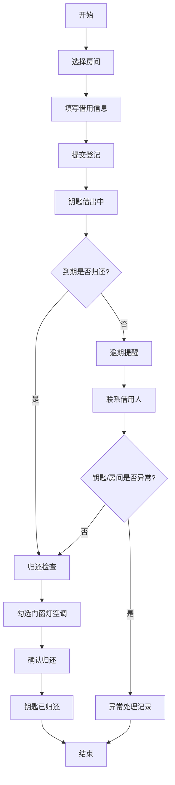

## 1. 产品概述

活动室钥匙管理系统用于解决社区活动室钥匙借用归还登记混乱、逾期无人提醒、损坏丢失无记录的问题。系统面向社区管理员，提供钥匙房间信息维护、借还登记、逾期提醒、异常处理和数据看板等功能，实现钥匙管理的规范化和可视化。

## 2. 核心功能

### 2.1 用户角色

| 角色 | 登录方式 | 核心权限 |
|------|----------|----------|
| 管理员 | 本地系统登录 | 房间钥匙管理、借还登记、异常处理、查看看板 |

### 2.2 功能模块

1. **数据看板**：按房间展示借出中、待归还、逾期数量及本周使用次数
2. **房间钥匙管理**：维护房间信息、钥匙编号、可借时段、押金、管理员、门牌照片
3. **借用登记**：记录活动名称、借用人、电话、借用时段、押金状态
4. **归还登记**：确认门窗灯空调是否关闭，记录归还时间
5. **逾期提醒**：单独展示逾期未还的借用记录
6. **异常处理**：钥匙丢失、房间损坏的处理记录

### 2.3 页面详情

| 页面名称 | 模块名称 | 功能描述 |
|----------|----------|----------|
| 数据看板 | 房间状态卡片 | 按房间展示借出中、待归还、逾期、本周使用次数统计 |
| 数据看板 | 逾期提醒栏 | 醒目展示所有逾期未还记录，支持快速操作 |
| 房间管理 | 房间列表 | 展示所有房间及钥匙信息，支持增删改查 |
| 房间管理 | 房间表单 | 录入房间名、钥匙编号、可借时段、押金、管理员、门牌照片 |
| 借用记录 | 记录列表 | 展示所有借用记录，支持筛选和搜索 |
| 借用记录 | 借用登记 | 新建借用单，选择房间、填写活动和借用人信息 |
| 借用记录 | 归还登记 | 勾选门窗灯空调状态，完成归还 |
| 异常处理 | 异常列表 | 展示钥匙丢失、房间损坏等异常记录 |
| 异常处理 | 异常登记 | 记录异常类型、情况描述、处理措施、赔偿金额 |

## 3. 核心流程

### 3.1 借用流程

管理员进入借用登记 → 选择房间和钥匙 → 填写活动名称、借用人、电话 → 设置开始结束时间 → 确认押金状态 → 提交登记 → 钥匙状态变更为借出中

### 3.2 归还流程

管理员找到对应借用记录 → 点击归还 → 检查并勾选门窗灯空调是否关好 → 确认归还 → 系统记录归还时间 → 钥匙状态变更为已归还

### 3.3 异常处理流程

发现钥匙丢失/房间损坏 → 新建异常记录 → 选择关联的借用记录 → 填写异常详情和处理措施 → 记录赔偿金额 → 提交保存

## 4. 用户界面设计

### 4.1 设计风格

- **主色调**：深青色 #0D9488（teal-600），传达专业、可靠的管理感
- **辅助色**：琥珀色 #F59E0B 用于提醒，红色 #EF4444 用于逾期和异常
- **成功色**：绿色 #10B981 用于正常状态
- **按钮风格**：圆角较大（rounded-lg），轻微阴影，悬停有上浮效果
- **字体**：标题使用思源黑体 Bold，正文使用思源黑体 Regular
- **布局风格**：左侧导航 + 右侧内容区的经典后台布局，卡片式信息展示
- **图标风格**：线性图标，统一24px尺寸

### 4.2 页面设计概览

| 页面名称 | 模块名称 | UI元素 |
|----------|----------|--------|
| 数据看板 | 顶部统计栏 | 大数字展示总房间数、借出中、逾期数、本周总使用次数 |
| 数据看板 | 房间卡片网格 | 每个房间一张卡片，含房间名、钥匙号、状态标签、四个统计数字 |
| 数据看板 | 逾期提醒条 | 红色背景醒目横幅，列出逾期记录，含快速归还按钮 |
| 房间管理 | 列表表格 | 房间名、钥匙编号、可借时段、押金、管理员、操作列 |
| 房间管理 | 照片预览 | 门牌照片缩略图，点击放大查看 |
| 借用记录 | 状态筛选标签 | 全部/借出中/已归还/逾期 四个筛选Tab |
| 借用记录 | 记录卡片 | 借用人、活动名称、时间、状态标签、操作按钮 |
| 归还弹窗 | 检查清单 | 门、窗、灯、空调 四个复选框，需全部勾选才能确认归还 |
| 异常处理 | 异常卡片 | 异常类型标签、关联借用、处理状态、赔偿金额 |

### 4.3 响应式

桌面端优先设计，最小支持1280px宽度。左侧导航固定宽度240px，右侧内容区自适应。在平板端可折叠导航为图标模式。

### 4.4 动效设计

- 页面切换：淡入淡出过渡（200ms）
- 卡片悬停：轻微上浮 + 阴影加深
- 状态变更：数字变化时有计数动画
- 逾期提醒：脉冲动画吸引注意力
- 弹窗出现：缩放 + 淡入效果
