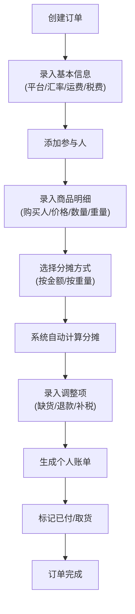

## 1. 产品概述
海淘包裹分摊工具，解决朋友合拼海淘时费用拆账不清的问题。支持订单管理、商品录入、智能费用分摊、调整记录和结算追踪。
- 主要用途：帮助海淘团长管理订单，自动计算每人应付金额，追踪付款和取货状态
- 目标用户：经常组织朋友一起海淘的团长、参与海淘拼单的用户
- 产品价值：告别手动计算，避免纠纷，透明化分摊过程

## 2. 核心功能

### 2.1 Feature Module
1. **订单管理页**：订单列表、新建/编辑订单、订单详情
2. **商品管理**：商品录入、分摊计算、调整记录
3. **结算中心**：个人应付明细、已付/待退状态、取货标记
4. **历史记录**：历史订单查询、未结清人员追踪

### 2.3 Page Details
| 页面名称 | 模块名称 | 功能描述 |
|-----------|-------------|---------------------|
| 订单列表 | 订单概览 | 展示所有订单卡片，显示平台、日期、总金额、状态 |
| 订单列表 | 新建订单 | 弹窗录入平台、汇率、转运单号、总运费、税费、参与人 |
| 订单详情 | 基本信息 | 展示订单基础信息，支持编辑 |
| 订单详情 | 商品列表 | 展示商品明细，支持增删改查 |
| 订单详情 | 分摊设置 | 选择分摊方式（按金额/按重量），实时预览分摊结果 |
| 订单详情 | 调整记录 | 记录缺货、退款、补税等调整项 |
| 订单详情 | 结算面板 | 展示每人应付、已付、待退金额，支持标记已付和取货 |
| 历史记录 | 未结清追踪 | 按人员维度展示未结清订单，支持一键催付 |

## 3. 核心流程
用户创建订单 → 录入参与人员 → 添加商品明细 → 选择分摊方式 → 系统自动计算分摊金额 → 录入调整项（缺货/退款/补税）→ 生成每人应付账单 → 标记付款和取货状态 → 订单完成

## 4. User Interface Design

### 4.1 Design Style
- **主色调**：深海蓝 (#0F3460)，代表专业和信任
- **辅助色**：珊瑚橙 (#FF6B6B) 用于强调和警告，薄荷绿 (#4ECDC4) 用于成功状态
- **中性色**：象牙白 (#F7F7F7) 背景，深灰 (#2C3E50) 文字
- **按钮风格**：圆角矩形，微立体阴影，hover时有轻微上浮效果
- **字体**：标题使用 Noto Serif SC（优雅衬线），正文使用 Noto Sans SC（清晰易读）
- **布局风格**：卡片式布局，清晰的视觉层级，充足留白
- **图标风格**：线性图标，统一2px描边，圆角端点

### 4.2 Page Design Overview
| 页面名称 | 模块名称 | UI Elements |
|-----------|-------------|-------------|
| 订单列表 | 顶部导航 | Logo、页面标题、新建订单按钮、历史记录入口 |
| 订单列表 | 订单卡片 | 平台Logo、日期、转运单号、总金额、参与人数、状态标签 |
| 订单详情 | 信息面板 | 网格布局展示订单信息，可编辑 |
| 订单详情 | 商品表格 | 支持行内编辑，每一行可展开查看截图 |
| 订单详情 | 分摊计算器 | 双栏布局，左侧参数设置，右侧实时结果 |
| 订单详情 | 结算面板 | 每人一张卡片，展示应付/已付/待退，状态切换按钮 |
| 历史记录 | 人员列表 | 头像、姓名、未结清金额、订单列表展开 |

### 4.3 Responsiveness
- Desktop-first 设计，1280px 为主要设计断点
- 平板端（768px-1280px）：卡片宽度自适应，表格可横向滚动
- 移动端（<768px）：单列布局，底部导航，表格转为卡片列表
- 所有按钮最小触摸区域 44x44px

## 5. 交互细节
- 分摊计算实时预览：修改分摊方式或商品信息时，分摊金额动画过渡更新
- 状态标记：已付/取货状态切换时有成功动画和音效反馈
- 数据持久化：自动保存草稿，防止数据丢失
- 金额格式化：所有金额自动保留2位小数，支持人民币和外币双显示
