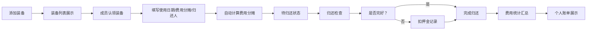

## 1. 产品概述

滑雪装备拼租管理工具，帮助朋友团体管理滑雪装备的租赁、认领、归还和费用分摊，解决"谁租了哪套装备"记混的问题。

- 主要面向结伴滑雪的朋友群体，提供装备信息管理、人员认领、费用自动计算和归还追踪功能
- 目标是让团体滑雪装备租赁管理简单透明，避免费用纠纷和装备丢失

## 2. 核心功能

### 2.1 用户角色
| 角色 | 注册方式 | 核心权限 |
|------|----------|----------|
| 普通用户 | 直接使用（本地存储） | 管理装备、认领装备、归还装备、查看费用统计 |

### 2.2 功能模块
1. **装备列表页**：展示所有租赁的装备卡片，支持筛选和搜索
2. **装备详情/认领**：查看装备详情，填写使用日期、承担费用、归还负责人
3. **归还管理**：勾选是否完好、是否扣押金，记录归还状态
4. **费用统计**：每个人该付多少、未归还装备、被扣押金记录
5. **换装备记录**：临时更换装备留下变更记录

### 2.3 页面详情
| 页面名称 | 模块名称 | 功能描述 |
|---------|----------|----------|
| 装备列表 | 顶部导航 | 页面切换（装备/归还/统计） |
| 装备列表 | 筛选栏 | 按类型、状态筛选装备 |
| 装备列表 | 装备卡片 | 展示类型、尺码、租赁店、押金、日价、适合身高、照片 |
| 装备列表 | 认领弹窗 | 填写使用人、使用日期、费用分摊比例、归还负责人 |
| 归还管理 | 待归还列表 | 展示已认领未归还的装备 |
| 归还管理 | 归还操作 | 勾选是否完好、是否扣押金、填写备注 |
| 费用统计 | 人员费用 | 每个人应付金额明细 |
| 费用统计 | 未归还清单 | 展示所有未归还装备 |
| 费用统计 | 扣押金记录 | 展示被扣押金的装备及原因 |
| 换装备记录 | 变更历史 | 展示所有装备更换记录 |

## 3. 核心流程

用户添加装备到列表 → 成员认领装备并填写使用信息 → 系统自动计算押金和租金分摊 → 归还时检查装备状态并记录 → 生成每个人的费用账单

## 4. 用户界面设计

### 4.1 设计风格
- **主色调**：冰蓝色系（#0EA5E9 天蓝）代表冰雪运动，搭配橙色（#F97316）作为强调色代表活力
- **辅助色**：深灰色文字，浅灰色背景
- **按钮风格**：圆角胶囊按钮，悬停有微缩放和阴影效果
- **字体**：使用现代无衬线字体，标题加粗，正文清晰易读
- **布局风格**：卡片式布局，装备卡片带轻微阴影和圆角，悬停时有上浮效果
- **图标风格**：使用 Lucide 线性图标，简洁现代

### 4.2 页面设计概述
| 页面名称 | 模块名称 | UI 元素 |
|---------|----------|---------|
| 装备列表 | 导航栏 | 顶部 Tab 切换，冰蓝色背景，白色文字 |
| 装备列表 | 筛选栏 | 圆角筛选按钮，横向滚动 |
| 装备列表 | 装备卡片 | 图片顶部展示，下方信息网格，底部状态标签 |
| 装备列表 | 认领弹窗 | 半透明遮罩，居中白色卡片，表单输入 |
| 归还管理 | 待归还列表 | 列表式布局，每行显示装备+使用人+操作按钮 |
| 费用统计 | 统计卡片 | 渐变色背景卡片展示总金额 |
| 费用统计 | 人员列表 | 头像+姓名+金额的列表布局 |

### 4.3 响应式
- 桌面端优先设计，自适应移动端
- 装备卡片在桌面端 3 列，平板 2 列，手机 1 列
- 触摸优化：按钮最小高度 44px，点击区域充足

### 4.4 视觉细节
- 装备卡片图片带轻微圆角和渐变遮罩
- 状态标签（可用/已认领/已归还）用不同颜色区分
- 费用数字用等宽字体显示
- 页面切换有平滑过渡动画
- 卡片悬停有微妙的上浮和阴影加深效果
