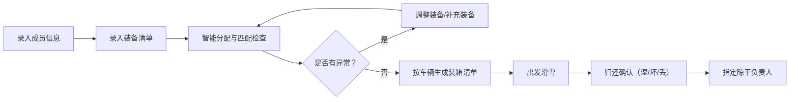

## 1. 产品概述

滑雪装备管理系统，帮助一群朋友在滑雪出行前高效管理团队成员信息和装备分配，避免现场发现护目镜、头盔、雪板尺码对不上的尴尬情况。

- 主要用途：团队滑雪出行的装备登记、智能分配、装箱管理与归还确认
- 目标用户：结伴滑雪的朋友/团队组织者
- 核心价值：减少装备错配遗漏，提升出行效率与安全性

## 2. 核心功能

### 2.1 用户角色

| 角色 | 注册方式 | 核心权限 |
|------|---------|---------|
| 团队成员 | 直接录入 | 查看自己信息、确认装备状态 |
| 组织者 | 直接录入 | 全部功能：成员管理、装备管理、分配、装箱、归还 |

### 2.2 功能模块

1. **成员管理**：录入身高、体重、鞋码、滑雪水平、是否近视、怕冷程度
2. **装备清单**：雪板、雪鞋、头盔、护目镜、手套、护具六大类，每件记录尺码、拥有者、状态、照片
3. **智能分配**：鞋码不匹配提示、板长不合适提示、近视没配镜片提示、关键装备缺失提示
4. **装箱清单**：出发前按车辆生成装箱清单
5. **归还确认**：逐件确认湿了/坏了/丢了，记录谁负责晾干

### 2.3 页面详情

| 页面名称 | 模块名称 | 功能描述 |
|---------|---------|----------|
| 成员管理 | 成员列表 | 展示所有成员卡片，支持增删改 |
| 成员管理 | 成员表单 | 录入姓名、身高、体重、鞋码、滑雪水平、是否近视、怕冷程度、备注 |
| 装备清单 | 分类标签页 | 雪板/雪鞋/头盔/护目镜/手套/护具六类切换 |
| 装备清单 | 装备卡片 | 展示装备图片、尺码、拥有者、状态，支持编辑和删除 |
| 装备清单 | 新增装备 | 上传照片、选择类型、填写尺码、指定拥有者、设置状态 |
| 智能分配 | 匹配总览 | 展示每位成员分配到的装备清单 |
| 智能分配 | 异常提示 | 红色高亮显示鞋码不匹配、板长不合适、近视无镜片、装备缺失等问题 |
| 装箱清单 | 车辆管理 | 添加车辆信息（车牌号、司机、容量） |
| 装箱清单 | 按车装箱 | 拖拽或选择装备分配到对应车辆，生成装箱清单 |
| 归还确认 | 装备状态确认 | 逐件勾选：湿了/坏了/丢了/正常 |
| 归还确认 | 晾干负责人 | 为湿了的装备指定负责晾干的人 |

## 3. 核心流程

## 4. 用户界面设计

### 4.1 设计风格

- **主色调**：冷蓝色系（#165DFF 主色、#E8F3FF 浅背景），呼应冰雪滑雪主题
- **辅助色**：橙红色（#FF7D00）用于警示提示，绿色（#00B42A）用于正常状态
- **中性色**：深灰 #1D2129、中灰 #4E5969、浅灰 #C9CDD4、极浅灰 #F2F3F5
- **按钮风格**：圆角 8px，主按钮实心蓝色，次按钮描边，悬停有微缩放和阴影
- **字体**：标题使用 "Noto Sans SC" 粗体，正文使用思源黑体常规，清晰现代
- **布局风格**：卡片式布局，充足留白，顶部标签导航
- **图标风格**：使用 lucide-react 线性图标，简洁一致

### 4.2 页面设计概览

| 页面名称 | 模块名称 | UI 元素 |
|---------|---------|---------|
| 成员管理 | 成员列表 | 网格布局卡片、头像、关键信息标签、编辑/删除按钮 |
| 装备清单 | 分类+列表 | 顶部横向标签切换、卡片网格、装备图片占位、状态角标 |
| 智能分配 | 匹配面板 | 左侧成员列表、右侧装备分配、红色警示卡片醒目提示 |
| 装箱清单 | 车辆面板 | 车辆卡片横向排列、车内装备列表、拖拽交互视觉反馈 |
| 归还确认 | 状态清单 | 勾选框组、湿/坏/丢三色标签、负责人下拉选择 |

### 4.3 响应式

- 桌面端优先设计（1280px 起）
- 平板端（768px）：卡片列数减少，导航折叠
- 移动端（375px）：单列布局，底部 Tab 导航
- 触摸区域最小 44px，适配手指点击

### 4.4 动效设计

- 页面切换：淡入 + 轻微上移动画
- 卡片悬停：上移 2px + 阴影加深
- 警示提示：脉冲呼吸效果吸引注意
- 状态切换：颜色渐变过渡 0.3s
