## 1. 产品概述
漂流防水包清点系统是一款专为漂流活动设计的物品管理工具，解决漂流过程中物品混乱、遗失、进水等问题。系统帮助组织者管理成员信息、防水包档案，实现出发前清点、入水前确认、返程后检查的全流程管控。

- 核心用户：漂流活动组织者、领队
- 核心价值：防止物品遗失、确保防水安全、明确责任分工
- 目标市场：户外俱乐部、团建组织者、自助游团队

## 2. 核心功能

### 2.1 用户角色
| 角色 | 注册方式 | 核心权限 |
|------|----------|----------|
| 管理员 | 系统初始化 | 所有功能操作、数据管理 |

### 2.2 功能模块
1. **看板首页**：未确认物品、贵重物品位置、损坏包、待晾晒清单
2. **成员档案**：成员信息增删改查（姓名、鞋码、游泳能力、过敏、紧急联系人、贵重物品备注）
3. **防水包档案**：包信息增删改查（容量、颜色、编号、拥有者、密封状态、照片）
4. **出发前清点**：按包记录手机、车钥匙、干衣、毛巾、防晒、药品、现金
5. **入水前确认**：二次确认防水包密封状态
6. **返程后检查**：进水检查、遗失检查、破损检查、晾干责任人登记

### 2.3 页面详情
| 页面名称 | 模块名称 | 功能描述 |
|-----------|-------------|---------------------|
| 看板首页 | 概览卡片 | 展示未确认物品数量、贵重物品位置清单、损坏包列表、待晾晒清单 |
| 成员档案 | 成员列表 | 表格展示所有成员，支持搜索、筛选 |
| 成员档案 | 成员表单 | 新增/编辑成员信息，包含完整字段 |
| 防水包档案 | 防水包列表 | 卡片式展示所有防水包，带颜色和照片预览 |
| 防水包档案 | 防水包表单 | 新增/编辑防水包信息，支持图片上传 |
| 出发前清点 | 清点列表 | 按包显示物品清单，支持勾选确认 |
| 入水前确认 | 密封确认 | 逐包确认密封状态，带时间戳记录 |
| 返程后检查 | 检查清单 | 进水/遗失/破损状态登记，晾干责任人分配 |

## 3. 核心流程

```mermaid
flowchart LR
    A["创建成员档案"] --> B["创建防水包档案"]
    B --> C["出发前按包清点物品"]
    C --> D["入水前二次确认密封"]
    D --> E["漂流活动"]
    E --> F["返程后检查进水/遗失/破损"]
    F --> G["登记晾干责任人"]
    G --> H["看板更新状态"]
    
    style A fill:#4ade80,stroke:#22c55e
    style B fill:#60a5fa,stroke:#3b82f6
    style C fill:#facc15,stroke:#eab308
    style D fill:#fb923c,stroke:#f97316
    style F fill:#f87171,stroke:#ef4444
    style H fill:#c084fc,stroke:#a855f7
```

## 4. 用户界面设计

### 4.1 设计风格
- **主色调**：海洋蓝色系 (#0ea5e9) 代表水和安全，搭配橙色 (#f97316) 作为警示强调色
- **辅色调**：绿色 (#22c55e) 表示已确认，红色 (#ef4444) 表示问题，黄色 (#eab308) 表示待处理
- **按钮风格**：圆角胶囊型，微立体阴影，hover状态带轻微上浮动画
- **字体**：标题使用 Noto Sans SC Bold，正文使用 Noto Sans SC Regular
- **布局风格**：卡片式布局，带微妙渐变背景和圆角阴影
- **图标风格**：使用 lucide-react 线性图标，与漂流主题呼应（水滴、救生圈、背包等）

### 4.2 页面设计概述
| 页面名称 | 模块名称 | UI 元素 |
|-----------|-------------|----------|
| 看板首页 | 统计卡片 | 四色卡片网格，数字动画，状态徽章 |
| 看板首页 | 列表区域 | 可滚动列表，带优先级排序，悬停高亮 |
| 成员档案 | 数据表格 | 斑马纹行，操作按钮组，筛选工具栏 |
| 防水包档案 | 卡片网格 | 响应式网格，彩色边框区分状态，照片圆角裁剪 |
| 清点/确认页 | 步骤向导 | 顶部进度条，左侧导航，右侧内容区 |
| 清点/确认页 | 物品勾选 | 大尺寸复选框，分组标题，批量操作 |

### 4.3 响应式
- 桌面端（>1024px）：侧边导航 + 主内容区，多列表格/网格布局
- 平板端（768-1024px）：顶部导航，自适应网格列数
- 移动端（<768px）：底部Tab导航，单列卡片布局，触摸优化按钮

### 4.4 视觉细节
- 背景：微妙的水波纹理渐变，低透明度不干扰内容
- 卡片：玻璃拟态效果，半透明背景 + 模糊 backdrop
- 动效：页面切换淡入淡出，数字滚动动画，勾选成功反馈
- 状态指示：彩色圆点徽章，进度条动画，闪烁警示
