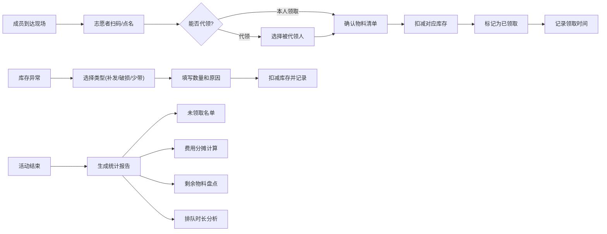

## 1. 产品概述

演唱会应援物领取管理系统是一款专为演唱会现场应援物发放设计的工具，帮助应援站组织者高效管理物料库存、成员领取状态和现场排队秩序。解决传统微信群刷"我到了"导致的混乱、错发漏发、库存难追踪等问题。

## 2. 核心功能

### 2.1 用户角色
| 角色 | 描述 | 核心权限 |
|------|------|----------|
| 管理员 | 应援站负责人 | 物料管理、成员管理、领取确认、数据统计、库存调整 |
| 志愿者 | 现场发放人员 | 领取确认、代领操作、库存扣减 |

### 2.2 功能模块
1. **领取看板页**：三列布局（待领取/已领取/代领），按取货点分类，实时显示领取状态
2. **物料管理页**：手幅、灯牌贴纸、票套、徽章等物料的数量、成本、制作人、照片、存放袋子
3. **成员管理页**：成员名单、座位区、手机号后四位、应付金额、代领权限
4. **领取确认弹窗**：扫码或点名确认，代领选择被代领人
5. **库存调整**：现场补发、破损、少带扣减库存
6. **统计报告页**：未领取名单、每人分摊费用、剩余物料、排队最久取货点

### 2.3 页面详情
| 页面名称 | 模块名称 | 功能描述 |
|----------|----------|----------|
| 领取看板页 | 三列领取状态 | 待领取列、已领取列、代领列，支持拖拽和搜索 |
| 领取看板页 | 取货点切换 | 顶部标签切换不同取货点，显示对应领取队列 |
| 领取看板页 | 成员卡片 | 显示姓名、座位区、手机号后四位、应付金额、代领标记 |
| 领取看板页 | 领取操作按钮 | 扫码领取、点名领取、代领按钮 |
| 物料管理页 | 物料列表 | 卡片式展示物料，含图片、名称、数量、成本、袋子编号 |
| 物料管理页 | 物料编辑 | 新增/编辑物料，上传照片，填写制作人信息 |
| 成员管理页 | 成员列表 | 表格展示所有成员，支持筛选和搜索 |
| 成员管理页 | 成员编辑 | 新增/编辑成员信息，设置能否代领 |
| 领取确认弹窗 | 扫码/点名 | 两种确认方式，显示成员详情和物料清单 |
| 领取确认弹窗 | 代领选择 | 代领时必须从列表中选择被代领人 |
| 库存调整弹窗 | 库存扣减 | 补发、破损、少带三种类型，填写原因和数量 |
| 统计报告页 | 未领取名单 | 列出所有未领取成员，支持导出 |
| 统计报告页 | 费用分摊 | 计算每人分摊金额，显示总成本和人均成本 |
| 统计报告页 | 剩余物料 | 展示各物料剩余数量和占比 |
| 统计报告页 | 排队分析 | 显示各取货点平均等待时间和最长排队记录 |

## 3. 核心流程

## 4. 用户界面设计

### 4.1 设计风格
- **主色调**：深紫色 + 亮粉色渐变（演唱会应援氛围）
- **辅助色**：金色点缀（VIP/已领取状态）
- **背景**：深色主题，带微光粒子效果，营造演唱会现场感
- **按钮风格**：圆角渐变按钮，悬停时有霓虹发光效果
- **字体**：标题使用有设计感的衬线字体，正文使用清晰的无衬线字体
- **布局风格**：卡片式布局，玻璃拟态效果，阴影分层
- **图标风格**：线性图标，带荧光色填充状态

### 4.2 页面设计概述
| 页面名称 | 模块名称 | UI元素 |
|----------|----------|--------|
| 领取看板页 | 顶部导航 | Logo、取货点标签切换、统计概览数字 |
| 领取看板页 | 三列布局 | 每列带标题栏和数量徽章，卡片可拖拽，滚动流畅 |
| 领取看板页 | 成员卡片 | 头像、姓名、座位区标签、手机号后四位、金额、代领图标 |
| 领取看板页 | 操作区 | 底部悬浮操作栏，扫码按钮、批量操作 |
| 物料管理页 | 物料网格 | 响应式网格布局，物料卡片带图片和状态角标 |
| 统计报告页 | 数据卡片 | 大号数字展示，带趋势箭头，图表可视化 |

### 4.3 响应式
- 桌面端：三列等宽布局，适合现场大屏展示
- 平板端：两列布局，代领列折叠为侧边抽屉
- 手机端：单列布局，顶部标签切换状态，适合志愿者手持操作
- 触控优化：按钮最小44px，支持滑动操作

### 4.4 动画与交互
- 页面加载：元素渐入+上移动画，错落延迟
- 卡片拖拽：重力感应+弹性回归效果
- 领取成功：金色光芒扩散动画+音效反馈
- 状态切换：平滑过渡动画，数字滚动效果
- 悬停效果：卡片微抬升+阴影加深
