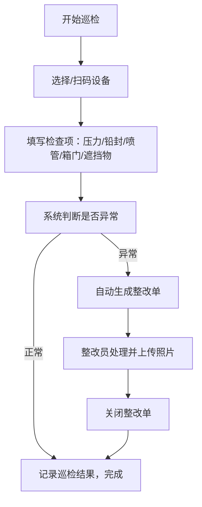

## 1. 产品概述

灭火器点检系统是一套面向物业消防安全管理的数字化巡检工具，解决传统纸质贴纸层层叠加、问题追溯困难、整改闭环缺失的痛点。系统通过扫码巡检、自动生成整改单、数据看板可视化等功能，实现灭火器全生命周期的规范化管理。

- 核心目标：提升消防设备巡检效率，确保问题及时发现与整改
- 目标用户：物业管理人员、消防安全巡检员、设施维护人员

## 2. 核心功能

### 2.1 用户角色

| 角色 | 注册方式 | 核心权限 |
|------|----------|----------|
| 管理员 | 系统预设 | 设备档案管理、查看所有数据、看板统计 |
| 巡检员 | 系统添加 | 扫码巡检、填写检查记录、查看整改单 |
| 整改员 | 系统添加 | 处理整改单、上传整改照片、关闭工单 |

### 2.2 功能模块

1. **数据看板**：楼栋合格率、即将到期数量、重复异常点、本月未检清单
2. **设备档案**：楼栋、楼层、位置、编号、类型、压力区间、有效期、照片管理
3. **巡检记录**：扫码巡检、压力/铅封/喷管/箱门/遮挡物检查项、检查人记录
4. **整改管理**：自动生成整改单、整改照片上传、整改关闭流程

### 2.3 页面详情

| 页面名称 | 模块名称 | 功能描述 |
|----------|----------|----------|
| 数据看板 | 楼栋合格率卡片 | 按楼栋展示巡检合格率百分比及趋势 |
| 数据看板 | 即将到期预警 | 显示30天内到期的灭火器数量及列表 |
| 数据看板 | 重复异常点 | 展示多次出现异常的设备位置及次数 |
| 数据看板 | 本月未检清单 | 列出本月尚未巡检的设备清单 |
| 设备档案 | 设备列表 | 分页展示所有设备，支持按楼栋/楼层筛选 |
| 设备档案 | 设备详情 | 查看设备完整信息及历史巡检记录 |
| 设备档案 | 新增/编辑设备 | 录入/修改设备基础信息和照片 |
| 巡检记录 | 巡检列表 | 按时间展示所有巡检记录，支持筛选 |
| 巡检记录 | 新建巡检 | 扫码或选择设备进行巡检登记 |
| 整改管理 | 整改单列表 | 展示待处理/处理中/已关闭的整改单 |
| 整改管理 | 整改详情 | 查看整改单详情，上传整改照片并关闭 |

## 3. 核心流程

### 3.1 巡检流程

巡检员通过扫码或选择设备进入巡检页面，依次检查压力、铅封、喷管、箱门、遮挡物等项目并填写结果。系统自动判断是否存在异常，若存在压力异常、过期或被遮挡等情况，自动生成整改单派发给整改员。整改完成后上传照片并关闭工单。

### 3.2 设备档案管理流程

管理员可新增、编辑、删除设备档案，录入楼栋、楼层、位置、编号、类型、压力区间、有效期等信息，并上传设备照片。设备信息是巡检和整改的基础数据。

## 4. 用户界面设计

### 4.1 设计风格

- **主色调**：消防红 (#DC2626) 作为品牌主色，搭配深灰 (#1F2937) 作为功能主色
- **辅助色**：成功绿 (#10B981)、警告橙 (#F59E0B)、危险红 (#EF4444)
- **按钮风格**：圆角矩形按钮，悬停有微阴影和颜色加深效果
- **字体**：系统无衬线字体，标题加粗，正文常规
- **布局风格**：卡片式布局，顶部导航 + 侧边菜单 + 内容区
- **图标风格**：线性图标，与文字颜色保持一致

### 4.2 页面设计概述

| 页面名称 | 模块名称 | UI元素 |
|----------|----------|--------|
| 数据看板 | 统计卡片 | 大数字+趋势箭头+卡片渐变背景，四象限布局 |
| 数据看板 | 楼栋合格率 | 进度条形式展示，按楼栋排列 |
| 数据看板 | 列表区域 | 表格展示即将到期和未检设备 |
| 设备档案 | 列表页 | 顶部筛选栏 + 卡片网格列表 + 分页 |
| 设备档案 | 详情/表单 | 左右布局，左侧照片，右侧信息表单 |
| 巡检记录 | 列表页 | 时间线样式展示巡检记录 |
| 整改管理 | 列表页 | Tab切换状态，卡片式整改单展示 |

### 4.3 响应式设计

- 采用桌面端优先设计
- 平板端：侧边栏可折叠，卡片网格自适应列数
- 移动端：顶部导航简化为汉堡菜单，单列布局

### 4.4 交互与动效

- 页面加载时卡片依次淡入
- 悬停按钮有轻微上浮和阴影增强
- 表单提交有加载状态
- 数字变化有计数动画
