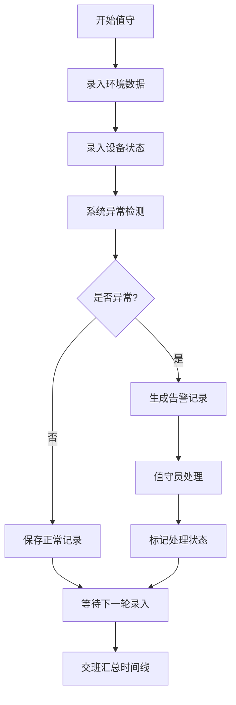

## 1. 产品概述
海边灯塔值守员大雾天气工作记录系统，用于规范记录雾号、灯光等设备运行状态，保障海上航行安全。
- 目标用户：灯塔值守员、海事管理人员
- 核心价值：标准化值守流程、实时异常告警、历史数据追溯

## 2. 核心功能

### 2.1 用户角色
| 角色 | 注册方式 | 核心权限 |
|------|----------|----------|
| 值守员 | 系统分配 | 录入值守数据、查看告警、提交工单 |
| 管理员 | 系统分配 | 数据审核、工单管理、历史统计 |

### 2.2 功能模块
1. **值守记录表单**：能见度、风向、海况、灯光周期、雾号间隔、船只反馈录入
2. **异常提示面板**：异常间隔告警、备用电源切换提示、设备结露预警、维护工单快捷入口
3. **告警时间线**：整晚告警事件汇总、时间轴可视化、状态标记

### 2.3 页面详情
| 页面名称 | 模块名称 | 功能描述 |
|-----------|-------------|---------------------|
| 值守记录主页 | 值守表单 | 录入六项基础数据，支持快速选择和手动输入 |
| 值守记录主页 | 异常提示区 | 实时检测并高亮显示四类异常情况，支持一键处理 |
| 值守记录主页 | 告警时间线 | 按时间倒序展示整晚所有告警事件，含类型、级别、处理状态 |
| 值守记录主页 | 数据汇总卡 | 显示当前值班时段的统计数据（记录条数、异常数、工单数量） |

## 3. 核心流程
值守员登录后进入主页面 → 周期性录入环境与设备数据 → 系统自动检测异常并触发告警 → 值守员处理异常并标记状态 → 系统汇总整晚告警时间线供交接班参考

## 4. 用户界面设计

### 4.1 设计风格
- 主色调：深海蓝(#0F3460) + 警示橙(#E94560) + 安全绿(#16C79A)
- 辅助色：雾灰(#8395A7)、灯塔黄(#FFD93D)
- 字体：标题用 Playfair Display，正文用 Noto Sans SC
- 风格：海事仪表盘风格，深色背景配发光效果，突出数据可视化
- 按钮风格：圆角胶囊按钮，带微发光边框

### 4.2 页面设计概览
| 页面名称 | 模块名称 | UI 元素 |
|-----------|-------------|-------------|
| 值守记录主页 | 值守表单 | 卡片式布局、图标标签组、发光输入框、动态校验边框 |
| 值守记录主页 | 异常提示区 | 四色警示卡片、脉冲动画、闪烁图标、快捷操作按钮 |
| 值守记录主页 | 告警时间线 | 垂直时间轴、颜色编码节点、状态徽标、悬停展开详情 |
| 值守记录主页 | 数据汇总卡 | 渐变背景、大数字统计、趋势小箭头 |

### 4.3 响应式
- 桌面端：四栏布局（汇总卡+表单+异常提示+时间线）
- 平板端：双栏布局（左侧汇总+表单，右侧异常+时间线）
- 移动端：单列纵向滚动，顶部导航切换不同模块
