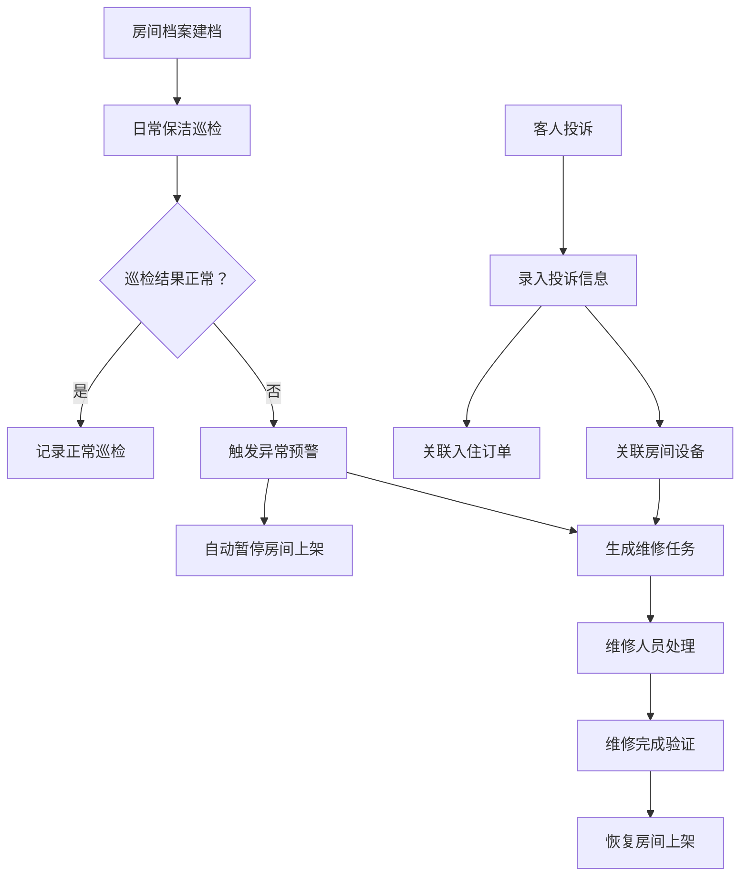

## 1. 产品概述

民宿热水器巡检管理系统，用于帮助房东提前发现热水器问题，避免客人洗到一半才投诉的尴尬情况。通过标准化巡检流程、设备档案管理和投诉跟踪，提升民宿运营效率和客人满意度。

- 核心目标：提前发现热水器隐患，降低客诉率，延长设备寿命
- 目标用户：民宿房东、保洁人员、维修人员、运营管理者
- 产品价值：标准化巡检流程，数据化设备管理，自动化异常预警

## 2. 核心功能

### 2.1 用户角色

| 角色 | 描述 | 核心权限 |
|------|------|----------|
| 管理员/房东 | 系统管理者 | 全部功能：档案管理、巡检查看、投诉处理、维修调度、看板统计 |
| 保洁人员 | 执行日常巡检 | 提交巡检记录、查看待巡检房间、上报异常 |
| 维修人员 | 处理设备故障 | 查看维修任务、更新维修进度、填写维修记录 |

### 2.2 功能模块

1. **看板首页**：待巡检房间、近期投诉、设备寿命预警、维修进度、旺季前必查清单
2. **房间档案**：热水器设备信息管理（型号、容量、类型、安装日期、保养记录、照片）
3. **巡检管理**：保洁后巡检记录（水温、出水量、漏水、异响、报警码、插座、排气）
4. **投诉管理**：客人反馈记录（水不热、忽冷忽热、跳闸），关联入住订单
5. **维修管理**：异常房间处理、维修派单、进度跟踪、自动暂停上架

### 2.3 页面详情

| 页面名称 | 模块名称 | 功能描述 |
|----------|----------|----------|
| 看板首页 | 统计卡片 | 待巡检数量、今日投诉、设备预警、进行中维修 |
| 看板首页 | 待巡检列表 | 按优先级排序的待巡检房间，快速开始巡检 |
| 看板首页 | 近期投诉 | 最近7天的客人投诉记录及处理状态 |
| 看板首页 | 设备寿命 | 按安装时间排序的设备老化预警 |
| 看板首页 | 维修进度 | 当前进行中的维修任务及状态 |
| 看板首页 | 旺季必查 | 旺季前需要重点检查的设备清单 |
| 房间档案 | 档案列表 | 所有房间的热水器档案，支持筛选搜索 |
| 房间档案 | 档案详情 | 设备详细信息、历史巡检、保养记录、照片 |
| 房间档案 | 档案编辑 | 新增/编辑房间档案信息 |
| 巡检管理 | 巡检列表 | 所有巡检记录，按日期/房间/状态筛选 |
| 巡检管理 | 巡检表单 | 提交巡检结果，包含所有检查项 |
| 投诉管理 | 投诉列表 | 所有客人投诉，关联订单信息 |
| 投诉管理 | 投诉详情 | 投诉内容、处理进度、关联房间和订单 |
| 维修管理 | 维修列表 | 所有维修任务，按状态筛选 |
| 维修管理 | 维修详情 | 维修内容、进度更新、费用记录 |

## 3. 核心流程

### 3.1 日常巡检流程

保洁人员每日查看待巡检房间 → 进入房间检查热水器各项指标 → 提交巡检记录 → 系统判断是否正常 → 异常则自动触发维修预警和暂停上架

### 3.2 投诉处理流程

客人反馈问题 → 前台录入投诉并关联入住订单 → 系统自动关联对应房间设备 → 生成维修任务 → 维修完成后恢复上架 → 回访客人

### 3.3 设备生命周期管理

设备入库建档 → 安装记录 → 定期保养记录 → 巡检数据积累 → 寿命预警 → 更换设备 → 旧设备归档

## 4. 用户界面设计

### 4.1 设计风格

- **设计方向**：专业工业风，强调数据可视化和操作效率
- **主色调**：深海蓝 (#0F172A) 作为主背景，搭配暖橙色 (#F97316) 作为警示强调色
- **辅助色**：青绿色 (#0D9488) 表示正常状态，红色 (#EF4444) 表示危险/异常
- **字体**：标题使用 SF Pro Display 加粗，正文使用 SF Pro Text，数字使用等宽字体
- **卡片风格**：深色毛玻璃效果，细微边框，柔和阴影
- **图标风格**：线性图标，统一粗细，状态色区分

### 4.2 页面设计概览

| 页面名称 | 模块名称 | UI 元素 |
|----------|----------|---------|
| 看板首页 | 顶部统计卡 | 四个数据卡片并排，渐变色背景，大数字显示，趋势小箭头 |
| 看板首页 | 待巡检列表 | 左侧列表，房间号+楼层+优先级标签，右侧快速操作按钮 |
| 看板首页 | 投诉时间线 | 垂直时间线，投诉类型图标，时间和状态标签 |
| 看板首页 | 设备寿命条 | 水平进度条，颜色从绿到红渐变，标注使用年限 |
| 看板首页 | 维修看板 | 卡片式布局，状态标签，进度百分比，负责人头像 |
| 房间档案 | 档案卡片 | 网格布局，设备照片+基本信息，状态角标 |
| 巡检表单 | 检查项 | 分组展示，开关/数值输入/照片上传，异常标红 |

### 4.3 响应式设计

- 桌面端（1280px+）：三栏布局，左侧导航+主内容+右侧详情面板
- 平板端（768-1279px）：两栏布局，顶部导航+主内容
- 移动端（<768px）：单栏布局，底部导航，卡片堆叠
- 重点优化：巡检表单移动端体验，支持单手操作

### 4.4 动效设计

- 页面加载：卡片依次淡入上移，stagger 效果
- 状态切换：平滑过渡动画，0.3s ease
- 数据更新：数字滚动动画，脉冲提示新数据
- 悬停反馈：卡片微上浮，阴影加深，边框高亮
