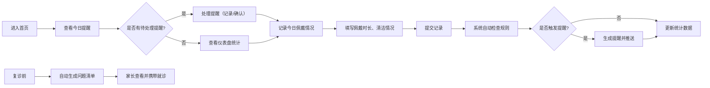

## 1. 产品概述

牙套清洁提醒应用是一款专为儿童牙齿矫正家庭设计的管理工具，帮助家长和孩子记录牙套佩戴和清洁情况，及时提醒漏戴和清洁超期问题，避免牙套丢失和口腔健康问题。

- 解决问题：孩子忘记泡清洁片、牙套丢失、清洁不规范导致的口腔问题
- 目标用户：佩戴牙套/保持器的儿童及其家长
- 核心价值：建立良好的牙套护理习惯，降低复诊问题发生率

## 2. 核心功能

### 2.1 用户角色

| 角色 | 注册方式 | 核心权限 |
|------|----------|----------|
| 家长用户 | 本地存储，无需注册 | 管理牙套档案、记录每日情况、查看提醒、生成复诊清单 |

### 2.2 功能模块

1. **首页仪表盘**：今日提醒、本周统计、清洁片库存、快捷记录入口
2. **牙套档案管理**：添加/编辑牙套基本信息、照片上传
3. **每日记录**：佩戴时长、清洁情况、外出带盒、异味记录
4. **智能提醒**：漏戴提醒、清洁超期提醒、盒子丢失提醒
5. **复诊清单**：自动生成复诊问题清单（压痛、裂纹、松动、漏戴记录）
6. **数据统计**：本周达标天数、清洁片库存管理

### 2.3 页面详情

| 页面名称 | 模块名称 | 功能描述 |
|----------|----------|----------|
| 首页仪表盘 | 提醒卡片 | 显示今日待办、漏戴/超期/丢失告警 |
| 首页仪表盘 | 统计概览 | 本周达标天数、连续记录天数、清洁片剩余 |
| 首页仪表盘 | 快捷操作 | 一键记录今日佩戴、快速查看档案 |
| 牙套档案页 | 档案列表 | 展示所有牙套/保持器档案卡片 |
| 牙套档案页 | 档案表单 | 佩戴阶段、医生、领取日期、盒子颜色、清洁周期、照片 |
| 每日记录页 | 记录表单 | 佩戴时长滑块、刷洗/泡片/带盒开关、异味等级选择 |
| 每日记录页 | 历史记录 | 最近7天记录列表，可编辑 |
| 提醒中心页 | 告警列表 | 漏戴提醒、清洁超期提醒、盒子丢失提醒 |
| 复诊清单页 | 问题清单 | 压痛记录、裂纹检查、松动情况、最近漏戴记录汇总 |
| 复诊清单页 | 库存管理 | 清洁片入库/出库、低库存预警 |

## 3. 核心流程

用户主要流程：
1. 首次使用：创建牙套档案 → 设置清洁周期 → 开始记录
2. 日常使用：打开应用 → 查看今日提醒 → 记录佩戴情况 → 系统检查是否触发提醒
3. 复诊前：进入复诊清单页面 → 查看自动生成的问题清单 → 携带就诊
4. 库存管理：清洁片用完时 → 更新库存 → 低库存时自动提醒

## 4. 用户界面设计

### 4.1 设计风格

**整体风格**：温暖治愈系，柔和清新的配色，适合儿童健康管理场景

- **主色调**：薄荷绿 `#3DDC97`（代表清新、健康、清洁）
- **辅助色**：珊瑚粉 `#FF6B6B`（提醒告警）、阳光黄 `#FFD93D`（注意提示）、天空蓝 `#4ECDC4`（信息展示）
- **中性色**：暖白 `#FFFBF5`、浅灰 `#F0EFEB`、深灰 `#2D3047`
- **字体**：
  - 标题：'ZCOOL KuaiLe'（圆润可爱，适合儿童主题）
  - 正文：'Noto Sans SC'（清晰易读）
- **按钮风格**：大圆角（16px）、柔和阴影、悬停微缩放效果
- **卡片风格**：白色背景、圆角20px、柔和投影、内部留白充足
- **图标风格**：圆润线条图标，配合emoji增强亲和力
- **动效**：页面切换淡入淡出、卡片悬停轻微上浮、提醒卡片脉冲动画

### 4.2 页面设计概述

| 页面名称 | 模块名称 | UI元素 |
|----------|----------|--------|
| 首页仪表盘 | 顶部问候 | 大标题、日期显示、天气emoji |
| 首页仪表盘 | 提醒横幅 | 彩色背景、图标、提醒文字、操作按钮 |
| 首页仪表盘 | 统计卡片 | 三列布局，数字+描述+小图标 |
| 首页仪表盘 | 快捷记录 | 大按钮，佩戴时长滑块，一键提交 |
| 首页仪表盘 | 最近记录 | 横向滚动卡片，显示最近3天 |
| 牙套档案页 | 顶部导航 | 返回按钮、标题、添加按钮 |
| 牙套档案页 | 档案卡片 | 照片预览、基本信息标签、编辑按钮 |
| 牙套档案页 | 表单弹窗 | 分段表单，每段有小标题，输入框带图标 |
| 每日记录页 | 日历选择 | 横向日期条，可切换日期 |
| 每日记录页 | 记录表单 | 滑块、开关组、表情选择器 |
| 每日记录页 | 历史列表 | 日期+状态图标+简要信息 |
| 提醒中心页 | 分类标签 | 全部/漏戴/清洁/丢失 |
| 提醒中心页 | 提醒卡片 | 左侧彩色竖条、图标、标题、时间、处理按钮 |
| 复诊清单页 | 问题卡片 | 分类标题、问题列表、勾选框 |
| 复诊清单页 | 库存管理 | 库存数字、+/-按钮、低库存提示 |

### 4.3 响应式

- **桌面优先**：最大宽度1200px居中布局
- **平板适配**：两列变一列，卡片间距调整
- **手机适配**：全宽布局，底部导航栏，触摸目标≥44x44px
- **触摸优化**：按钮最小高度48px，滑块增大触摸区域

### 4.4 交互动效

- **页面加载**：内容从上到下渐入，延迟100ms错开
- **提醒动画**：新提醒出现时脉冲闪烁3次
- **按钮交互**：点击时缩放0.95，释放回弹
- **滑块交互**：拖动时实时更新数值显示
- **开关切换**：平滑过渡动画，颜色变化
- **列表滚动**：惯性滚动，边缘渐隐效果
