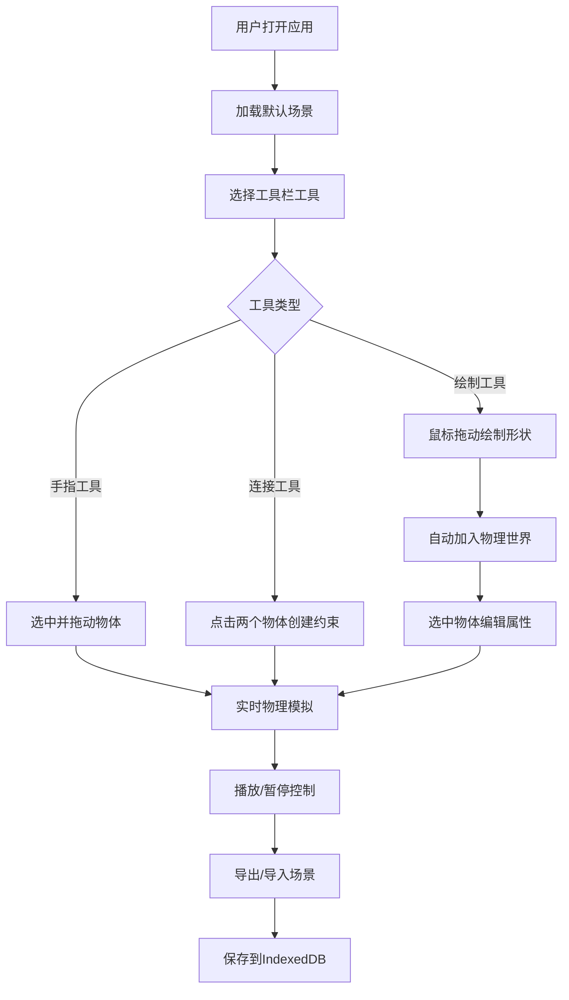

## 1. 产品概述
物理引擎沙盒是一个基于Web的交互式物理模拟平台，类似Algodoo或matter.js demo。用户可以创建各种物理物体，设置物理属性，观察真实的物理碰撞效果，并通过预设场景探索经典物理现象。
- 核心目的：提供一个直观、易用的2D物理实验环境，让用户能够快速创建和测试物理场景
- 目标用户：物理爱好者、教育工作者、游戏开发者、学生
- 产品价值：降低物理模拟的门槛，让复杂的物理现象变得可视化和可交互

## 2. 核心 Features

### 2.1 Feature Module
1. **主画布区域**：全屏物理模拟画布，支持缩放平移
2. **左侧工具栏**：8种创建工具（矩形、圆、三角、多边形、手画、弹簧、绳索、关节）
3. **右侧属性面板**：物体属性编辑（密度、摩擦、弹性、类型、颜色）
4. **顶部控制栏**：播放/暂停/步进、时间倍速、场景管理
5. **性能监控**：实时显示FPS、物体数、碰撞对数
6. **场景系统**：10个预设场景模板、IndexedDB存储、导入导出

### 2.3 Page Details
| Page Name | Module Name | Feature description |
|-----------|-------------|---------------------|
| 主页面 | 画布区域 | 整屏Canvas渲染，支持鼠标滚轮缩放、拖拽平移，物理世界实时渲染 |
| 主页面 | 左侧工具栏 | 8种工具按钮，点击切换，鼠标拖动直接绘制，大小由拖距决定 |
| 主页面 | 右侧属性面板 | 选中物体后显示可编辑属性，实时生效 |
| 主页面 | 顶部控制栏 | 播放控制按钮，时间倍速滑块（0.1x-5x），场景下拉选择 |
| 主页面 | 粒子发射器 | 可配置的粒子喷射，频率和初速度可调 |
| 主页面 | 场景管理 | 场景列表带缩略图，一键切换，自动保存到IndexedDB |

## 3. Core Process
用户打开应用后，默认看到空白物理场景。可以选择左侧工具创建物体，用手指工具拖动物体，右键施加爆炸力。点击预设场景可快速加载经典物理演示。所有操作自动保存到本地IndexedDB。

## 4. User Interface Design

### 4.1 Design Style
- **主色调**：深空蓝 (#1a1a2e) 作为背景，科技感青色 (#00f5d4) 作为强调色
- **辅助色**：霓虹紫 (#9d4edd)、活力橙 (#ff6b6b)
- **按钮风格**：圆角矩形，微立体效果，悬停时发光动画
- **字体**：Geist Mono 作为等宽字体，Inter 作为界面字体
- **布局风格**：三栏布局，左右工具栏固定宽度，中间画布自适应
- **视觉效果**：玻璃拟态面板， subtle 边框发光，柔和阴影

### 4.2 Page Design Overview
| Page Name | Module Name | UI Elements |
|-----------|-------------|-------------|
| 主页面 | 画布区域 | 深色网格背景，物理物体带高光边缘，选中物体有发光边框 |
| 主页面 | 左侧工具栏 | 垂直排列图标按钮，选中状态高亮，工具提示 |
| 主页面 | 属性面板 | 分组折叠面板，滑块控件，颜色选择器 |
| 主页面 | 控制栏 | 透明玻璃质感，图标按钮，滑块控制 |
| 主页面 | 场景列表 | 卡片式布局，缩略图预览，hover效果 |

### 4.3 Responsiveness
- 桌面端：三栏固定布局，画布占据主要空间
- 平板端：工具栏可折叠，属性面板可收起
- 移动端：简化工具栏，触控优化
