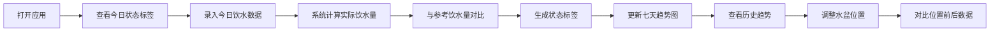

## 1. 产品概述

猫咪饮水观察小面板是一款帮助宠物主人科学监测猫咪饮水健康的工具。通过记录每日饮水量、尿团数量等关键指标，结合体重自动计算参考饮水量，智能判断饮水状态是否正常，让主人随时掌握猫咪的健康状况。

- 解决问题：猫咪饮水变化难以察觉，异常发现不及时可能导致健康问题
- 目标用户：养猫人士，尤其是关注猫咪泌尿系统健康的主人
- 产品价值：用数据化方式量化猫咪饮水习惯，提前发现潜在健康风险

## 2. 核心功能

### 2.1 用户角色
| 角色 | 注册方式 | 核心权限 |
|------|----------|----------|
| 普通用户 | 无需注册，本地存储 | 管理宠物档案、记录饮水数据、查看趋势分析 |

### 2.2 功能模块
1. **宠物档案模块**：记录体重、年龄、主食类型、饮水盆位置、健康备注
2. **每日记录模块**：换水量、剩水量、饮水机状态、尿团数量、异常表现
3. **智能标签模块**：自动判断正常/偏少/偏多/连续异常状态
4. **趋势分析模块**：最近七天饮水量趋势图
5. **位置对比模块**：换水盆位置前后饮水数据对比

### 2.3 页面详情
| 页面名称 | 模块名称 | 功能描述 |
|----------|----------|----------|
| 首页仪表盘 | 今日状态卡片 | 展示今日饮水状态标签、饮水量、与参考值对比 |
| 首页仪表盘 | 宠物档案卡片 | 展示宠物基本信息，支持编辑修改 |
| 首页仪表盘 | 七天趋势图 | 柱状图展示最近七天饮水量变化 |
| 首页仪表盘 | 每日记录列表 | 最近几天的饮水记录概览 |
| 记录页 | 记录表单 | 添加/编辑每日饮水记录的表单 |
| 档案页 | 档案表单 | 编辑宠物档案信息，调整饮水基准系数 |
| 趋势页 | 详细趋势分析 | 多维度趋势展示，水盆位置对比 |

## 3. 核心流程

用户打开应用 → 查看今日饮水状态 → 记录当日换水量和剩水量 → 系统自动计算饮水量并给出标签 → 查看七天趋势 → 调整饮水盆位置 → 对比位置变化前后的饮水数据

## 4. 用户界面设计

### 4.1 设计风格
- **主色调**：柔和的暖橙色系（温暖、友好、猫主题），搭配淡蓝色（健康、清新）
- **辅助色**：绿色（正常）、黄色（偏少）、红色（偏多/异常）
- **按钮风格**：圆润饱满，带有轻微阴影，hover 时有上浮效果
- **字体**：标题使用圆润可爱的字体，正文使用清晰易读的无衬线字体
- **布局风格**：卡片式布局，圆角大，留白充足，温馨居家感
- **图标风格**：柔和线条风格图标，搭配猫咪相关的可爱元素

### 4.2 页面设计概览
| 页面名称 | 模块名称 | UI 元素 |
|----------|----------|---------|
| 首页仪表盘 | 今日状态卡片 | 大字号状态标签、饮水量数值、进度条、猫咪爪印装饰 |
| 首页仪表盘 | 宠物档案卡片 | 头像占位、基本信息网格、编辑按钮 |
| 首页仪表盘 | 七天趋势图 | 彩色柱状图、参考线、hover 提示、日期标签 |
| 首页仪表盘 | 记录列表 | 日期、水量、状态标签、尿团数、饮水机状态图标 |
| 记录页 | 记录表单 | 数值输入框、开关按钮、文本域、保存按钮 |
| 档案页 | 档案表单 | 分组输入框、滑块调整基准系数、保存按钮 |

### 4.3 响应式
- 桌面端优先设计，采用卡片网格布局
- 平板端自适应卡片宽度
- 移动端单列布局，优化触控区域
- 所有输入控件支持触控操作

### 4.4 微交互设计
- 页面加载时卡片依次淡入（staggered animation）
- 状态标签有呼吸动画效果吸引注意
- 数据更新时数字滚动动画
- 柱状图入场时有从下往上的生长动画
- 按钮 hover 时有轻微放大和阴影加深
