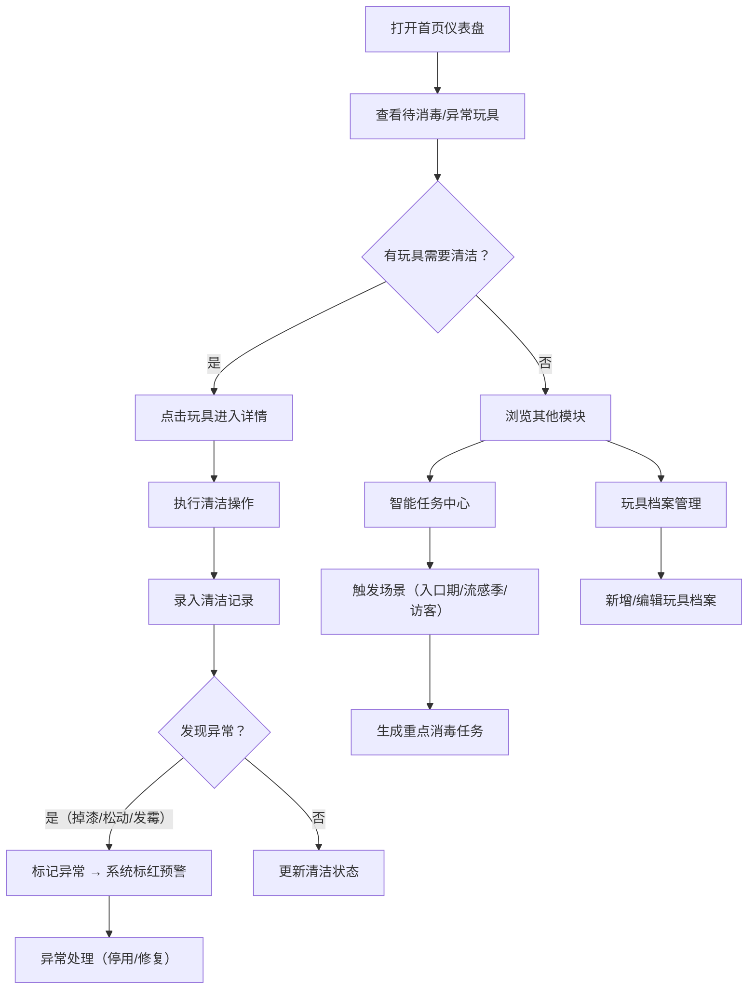

## 1. 产品概述
玩具消毒管家是一款帮助家长科学管理孩子玩具清洁消毒的Web应用，解决积木、牙胶、毛绒玩具混合存放时清洁方式混淆、消毒记录遗忘等痛点问题。
- 目标用户：0-6岁儿童的家长，特别是注重孩子健康卫生、有多个玩具需要管理的家庭
- 核心价值：建立玩具全生命周期档案，智能提醒消毒任务，异常预警及时停用危险玩具

## 2. 核心功能

### 2.1 用户角色
| 角色 | 注册方式 | 核心权限 |
|------|----------|----------|
| 家长用户 | 无需注册，本地存储 | 管理玩具档案、记录清洁、查看任务、设置提醒 |

### 2.2 功能模块
1. **首页仪表盘**：待消毒玩具卡片、异常玩具预警、清洁频率统计、按收纳箱任务清单
2. **玩具档案管理**：玩具列表、新增/编辑/删除玩具、玩具详情、照片上传
3. **清洁记录中心**：清洁记录列表、新增清洁记录、历史记录查询
4. **智能消毒任务**：入口期/流感季/访客后自动生成重点消毒任务、手动创建任务
5. **异常预警系统**：掉漆/松动/发霉自动标红、停用建议、异常处理记录

### 2.3 页面详情
| 页面名称 | 模块名称 | 功能描述 |
|----------|----------|----------|
| 首页仪表盘 | 统计概览卡片 | 展示玩具总数、本月清洁次数、待消毒数量、异常数量4项核心指标 |
| 首页仪表盘 | 待消毒清单 | 按时间优先级展示需要消毒的玩具，支持一键标记完成 |
| 首页仪表盘 | 异常玩具预警 | 红色醒目卡片展示掉漆、松动、发霉玩具，附停用建议 |
| 首页仪表盘 | 清洁频率图表 | 近30天清洁趋势柱状图，各类清洁方式占比饼图 |
| 首页仪表盘 | 收纳箱任务 | 按收纳位置分组生成消毒任务清单，支持整箱任务标记 |
| 玩具档案 | 玩具列表 | 卡片式展示，支持按材质/年龄/收纳位置筛选搜索 |
| 玩具档案 | 玩具表单 | 录入名称、材质、适用年龄、清洁方式、购买日期、收纳位置、照片 |
| 玩具档案 | 玩具详情 | 展示完整档案信息、清洁历史、异常记录时间线 |
| 清洁记录 | 记录列表 | 时间倒序展示所有清洁记录，支持按玩具/方式/时间筛选 |
| 清洁记录 | 新增记录 | 选择玩具、清洁方式（水洗/擦拭/紫外线/晾干）、破损/异味情况 |
| 智能任务 | 任务列表 | 展示系统生成和手动创建的消毒任务，区分普通/紧急 |
| 智能任务 | 场景触发 | 入口期/流感季/小朋友来访后一键生成重点消毒任务 |
| 异常预警 | 异常列表 | 所有异常玩具集中管理，标记处理状态（待处理/已处理/已停用） |

## 3. 核心流程
家长打开应用后，首先在首页查看待消毒任务和异常预警，点击玩具卡片可进入详情。可通过玩具档案页面新增或编辑玩具信息，每次清洁后在清洁记录中心录入操作。当进入入口期、流感季或有小朋友来访时，系统会在智能任务页面生成重点消毒任务清单。若发现玩具出现掉漆、松动小零件或发霉情况，在清洁记录或玩具详情中标记异常，系统自动标红并建议停用。

## 4. 用户界面设计

### 4.1 设计风格
- 主色调：温暖柔和的婴儿粉 `#FFB6C1` 搭配清新薄荷绿 `#98D8C8`，传递母婴健康关怀感
- 辅助色：消毒蓝 `#5DADE2`（水洗/紫外线）、木质棕 `#D4A574`（收纳/自然）、警示红 `#E74C3C`（异常预警）
- 按钮风格：圆润大圆角（16px），带轻微阴影，点击有缩放反馈
- 字体：标题使用圆润可爱的 "Nunito" 字体，正文使用清晰易读的 "Noto Sans SC" 中文字体
- 布局：卡片式布局为主，顶部导航栏 + 侧边分类菜单，整体空间留白充足
- 图标风格：使用 emoji + 线性图标结合，玩具类用emoji增强童趣感，操作类用简洁线性图标

### 4.2 页面设计概览
| 页面名称 | 模块名称 | UI元素 |
|----------|----------|--------|
| 首页仪表盘 | 统计概览卡片 | 渐变背景卡片、大号数字、趋势小箭头、悬停上浮动画 |
| 首页仪表盘 | 待消毒清单 | 横向卡片、倒计时标签、清洁方式彩色徽章、一键完成按钮 |
| 首页仪表盘 | 异常预警区 | 红色渐变边框、⚠️ 醒目图标、脉冲动画、停用建议标签 |
| 首页仪表盘 | 清洁频率图表 | 柔和色彩柱状图、图例悬浮提示、数据变化动画 |
| 首页仪表盘 | 收纳箱任务 | 折叠面板、收纳箱图标、进度条、整箱完成按钮 |
| 玩具档案 | 玩具列表 | 网格卡片、玩具照片主图、悬浮操作按钮、彩色标签组 |
| 玩具档案 | 玩具表单 | 分区表单、材质图标选择器、照片上传拖拽区、日期选择器 |
| 清洁记录 | 新增记录 | 步骤式表单、清洁方式图标卡片、异常情况开关、备注输入 |
| 智能任务 | 任务卡片 | 紧急程度色条（红/橙/黄）、场景图标、任务项复选框列表 |

### 4.3 响应式
- 采用桌面优先设计，1280px以上为最佳体验
- 平板端（768-1279px）：侧边菜单收起为图标栏，卡片网格从3列变2列
- 移动端（<768px）：顶部导航简化，卡片单列堆叠，收纳箱任务改为手风琴式展开
- 所有交互元素触摸区域不小于44px，表单输入框适配软键盘弹出

### 4.4 交互动效
- 页面加载：卡片从下往上错峰淡入（staggered fade-in-up）
- 卡片悬停：轻微上浮+阴影加深（translateY(-4px), box-shadow增强）
- 按钮点击：scale(0.96) 缩放反馈，过渡时间150ms
- 异常卡片：呼吸灯脉冲动画（box-shadow光晕变化）
- 完成标记：绿色勾选图标弹出动画，进度条平滑增长
