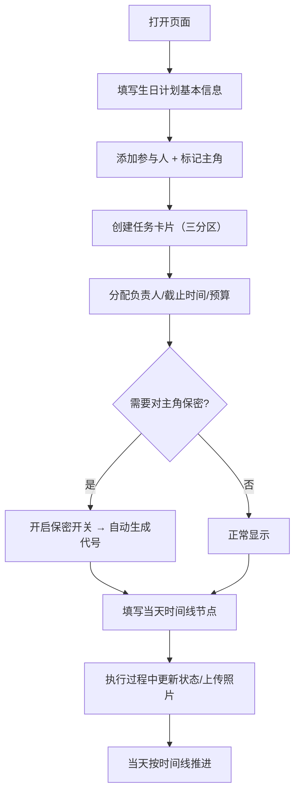

## 1. 产品概述

生日惊喜小群分工协作工具，帮助小圈子朋友在筹备生日惊喜时明确分工，避免"以为别人管了"的责任真空问题。无需复杂账号系统，本地存储即可，聚焦于惊喜策划的执行落地。

- 核心用户：准备生日惊喜的小型好友群体（3-10人）
- 解决痛点：任务分配模糊、进度不透明、保密信息容易泄露给主角
- 产品价值：一张页面管全流程，从计划创建到当天执行时间线

## 2. 核心功能

### 2.1 用户角色
| 角色 | 标识方式 | 核心权限 |
|------|----------|----------|
| 组织者 | 页面使用者 | 创建计划、分配任务、编辑所有内容 |
| 参与者 | 在参与人列表中 | 查看自己负责的任务（无账号系统，同页协作） |
| 主角 | 在参与人列表中标注 | 敏感任务标题对其隐藏，仅显示代号 |

### 2.2 功能模块
1. **生日计划头部信息区**：主角姓名、生日日期、集合地点、总预算、保密等级、参与人名单
2. **任务看板区**：三列看板布局（不能被主角发现 / 当天必须完成 / 可提前准备）
3. **任务卡片**：负责人、截止时间、预算、垫付状态、照片证据上传、保密开关
4. **保密任务遮罩**：开启后标题显示为随机代号，详情需解锁查看
5. **当天时间线**：从接人到收场的按时间轴排列的执行节点

### 2.3 页面详情
| 页面名称 | 模块名称 | 功能描述 |
|-----------|-------------|---------------------|
| 主页面 | 生日计划头部 | 表单录入主角、日期、集合点、预算、保密等级、参与人（含标记主角） |
| 主页面 | 任务看板 | 三列拖拽分区展示任务卡片，支持新增/编辑/删除 |
| 主页面 | 任务卡片 | 包含任务名、负责人、截止时间、预算、垫付勾选、照片上传、保密开关 |
| 主页面 | 保密遮罩 | 标记主角后，敏感任务显示代号（如"阿尔法行动"），点击解锁显示原名 |
| 主页面 | 当天时间线 | 垂直时间轴：接人→布置场地→迎接主角→点蜡烛→切蛋糕→拍照→收拾，支持自定义编辑 |

## 3. 核心流程

### 主要用户流程
组织者打开页面 → 填写生日计划基本信息 → 添加参与人并标记主角 → 在三个分区中创建任务卡片，指定负责人和截止时间 → 对需要保密的任务开启保密开关 → 填写当天时间线各节点 → 随时更新任务进度和垫付状态 → 当天按时间线执行

## 4. 用户界面设计

### 4.1 设计风格
- **主题色调**：温暖的珊瑚粉（#FF6B6B）为主色，奶油黄（#FFE66D）为强调色，薄荷绿（#4ECDC4）为辅助色，深灰蓝（#2C3E50）为文字色
- **整体风格**：温暖治愈的「庆祝感」设计，柔和圆角，轻微玻璃拟态，点缀彩带和气球装饰元素
- **按钮风格**：圆角胶囊按钮，主按钮带渐变填充，悬停时有上浮 + 阴影加深
- **字体方案**：展示字体使用「ZCOOL KuaiLe」（活泼快乐），正文字体使用「Noto Sans SC」（清晰易读）
- **布局风格**：卡片式模块化布局，顶部计划信息区 + 中部三列看板 + 底部时间线
- **图标/emoji**：大量使用生日相关emoji（🎂🎈🎉🎁🥳）作为视觉点缀和功能标识

### 4.2 页面设计概览
| 页面名称 | 模块名称 | UI元素 |
|-----------|-------------|-------------|
| 主页面 | 生日计划头部 | 渐变背景横幅、圆角输入框、参与人头像胶囊、保密等级徽章 |
| 主页面 | 任务看板区 | 三列等宽卡片，每列顶部有色带标题，卡片间有间隙，支持阴影 |
| 主页面 | 任务卡片 | 白色圆角卡片，底部状态标签条，保密卡片带模糊遮罩效果 |
| 主页面 | 当天时间线 | 左侧垂直色带 + 时间节点圆点 + 右侧内容卡片，交替配色 |

### 4.3 响应式
- 桌面端优先（1024px+）：三列看板并排展示
- 平板端（768-1024px）：看板改为两列布局
- 移动端（<768px）：看板改为单列纵向堆叠，时间线紧凑显示
- 所有输入和按钮支持触屏点击优化

### 4.4 动画与交互
- 页面加载：看板卡片从下往上 staggered 渐入
- 新增任务：卡片从缩放0到1的弹性动画
- 保密切换：遮罩淡入淡出 + 模糊变化
- 悬停效果：卡片微上浮 + 阴影加深
- 时间线节点：当前时间节点带脉冲光晕
