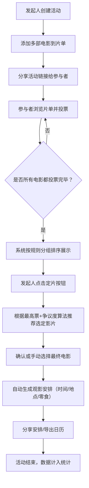

## 1. 产品概述
电影夜投票协作平台，解决朋友聚会选片效率低的痛点。发起人创建片单，参与者通过投票快速达成共识，并自动生成观影安排。
- 主要解决：群聊甩片名混乱、决策效率低、无记录追踪
- 目标用户：经常组织电影夜的朋友群体、影迷小圈子
- 产品价值：让选片变得高效、有趣、有据可依

## 2. 核心功能

### 2.1 用户角色
| 角色 | 参与方式 | 核心权限 |
|------|----------|----------|
| 发起人 | 创建投票活动 | 添加/删除电影、定片、生成观影安排 |
| 参与者 | 加入活动 | 投票（想看/不想看/看过）、备注理由、查看统计 |

### 2.2 功能模块
1. **首页/片单页**：电影卡片分组展示、投票操作、投票进度条
2. **添加电影弹窗**：片名、类型、时长、平台、评分、预告链接、海报上传
3. **观影安排页**：自动生成时间、地点、零食负责人，支持手动调整
4. **统计页**：弃票率排行、受欢迎类型分布、平均决定用时、投票热力图

### 2.3 页面详情
| 页面名称 | 模块名称 | 功能描述 |
|-----------|-------------|---------------------|
| 首页/片单页 | 顶栏导航 | 活动标题、参与人数、切换标签页、定片按钮 |
| 首页/片单页 | 最高票分组 | 按想看票数降序排列Top3，金色高亮边框 |
| 首页/片单页 | 争议大分组 | 想看与不想看票数接近的电影（差值≤2），橙色警示边框 |
| 首页/片单页 | 短片优先 | 时长≤100分钟的电影，绿色标签标识 |
| 首页/片单页 | 适合深夜 | 悬疑/恐怖/惊悚类型或时长≥130分钟，紫色月亮图标 |
| 首页/片单页 | 电影卡片 | 海报缩略图、片名、类型标签、时长、评分、投票统计条、三个投票按钮（👍想看/👎不想看/👀看过）、备注输入框 |
| 添加电影弹窗 | 表单区域 | 片名字段、类型多选（动作/喜剧/爱情/科幻/悬疑/恐怖/动画/纪录片等）、时长（分钟）、播放平台（Netflix/Disney+/爱奇艺/腾讯视频/优酷/蓝光碟等）、豆瓣评分（0-10）、预告片链接（YouTube/B站）、海报图上传/URL |
| 添加电影弹窗 | 预览区域 | 右侧实时预览卡片效果 |
| 观影安排页 | 头部信息 | 最终选定电影名、海报大图、基本信息展示 |
| 观影安排页 | 时间安排 | 默认本周五晚20:00，支持日期时间选择器修改 |
| 观影安排页 | 地点选择 | 默认发起人地址，支持输入/选择常用地点 |
| 观影安排页 | 零食分配 | 随机或手动分配：薯片/饮料/甜品/水果负责人，支持重新抽取 |
| 观影安排页 | 分享功能 | 复制安排文字、生成图片海报、导出日历事件 |
| 统计页 | 弃票率排行 | 柱状图展示每位成员的弃票率，高亮Top3"划水王" |
| 统计页 | 类型偏好 | 饼图展示所有历史投票中各类型的想看率 |
| 统计页 | 决策效率 | 折线图展示每次活动的决定用时（从创建到定片的时长） |
| 统计页 | 投票热力图 | 时间轴热力图展示投票集中的时间段 |

## 3. 核心流程

## 4. 用户界面设计

### 4.1 设计风格
- **主色调**：深邃影院紫 `#1A0B2E` + 霓虹粉 `#FF2E9F` + 琥珀金 `#FFB43A`
- **辅助色**：投票想看绿 `#36D399`、不想看红 `#F87272`、看过了蓝 `#60A5FA`
- **按钮风格**：圆角胶囊按钮（rounded-full），带微弱发光hover效果
- **字体**：标题使用 `Playfair Display` 衬线体营造电影感，正文使用 `Manrope` 无衬线体
- **布局风格**：电影胶片纹理背景、卡片式布局、毛玻璃分组标题栏
- **图标风格**：Lucide图标 + Emoji混合使用，电影相关元素（胶片、爆米花、放映机）

### 4.2 页面设计概述
| 页面名称 | 模块名称 | UI元素 |
|-----------|-------------|-------------|
| 首页/片单页 | 分组标题栏 | 毛玻璃效果、渐变色左边框、分组图标、电影数量角标 |
| 首页/片单页 | 电影卡片 | 左侧海报圆角矩形、右侧信息分层排版、底部投票按钮组带active状态、hover时卡片微上浮+阴影增强 |
| 首页/片单页 | 投票进度条 | 三色分段进度条（想看绿/看过蓝/不想看红），带百分比数字 |
| 添加电影弹窗 | 表单 | 左侧表单分区（基本信息/附加信息），右侧实时预览卡片，深色半透明遮罩 |
| 观影安排页 | 电影英雄区 | 海报大图作为背景带渐变遮罩、片名大号衬线字体、叠加信息标签 |
| 观影安排页 | 安排卡片 | 三段式卡片布局（时间/地点/零食），每段带图标和可编辑标识 |
| 统计页 | 数据卡片 | 顶部4个数据概览卡片（总活动数/总投票数/平均用时/最活跃用户），下方分组图表区 |

### 4.3 响应式
- 桌面端优先（1280px+）：多列网格布局，侧边导航栏
- 平板端（768-1279px）：两列布局，顶部导航栏
- 移动端（<768px）：单列流式布局，底部Tab切换，卡片全宽展示
- 触摸优化：投票按钮尺寸≥44px，增加触控反馈动画

### 4.4 动效设计
- 页面加载：卡片按顺序错落淡入（staggered fade-in）
- 投票点击：按钮缩放动画 + 对应颜色粒子发散效果
- 分组切换：Tab滑动指示器、内容区水平滑动过渡
- 定片确认：最终影片放大弹出动画 + 彩纸飘落效果
- 零食分配：老虎机式滚动抽取动画
