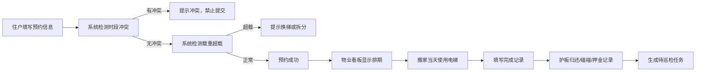

## 1. 产品概述

小区电梯搬家预约系统，解决多户同时搬家时货梯争抢、大厅拥堵问题。通过线上预约机制，实现电梯资源合理分配，物业统一管理，提升搬家效率和居住体验。

## 2. 核心功能

### 2.1 用户角色

| 角色 | 登录方式 | 核心权限 |
|------|---------|---------|
| 住户 | 选择楼栋单元 | 提交搬家预约、查看预约状态、记录搬家完成情况 |
| 物业管理员 | 管理员入口 | 电梯档案管理、查看今日排期、处理冲突申请、巡检管理、押金管理 |

### 2.2 功能模块

1. **住户预约页**：填写搬家信息、选择电梯时段、提交预约
2. **电梯档案页**：电梯信息管理、载重配置、可用时段、检修安排
3. **物业看板页**：今日排期、冲突申请、待巡检楼层
4. **搬家完成页**：护板归还记录、墙面磕碰记录、押金状态更新

### 2.3 页面详情

| 页面名称 | 模块名称 | 功能描述 |
|---------|---------|---------|
| 住户预约页 | 预约表单 | 楼栋、单元、搬家公司、车辆信息、预计件数、是否需要保护垫、时间段选择 |
| 住户预约页 | 冲突检测 | 同一电梯同一时段禁止重复预约、超载检测提示换梯或拆分 |
| 电梯档案页 | 电梯列表 | 显示所有电梯基本信息、载重、状态 |
| 电梯档案页 | 电梯详情 | 载重、可用时段、检修安排、是否可铺护板配置 |
| 物业看板页 | 今日排期 | 时间轴展示当天所有预约 |
| 物业看板页 | 冲突申请 | 显示有冲突的预约申请，支持人工协调 |
| 物业看板页 | 待巡检楼层 | 待巡检的搬家楼层列表 |
| 搬家完成页 | 完成记录 | 护板归还状态、墙面磕碰情况、押金退还状态 |

## 3. 核心流程

## 4. 用户界面设计

### 4.1 设计风格
- **主色调**：深青蓝色 `#1e3a5f`（专业、稳重）
- **辅助色**：暖橙色 `#f97316`（警示、提示）、绿色 `#22c55e`（成功、可用）、红色 `#ef4444`（危险、冲突）
- **按钮风格**：圆角 8px，微阴影，hover 时有轻微上浮效果
- **字体**：Noto Sans SC（清晰易读），标题 20px-24px，正文 14px-16px
- **布局风格**：卡片式布局，顶部导航，左侧内容区，右侧信息面板
- **图标**：lucide-react 线性图标，简约现代

### 4.2 页面设计概述

| 页面名称 | 模块名称 | UI 元素 |
|---------|---------|---------|
| 住户预约页 | 预约表单 | 两列表单布局，下拉选择，日期时间选择器，卡片式表单容器，提交按钮有加载状态 |
| 电梯档案页 | 电梯列表 | 网格卡片布局，每张卡片显示电梯状态标签（正常/检修/禁用），载重信息徽章 |
| 物业看板页 | 时间轴排期 | 垂直时间轴，每个时间块显示预约详情，冲突块用红色边框高亮 |
| 搬家完成页 | 状态切换 | 开关组件记录护板归还，单选按钮记录磕碰情况，押金状态下拉选择 |

### 4.3 响应式
- Desktop-first 设计，断点 768px
- 移动端自动调整为单列布局
- 触摸目标 ≥ 44x44px
- 表格在移动端转为卡片列表

## 5. 业务规则

1. **时段冲突检测**：同一电梯同一时间段（精确到小时）只能有一个预约
2. **载重检测**：根据预计件数估算重量，超过电梯载重时提示
3. **检修时段屏蔽**：电梯检修期间不可预约
4. **押金管理**：需要保护垫的预约需记录押金，归还后可退还
5. **巡检机制**：每次搬家完成后自动生成待巡检记录
