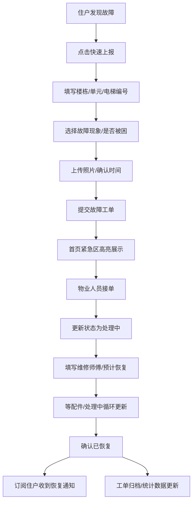

## 1. 产品概述
社区电梯故障互报系统，解决电梯故障信息不对称、物业群刷屏难追踪的痛点。住户可快速上报故障、订阅楼栋获取恢复通知，物业可接单跟进、更新状态，让每一次电梯停运都透明可查。
- 目标用户：小区住户、物业管理人员、维修人员
- 核心价值：故障信息透明化、处理进度可视化、历史数据可追溯

## 2. 核心功能

### 2.1 用户角色
| 角色 | 核心权限 |
|------|----------|
| 住户 | 上报故障、查看故障列表、订阅楼栋、接收恢复通知 |
| 物业 | 接单、更新处理状态、填写维修信息、发布绕行提示 |

### 2.2 功能模块
1. **首页（故障看板）**：按状态分组展示故障卡片，紧急优先排序
2. **故障上报页**：填写楼栋/单元/电梯信息、故障详情、上传照片
3. **故障详情页**：查看完整信息、物业处理操作、状态时间线
4. **统计分析页**：故障率排行、恢复时效、重复故障分析
5. **订阅管理**：选择关注楼栋、开关通知提醒

### 2.3 页面详情
| 页面名称 | 模块名称 | 功能描述 |
|-----------|-------------|---------------------|
| 首页 | 顶部导航 | Logo、角色切换、通知图标、订阅入口 |
| 首页 | 快速上报按钮 | 悬浮大号按钮，一键进入上报页 |
| 首页 | 状态筛选标签 | 紧急/处理中/已恢复/反复故障 分组切换 |
| 首页 | 故障卡片列表 | 楼栋电梯信息、状态标签、紧急度标识、时间戳 |
| 故障上报 | 位置信息表单 | 楼栋选择、单元号、电梯编号输入 |
| 故障上报 | 故障详情表单 | 故障现象描述、是否有人被困、发生时间 |
| 故障上报 | 照片上传 | 多图上传、预览删除 |
| 故障上报 | 提交按钮 | 校验并提交，返回首页 |
| 故障详情 | 基本信息区 | 电梯位置、上报人、时间、照片展示 |
| 故障详情 | 状态操作区 | 物业接单、状态下拉、维修师傅、预计恢复时间 |
| 故障详情 | 绕行提示 | 临时绕行路线文本输入 |
| 故障详情 | 时间线 | 各状态变更时间节点展示 |
| 统计页 | 电梯故障率排行 | Top10 电梯柱状图、故障次数 |
| 统计页 | 恢复时效统计 | 平均恢复时长、各状态耗时饼图 |
| 统计页 | 重复故障分析 | 高频故障类型、反复故障电梯列表 |
| 统计页 | 楼栋概览 | 各楼栋故障数量对比 |

## 3. 核心流程
住户发现电梯故障 → 点击上报按钮 → 填写位置和故障详情 → 提交生成工单 → 物业端收到提醒接单 → 更新处理状态（处理中/等配件/已恢复） → 订阅该楼栋的住户收到状态变更通知 → 工单归档进入统计分析

## 4. 用户界面设计
### 4.1 设计风格
- **主色调**：深海蓝 #1e3a5f（专业信任）、警示红 #e74c3c（紧急被困）、处理橙 #f39c12（进行中）、成功绿 #27ae60（已恢复）
- **辅色**：石板灰中性色、警示黄 #f1c40f（反复故障标签）
- **按钮风格**：圆角 8px、主按钮实色填充带微阴影、次按钮描边空心
- **字体**：Noto Sans SC（中文现代感），标题 700、正文 400、辅助信息 300
- **布局风格**：卡片式布局，分组标题左对齐配色条，悬浮导航+底部快捷操作
- **图标**：lucide-react 线性图标，紧急状态用脉冲动画强调

### 4.2 页面设计概述
| 页面名称 | 模块名称 | UI Elements |
|-----------|-------------|-------------|
| 首页 | 状态标签栏 | 横向滚动标签、选中态下划色条、对应状态计数角标 |
| 首页 | 紧急卡片 | 红边描边+左红条、被困徽章脉冲、高层停运标识置顶 |
| 首页 | 故障卡片 | 楼栋电梯号标题行、状态标签pill、时间相对显示、展开箭头 |
| 故障上报 | 表单卡片 | 分组卡片式表单、选择器用下拉、必填项红星标 |
| 故障详情 | 时间线 | 左侧竖线+节点圆点、不同状态节点用对应色填充 |
| 统计页 | 图表区 | 卡片内嵌柱状图/饼图、悬停显示具体数值 |

### 4.3 响应式
桌面端优先（1200px+），双栏布局左侧导航右侧内容；平板端折叠导航为抽屉；移动端单列卡片流，底部 Tab 切换导航，上报按钮改为底部悬浮圆钮。触摸区域 ≥44x44px。
