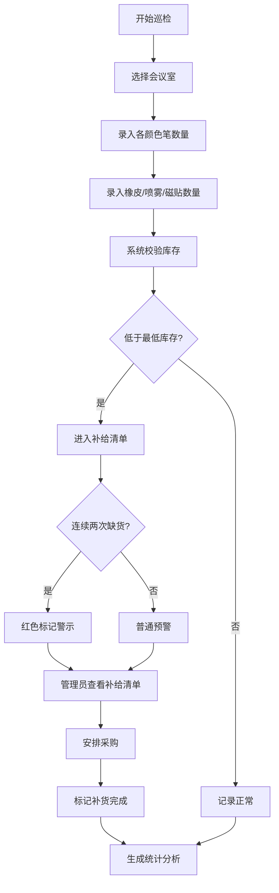

## 1. 产品概述
白板笔补给看板是一款面向企业行政管理人员的会议室耗材管理工具，解决白板笔断墨、橡皮丢失等常见问题，实现耗材的智能化巡检、预警和采购决策支持。
- 核心价值：通过数字化巡检和自动预警机制，确保会议室白板笔、橡皮等耗材常备充足，提升会议体验和行政效率
- 目标用户：行政管理人员、设施维护人员、部门采购负责人

## 2. 核心 Features

### 2.1 用户角色（如适用）
| 角色 | 注册方式 | 核心权限 |
|------|----------|----------|
| 管理员 | 系统预置 | 会议室档案管理、查看所有数据、导出采购清单 |
| 巡检员 | 系统预置 | 录入巡检记录、查看补给清单 |
| 部门负责人 | 系统预置 | 查看本部门预约记录和耗材消耗统计 |

### 2.2 Feature Module
1. **会议室档案看板**：会议室列表卡片、档案详情、新增/编辑会议室
2. **巡检记录模块**：快速录入界面、历史记录查询、异常标记
3. **补给清单模块**：自动预警列表、连续缺货标记、补货状态管理
4. **统计分析模块**：消耗排名、部门耗材分析、采购建议

### 2.3 Page Details
| Page Name | Module Name | Feature description |
|-----------|-------------|---------------------|
| 仪表盘首页 | 总览卡片 | 显示会议室总数、待补给数量、今日巡检完成率、缺货预警数量 |
| 会议室档案 | 会议室列表 | 卡片式展示所有会议室，含照片缩略图、容量、负责人 |
| 会议室档案 | 档案表单 | 录入房间名、容量、白板数量、默认配色、最低库存、负责人、照片上传 |
| 巡检记录 | 快速录入 | 选择会议室后快速录入各颜色笔数量、橡皮、清洁喷雾、磁贴数量 |
| 巡检记录 | 历史列表 | 按时间和会议室筛选巡检历史，支持查看详情 |
| 补给清单 | 预警列表 | 自动展示低于库存线的耗材，红色标记连续两次缺货项 |
| 补给清单 | 补货操作 | 标记补货完成、批量处理、导出采购清单 |
| 统计分析 | 消耗排名 | 柱状图展示各会议室耗材消耗速度排名 |
| 统计分析 | 部门分析 | 表格展示各部门预约后耗材缺失情况 |
| 统计分析 | 采购建议 | 根据历史消耗自动计算下次采购数量建议 |

## 3. 核心流程
巡检员登录系统 → 选择待巡检会议室 → 录入各颜色白板笔可用支数及其他耗材数量 → 系统自动判断是否低于最低库存 → 低于库存线的耗材自动进入补给清单 → 连续两次同一颜色缺货标记红色警示 → 管理员查看补给清单并安排采购 → 采购完成后标记补货 → 系统统计消耗数据生成分析报告

## 4. 用户界面设计

### 4.1 设计风格
- 主色调：采用工业蓝（#165DFF）作为主色，搭配警示红（#F53F3F）标记缺货状态
- 按钮风格：圆角8px，悬停有微缩放动效，主要操作按钮使用渐变背景
- 字体：标题使用"Noto Sans SC" Bold，正文使用"Noto Sans SC" Regular，数字使用等宽字体增强可读性
- 布局风格：卡片式布局，采用栅格系统，卡片间有适度阴影和间距
- 图标风格：使用线性图标，颜色与功能匹配（蓝色表示正常，红色表示警告）

### 4.2 Page Design Overview
| Page Name | Module Name | UI Elements |
|-----------|-------------|-------------|
| 仪表盘 | 统计卡片 | 4个大数字卡片横向排列，带有渐变背景和图标，数字有滚动动画 |
| 会议室档案 | 卡片网格 | 3列卡片网格，每张卡片含会议室照片、名称、容量、状态标签 |
| 巡检录入 | 表单界面 | 颜色块展示各颜色笔，数字输入框带增减按钮，底部提交按钮 |
| 补给清单 | 数据表格 | 带斑马纹的表格，缺货行高亮，连续缺货行红色背景，操作列有按钮 |
| 统计分析 | 图表区域 | 左侧柱状图，右侧数据表格，顶部有时间筛选器 |

### 4.3 响应式设计
- 桌面端优先设计，适配1920px和1440px屏幕
- 平板端：卡片网格调整为2列，侧边栏可折叠
- 移动端：卡片网格改为1列，底部导航替代顶部导航，表格支持横向滚动
- 所有交互元素最小44px触摸区域

### 4.4 视觉动效
- 页面加载时卡片依次淡入，staggered动画延迟100ms
- 数字变化时采用滚动计数动画
- 缺货警示图标有呼吸灯动效
- 表格行悬停时背景色微变，操作按钮滑入显示
- 表单提交成功有绿色对勾动画反馈
