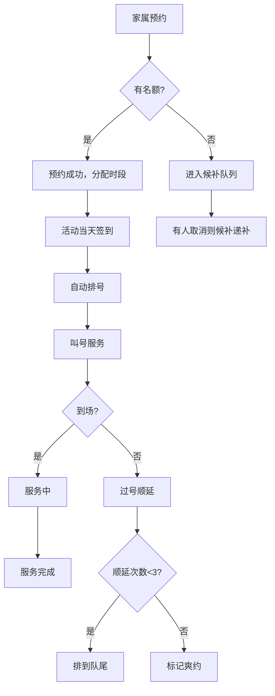

# 社区公益理发预约看板 - 产品需求文档

## 1. 产品概述

社区公益理发预约看板系统，旨在解决社区每月公益理发活动中纸表排队效率低、老人等待时间长的问题。通过数字化预约和排号管理，提升服务效率，改善老人体验。

- **目标用户**：社区工作人员、家属及老人
- **核心价值**：数字化预约管理、自动排号、实时状态看板、数据统计分析

## 2. 核心功能

### 2.1 用户角色

| 角色 | 描述 | 核心权限 |
|------|------|----------|
| 工作人员 | 社区服务人员 | 创建理发日、管理预约、现场签到、查看统计 |
| 家属 | 老人家属 | 为老人预约理发服务、查看预约状态 |

### 2.2 功能模块

1. **首页看板**：今日理发状态分组展示（到场、候补、已完成、爽约）
2. **理发日管理**：创建/编辑理发日，设置地点、时段、理发师人数、预计时长、名额
3. **预约管理**：家属为老人预约，填写姓名、年龄、电话、行动不便、偏好时间
4. **现场签到**：扫码/手动签到，自动排号，过号顺延
5. **数据统计**：服务人数、爽约率、热门时段分析

### 2.3 页面详情

| 页面名称 | 模块名称 | 功能描述 |
|----------|----------|----------|
| 首页看板 | 状态分组卡片 | 按到场/候补/已完成/爽约四组展示今日预约列表 |
| 首页看板 | 当前叫号显示 | 显示当前正在服务的号码和下一位 |
| 首页看板 | 快捷操作 | 签到、叫号、完成、过号顺延等操作按钮 |
| 理发日列表 | 理发日卡片 | 展示近期理发日信息和报名情况 |
| 理发日创建/编辑 | 表单填写 | 地点、服务时段、理发师人数、每人预计时长、可服务名额 |
| 预约页面 | 预约表单 | 老人姓名、年龄、联系电话、行动是否不便、偏好时间 |
| 预约页面 | 预约列表 | 查看当前用户的所有预约记录 |
| 统计页面 | 数据概览 | 总服务人数、爽约率等核心指标 |
| 统计页面 | 时段分析 | 各时间段预约热度排行 |
| 统计页面 | 历史记录 | 每场理发日的详细数据 |

## 3. 核心流程

### 3.1 工作人员创建理发日流程

工作人员进入理发日管理页面，点击新建，填写地点、服务开始/结束时间、理发师人数、每人预计服务时长、可服务总名额，提交后系统自动生成时间段。

### 3.2 家属预约流程

家属选择理发日，填写老人信息（姓名、年龄、电话、行动是否不便），选择偏好时间段，提交预约。系统根据名额判断是否进入候补队列。

### 3.3 现场服务流程

老人到场后工作人员点击签到，系统自动分配号码。理发师就绪后叫号，服务完成标记为已完成。若过号则自动顺延至当前队列末尾，最多顺延3次。

## 4. 用户界面设计

### 4.1 设计风格

- **主色调**：温暖的橘红色系（#E67E22），传达社区服务的温暖感
- **辅助色**：深青色（#16A085）用于成功/完成状态，柔和蓝色（#3498DB）用于信息提示
- **中性色**：暖灰色系，确保内容清晰易读，适合老年用户
- **按钮风格**：圆角大按钮，点击区域充足，方便操作
- **字体**：大号清晰字体，正文不小于14px，标题加粗醒目
- **布局风格**：卡片式布局，信息分区明确，减少视觉负担
- **图标风格**：线性图标，简洁明了，配合文字说明

### 4.2 页面设计概览

| 页面名称 | 模块名称 | UI元素 |
|----------|----------|--------|
| 首页看板 | 顶部状态栏 | 当前日期、理发日地点、理发师数量 |
| 首页看板 | 四象限分组 | 到场、候补、已完成、爽约四个卡片区域，每个区域显示人员列表 |
| 首页看板 | 当前叫号区 | 大号数字显示当前号码和下一位，醒目配色 |
| 首页看板 | 快捷操作栏 | 签到、叫号、完成、过号等大按钮 |
| 理发日列表 | 时间线布局 | 按日期排列理发日卡片，显示地点、名额、已预约数 |
| 理发日表单 | 分步表单 | 分步骤填写基本信息、时段设置、名额配置 |
| 预约页面 | 老人信息表单 | 大输入框，清晰标签，必填项标记 |
| 预约页面 | 时段选择 | 可视化时段格子，可选/已约满状态清晰区分 |
| 统计页面 | 数据卡片 | 大数字展示核心指标，配趋势箭头 |
| 统计页面 | 图表区域 | 柱状图展示各时段预约量，折线图展示历史趋势 |

### 4.3 响应式设计

- 桌面端：四列并排展示四个状态分组
- 平板端：两列布局，上下分组
- 手机端：单列垂直排列，支持横向滑动切换分组
- 触控优化：所有可点击元素不小于44x44px，间距充足

### 4.4 无障碍设计

- 高对比度配色，确保文字清晰可读
- 字体大小可调节，支持老年人视力需求
- 重要信息不仅用颜色区分，还配合图标和文字
- 表单标签清晰，错误提示明确
